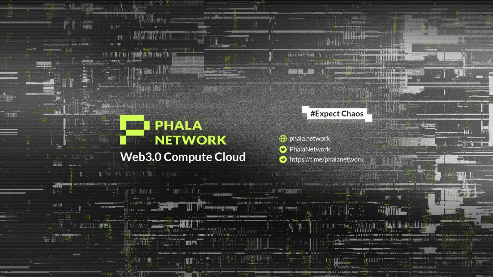

# Phala Network

<figure><figcaption></figcaption></figure>

## Phala Network: Web3 Computing Cloud 

The vision of our Phala is to become the world’s largest P2P computing network, a standard decentralized computing cloud based on Web3. Compared with centralized solutions like Amazon Web Services, Microsoft Azure and Google Cloud Platform, trustless is not only the first feature of Phala recognized by the community but also the cornerstone of Phala becoming a reliable distributed computing network.

When we say Phala Network is _trustless_, it means the following features:

* Phala does not own any servers, and anyone with qualified hardware is allowed to join the network to be a _worker_ and share the computing power. The live statistic is available [here](https://app.phala.network/delegate/vault);
* All Phala codebases are open-source for review, check our [Github repositories](https://github.com/Phala-Network);
* Phala assumes no trust in the worker operators (the human), so any worker must run Secure-Enclave-based hardware, and needs to prove its integrity during worker registration. This provides the hardware-based promise of the correctness of execution and data privacy. Phala further designs its [Supply-end Tokenomics](general/phala-network/worker-rewards.md) to encourage high-quality services of both performance and stability;
* All the workers are managed by the blockchain, which is governed by the on-chain Council. Phala Network follows [democratic governance](general/phala-network/governance-mechanism.md);

We strongly agree that Web3 will be the most powerful innovation-driving force in the next 20–30 years. Web3 and the evolution of artificial intelligence coexist, otherwise, the world might fall into a worse situation. Therefore, we cannot stop and be constrained by previous designs or “fundamentalism” because there is still a long way to go till the success of the Web3 revolution. We will replace any centralized services used by the Crypto world step by step to fulfill our vision, which is also the evolutionary goal of Phala Network.

## How to use Phala Cloud 

Through [Phat Contract](build/phat-contract/).

<figure><figcaption></figcaption></figure>

You can do serverless computing on Phala by programming and deploying Phat contracts. With “serverless” we mean that you do not need to care about the setup of underlying hardware anymore, and the network will allocate the computing power for you proportional to the PHA token you stake, i.e., _stake-to-compute_.

> Learn about other [Phala’s products](general/phala-network/phala-products.md).
