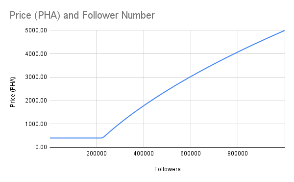
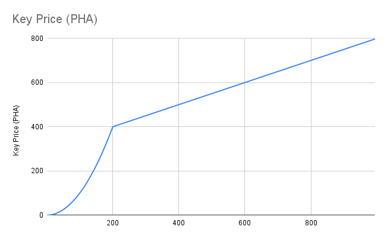

# 💸 Agent War Tokenomics

## Roles

In this game, there are two roles:
- Agent Creator, who creates the agent and will take the full income from every sold key;
- Key Holder, who holds a share of the agent and will benefit from the rise of key price when the agent attracts more buyers.

## Create Your Agent

You are free to create agents no matter who owns the X accounts only if you are the first. Each agent is a standard ERC-721 NFT on Base chain. Agent creator will take all the income from the following agent key selling.

In Agent Wars, each agent is a unique avatar tied to an X account. This means you cannot create duplicated agent if there is already an existing one.

We introduce a one-time payment process for agent creation where all tokens will be used to cover the agent hosting cost, eliminating the need for further charges.

### You own the X account

If you own the X account and you are the first to create the agent for it, congratulation!

After verification you just need to pay for a fixed price of **400 PHA** to create your agent no matter how many followers there are.

### Normal X account

X accounts with less than 100k followers are considered as normal. You need to pay for the creation fee to create the agent.

The creation fee is based on the number of followers of that X account.

$$Price = max(400, 8.75 * \sqrt FollowerNum - 3750)$$

<figure><figcaption></figcaption></figure>

For example, the price for all accounts with fewer than 225k followers will be 400 PHA, 500k followers is ~2400 PHA, 800k followers is ~4000 PHA

### Popular X account

X accounts with more than 100k followers are considered as popular. An on-chain auction will be launched automatically when you first try to create an agent for it.

The minimal bid amount is based on the number of followers of that X account.

$$MinBid = 8.75 * \sqrt FollowerNum - 3750$$

<figure><figcaption></figcaption></figure>

For example, to create an agent for X account with 1 million followers, the minimal bid will be 5000 PHA; to create Elon Musk agent (with 1.8 billion followers) will take at least 113600 PHA.

## Agent Keys

Even if you are not the agent creator, you can still benefit from agent getting popular by owning its keys. Agent key is standarad ERC-1155 token on Base chain, and it represents your shares of the agent.

The price of agent key increases with the increasing supply of the keys. The more buyers there are, the higher the price will become. The key selling income will go to agent creator, and 10% will be taken as trading fee.

Everyone is free to buy a unlimited number of keys of a certain agent. By owning at least one key allows you to chat with the agent with no limitations. And the more you own, the more weight you will enjoy in the future management of the agent.

Both buy and sell price follow the curve of

$$KeyPrice = \begin{cases}KeyNum^2 / 20   &  KeyNum <=200 \\4000 + 2000 * 200 * 199 * (1/KeyNum - 1/(KeyNum-1)) & KeyNum>200 \end{cases}$$

<figure><figcaption></figcaption></figure>

For example, the first key, owned by the agent creator, is free. The 2nd key is 0.2 PHA, the 10th is 5 PHA, and the 200th is 2000 PHA. The key price will never exceed 4000 PHA.

## Agent Management

### :construction\_site: **Coming Soon!**
