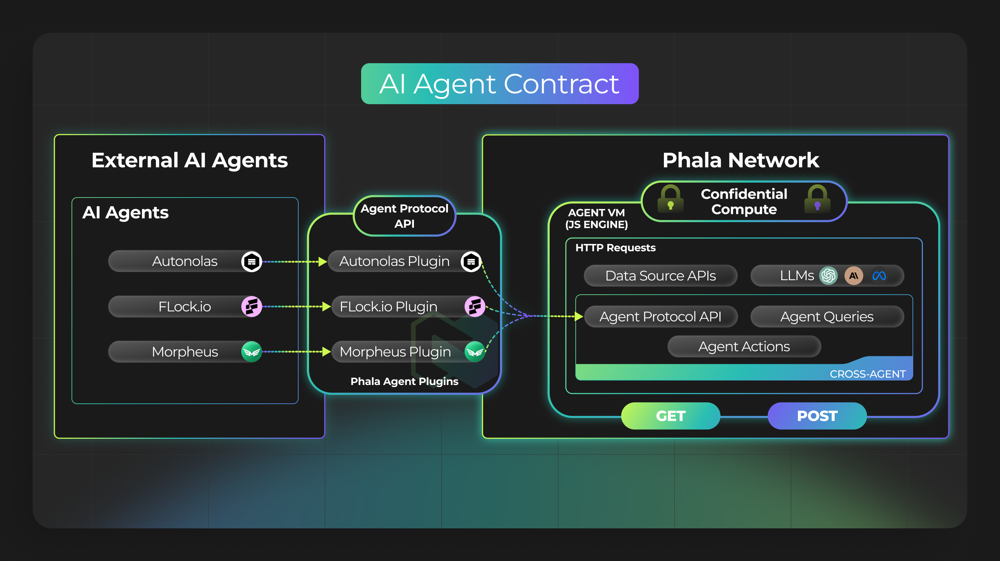

# 🧙‍♂️ Examples


**WARNING**

This section is no longer recommended for deploying on Phala. To build and deploy securely and efficiently, please use the fully managed [Phala Cloud](https://cloud.phala.network) platform instead. Check out the doc on how to [get started](../../cloud/getting-started/getting-started.md).


In this section, you will learn to build:

* Agent Plugins to connect your external AI Agents to an AI Agent Contract.

<figure><figcaption></figcaption></figure>

* Custom Data Source (Retrieval) Agents to aggregate data from external APIs.
* Handling Secrets and Queries for HTTP **GET** and **POST.**
