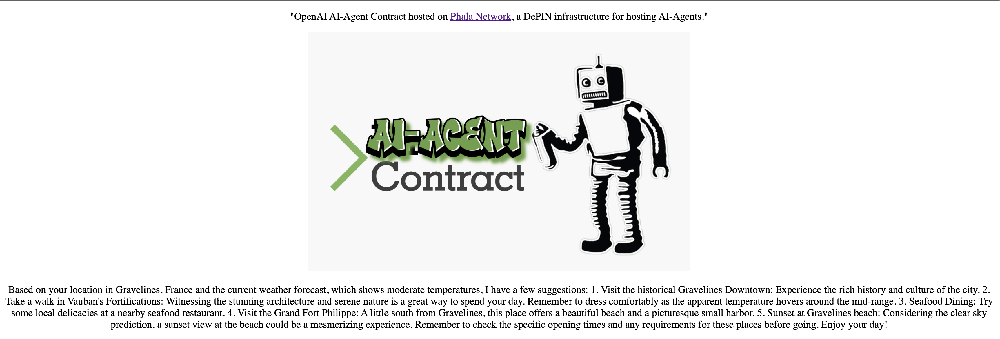

# Integrate with 3rd Party API with HTTP Request

Now that we have been able to deploy a couple of template AI Agents, let's connect our AI Agent to a 3rd party API through HTTP request. We will use the [OpenAI AI Agent Contract](build-your-ai-agent-contract-with-openai.md) for this example.


View the example code [here](https://github.com/HashWarlock/ai-agent-template-hello). The code is based on the [guide](https://cookbook.openai.com/examples/how\_to\_build\_an\_agent\_with\_the\_node\_sdk) on how to build an agent from the OpenAI Cookbook.


## Overview

In this tutorial, you will learn how to create an agent with 2 functions to enable [function calling](https://platform.openai.com/docs/guides/function-calling) for your agent. The 2 functions we will implement are:

* `getLocation()`  - Get the current location (latitude, longitude) based on the IP of the worker node if no location is described in the user prompt.
* `getWeatherData(latitude, longitude)` - Get the current weather data based on the latitude and longitude retrieved from `getLocation()`.&#x20;

These two functions will be described for your agent to understand the purpose of the functions. Then we will set the system prompt for the agent with:

```
You are a helpful assistant. Only use the functions you have been provided with.
```

## Getting Started

### Prepare

Clone git repo or use [degit](https://www.npmjs.com/package/degit) to get the source code.



```sh
git clone https://github.com/Phala-Network/ai-agent-template-openai.git
```



```sh
npx degit github:Phala-Network/ai-agent-template-openai#main ai-agent-template-openai
```



Install dependencies

```
npm install
```

## Creating Your Functions

In this step, we will create our 2 functions `getLocation()` and `getWeatherData(latitude, longitude)` then we will describe our functions for the agent to understand how to use the functions.

Go to your `src/index.ts` file, your initial file should look like the following.

<details>

<summary>src/index.ts</summary>

```typescript
import { Request, Response, route } from './httpSupport'
import { renderHtml } from './uiSupport'

import OpenAI from 'openai'

async function GET(req: Request): Promise<Response> {
    const secret = req.queries?.key ?? '';
    const openaiApiKey = req.secret?.openaiApiKey as string;
    const openai = new OpenAI({ apiKey: openaiApiKey })
    const query = req.queries.chatQuery[0] as string;

    const completion = await openai.chat.completions.create({
        messages: [{ role: "system", content: `${query}` }],
        model: 'gpt-3.5-turbo',
    });

    return new Response(renderHtml(completion.choices[0].message.content as string))
}

async function POST(req: Request): Promise<Response> {
    const secret = req.queries?.key ?? '';
    const openaiApiKey = req.secret?.openaiApiKey as string;
    const openai = new OpenAI({ apiKey: openaiApiKey })
    const query = req.queries.chatQuery[0] as string;

    const completion = await openai.chat.completions.create({
        messages: [{ role: "system", content: `${query}` }],
        model: 'gpt-3.5-turbo',
    });

    return new Response(renderHtml(completion.choices[0].message.content as string))
}

export default async function main(request: string) {
    return await route({ GET, POST }, request)
}
```

</details>

### Create getLocation()

For the `getLocation()` function, we will need to call an API to get the location based on [https://ipapi.co/](https://ipapi.co/). Traditionally, devs will not have access to the internet, but with Phala's AI Agent Contracts, devs now can make async HTTP calls to bring more data for fine tuning their agents.&#x20;

The implementation is simple and we will add this following code.

```typescript
async function getLocation() {
    const response = await fetch("https://ipapi.co/json/");
    const locationData = await response.json();
    return locationData;
}
```

### Create getWeatherData(latitude, longitude)

For the getWeatherData(latitude, longitude) function, we will call the free weather API by [https://open-meteo.com/](https://open-meteo.com/).&#x20;

We will add the following code to our `index.ts` file.

```typescript
async function getCurrentWeather(latitude: any, longitude: any) {
    const url = `https://api.open-meteo.com/v1/forecast?latitude=${latitude}&longitude=${longitude}&hourly=apparent_temperature`;
    const response = await fetch(url);
    const weatherData = await response.json();
    return weatherData;
}
```

### Describe Functions

For our OpenAI agent to understand the purpose of these functions, we need to describe them using a specific schema. We'll create an array called `tools` that contains one object per function. Each object will have two keys: `type`, `function`, and the `function` key has three subkeys: `name`, `description`, and `parameters`.

```typescript
const tools = [
    {
        type: "function",
        function: {
            name: "getCurrentWeather",
            description: "Get the current weather in a given location",
            parameters: {
                type: "object",
                properties: {
                    latitude: {
                        type: "string",
                    },
                    longitude: {
                        type: "string",
                    },
                },
                required: ["longitude", "latitude"],
            },
        }
    },
    {
        type: "function",
        function: {
            name: "getLocation",
            description: "Get the user's location based on their IP address",
            parameters: {
                type: "object",
                properties: {},
            },
        }
    },
];

const availableTools = {
    getCurrentWeather,
    getLocation,
};
```

## Add Agent Functionality

### Setup Messages for Agent

We need to define a `messages` array. This will keep track of all of the messages back and forth between our app and OpenAI. Here we create a type `MessageInfo` that will be the fields that may be included in the `messages` array.

The first object in the array should always have the `role` property set to `"system"`, which tells OpenAI that this is how we want it to behave.

```typescript
type MessageInfo = {
    role: any,
    content: any,
    name?: any,
}

const messages: MessageInfo[] = [
    {
        role: "system",
        content: `You are a helpful assistant. Only use the functions you have been provided with.`,
    },
];
```

### Create Agent Function For User Input

We are now ready to build the logic of our app, which lives in the `agent` function. It is asynchronous and takes one argument: the `userInput`.

We start by pushing the `userInput` to the messages array. This time, we set the `role` to `"user"`, so that OpenAI knows that this is the input from the user.

```typescript
async function agent(openai, userInput) {
  messages.push({
    role: "user",
    content: userInput,
  });
  const response = await openai.chat.completions.create({
    model: "gpt-4",
    messages: messages,
    tools: tools,
  });
  console.log(response);
}
```

Next, we'll send a request to the Chat completions endpoint via the `chat.completions.create()` method in the Node SDK. This method takes a configuration object as an argument. In it, we'll specify three properties:

* `model` - Decides which AI model we want to use (in our case, GPT-4).
* `messages` - The entire history of messages between the user and the AI up until this point.
* `tools` - A list of tools the model may call. Currently, only functions are supported as a tool., we'll we use the `tools` array we created earlier.

### Turn OpenAI Agent Response into Functions

Now that we have the name of the function as a string, we'll need to translate that into a function call. To help us with that, we'll gather both of our functions in an object called `availableTools`:

```typescript
const availableTools = {  getCurrentWeather,  getLocation,};
```

This is handy because we'll be able to access the `getLocation` function via bracket notation and the string we got back from OpenAI, like this: `availableTools["getLocation"]`.

```typescript
const { finish_reason, message } = response.choices[0]; 
if (finish_reason === "tool_calls" && message.tool_calls) {  
    const functionName = message.tool_calls[0].function.name;  
    const functionToCall = availableTools[functionName];  
    const functionArgs = JSON.parse(message.tool_calls[0].function.arguments);  
    const functionArgsArr = Object.values(functionArgs);  
    const functionResponse = await functionToCall.apply(null, functionArgsArr);  
    console.log(functionResponse);
}
```

We're also grabbing ahold of any arguments OpenAI wants us to pass into the function: `message.tool_calls[0].function.arguments`. However, we won't need any arguments for this first function call.

If we run the code again with the same input (`"Where am I located right now?"`), we'll see that `functionResponse` is an object filled with location about where the user is located right now. In my case, that is Oslo, Norway.

```bash
{ip: "193.212.60.170", network: "193.212.60.0/23", version: "IPv4", city: "Oslo", region: "Oslo County", region_code: "03", country: "NO", country_name: "Norway", country_code: "NO", country_code_iso3: "NOR", country_capital: "Oslo", country_tld: ".no", continent_code: "EU", in_eu: false, postal: "0026", latitude: 59.955, longitude: 10.859, timezone: "Europe/Oslo", utc_offset: "+0200", country_calling_code: "+47", currency: "NOK", currency_name: "Krone", languages: "no,nb,nn,se,fi", country_area: 324220, country_population: 5314336, asn: "AS2119", org: "Telenor Norge AS"}
```

We'll add this data to a new item in the `messages` array, where we also specify the name of the function we called.

```typescript
messages.push({
  role: "function",
  name: functionName,
  content: `The result of the last function was this: ${JSON.stringify(
    functionResponse
  )}
  `,
});
```

Notice that the `role` is set to `"function"`. This tells OpenAI that the `content` parameter contains the result of the function call and not the input from the user.

At this point, we need to send a new request to OpenAI with this updated `messages` array. However, we don’t want to hard code a new function call, as our agent might need to go back and forth between itself and GPT several times until it has found the final answer for the user.

This can be solved in several different ways, e.g. recursion, a while-loop, or a for-loop. We'll use a good old for-loop for the sake of simplicity.&#x20;

### Creating The Loop

At the top of the `agent` function, we'll create a loop that lets us run the entire procedure up to five times.

If we get back `finish_reason: "tool_calls"` from GPT, we'll just push the result of the function call to the `messages` array and jump to the next iteration of the loop, triggering a new request.

If we get `finish_reason: "stop"` back, then GPT has found a suitable answer, so we'll return the function and cancel the loop.

```typescript
for (let i = 0; i < 5; i++) {
  const response = await openai.chat.completions.create({
    model: "gpt-4",
    messages: messages,
    tools: tools,
  });
  const { finish_reason, message } = response.choices[0];
 
  if (finish_reason === "tool_calls" && message.tool_calls) {
    const functionName = message.tool_calls[0].function.name;
    const functionToCall = availableTools[functionName];
    const functionArgs = JSON.parse(message.tool_calls[0].function.arguments);
    const functionArgsArr = Object.values(functionArgs);
    const functionResponse = await functionToCall.apply(null, functionArgsArr);
 
    messages.push({
      role: "function",
      name: functionName,
      content: `
          The result of the last function was this: ${JSON.stringify(
            functionResponse
          )}
          `,
    });
  } else if (finish_reason === "stop") {
    messages.push(message);
    return message.content;
  }
}
return "The maximum number of iterations has been met without a suitable answer. Please try again with a more specific input.";
```

If we don't see a `finish_reason: "stop"` within our five iterations, we'll return a message saying we couldn’t find a suitable answer.

## Update GET() and POST()

Now we need to call our `agent(openai, userInput)` in our `GET` and `POST` calls that will pass in a users prompt that can be accessed in the `chatQuery` property. The code change is minimial and our functions look like the following.

```typescript
async function GET(req: Request): Promise<Response> {
    const secret = req.queries?.key ?? '';
    const openaiApiKey = req.secret?.openaiApiKey as string;
    const openai = new OpenAI({ apiKey: openaiApiKey })
    const query = req.queries.chatQuery[0] as string;

    const response = await agent(openai, query);

    return new Response(renderHtml(response as string))
}

async function POST(req: Request): Promise<Response> {
    const secret = req.queries?.key ?? '';
    const openaiApiKey = req.secret?.openaiApiKey as string;
    const openai = new OpenAI({ apiKey: openaiApiKey })
    const query = req.queries.chatQuery[0] as string;

    const response = await agent(openai, query);

    return new Response(renderHtml(response as string))
}
```

## Test Locally

Now that we have the code implemented to interact with APIs and call the functions, let's test the code locally. You will need to setup your `.env` file with your OpenAI API Key.

Create `.env` file and add your OpenAI API Key

```
cp .env.local .env
```

In `.env` file replace `YOUR_OPENAI_KEY` with your API Key

```
OPENAI_API_KEY="YOUR_OPENAI_KEY"
```

Build your Agent

```
npm run build
```

Test your Agent locally

```
npm run test
```

Expected output:

```bash

> phat-gpt-template@0.0.1 test
> tsx src/test.ts

INPUT: {"method":"GET","path":"/ipfs/QmVHbLYhhYA5z6yKpQr4JWr3D54EhbSsh7e7BFAAyrkkMf","queries":{"chatQuery":["Please suggest some activities based on my location and the weather."]},"secret":{"openaiApiKey":"OPENAI_API_KEY"},"headers":{}}
GET RESULT: {
  status: 200,
  body: '\n' +
    '    <!DOCTYPE html>\n' +
    '    <html lang="en">\n' +
    '        <head>\n' +
    '            <meta charset="utf-8" />\n' +
    '            <title>AI-Agent Contract Demo UI</title>\n' +
    '        </head>\n' +
    '        <body>\n' +
    '            <div align="center">\n' +
    '                <p>"OpenAI AI-Agent Contract hosted on <a href="https://github.com/Phala-Network/ai-agent-template-openai">Phala Network</a>, a DePIN infrastructure for hosting AI-Agents."</p>\n' +
    '                \n' +
    '                <p>Based on your location in Chicago, Illinois and the current weather of an apparent temperature around 25°C, I would recommend these activities:\n' +
    '\n' +
    '1. Visit the Navy Pier: Enjoy the beautiful view of Lake Michigan, take a ride on the Centennial Wheel or enjoy a nice meal at one of the restaurants.\n' +
    '\n' +
    "2. Spend time in Millennium Park: With the weather being nice, it's a perfect day for a picnic. Plus, you can see the famous Cloud Gate sculpture!\n" +
    '\n' +
    '3. Walk along the Chicago Riverwalk: This pedestrian trail along the bank of the Chicago River offers a variety of restaurants, bars, and urban attractions.  \n' +
    '\n' +
    '4. Explore the Art Institute of Chicago: If you prefer indoor activities, you might enjoy visiting this world-renowned art museum. \n' +
    '\n' +
    'Remember to stay hydrated and wear comfortable footwear for walking around. Enjoy your day!</p>\n' +
    '            </div>\n' +
    '        </body>\n' +
    '    </html>',
  headers: {
    'Content-Type': 'text/html; charset=UTF-8',
    'Access-Control-Allow-Origin': '*'
  }
}

INPUT: {"method":"POST","path":"/ipfs/QmVHbLYhhYA5z6yKpQr4JWr3D54EhbSsh7e7BFAAyrkkMf","queries":{"chatQuery":["When did humans land on the moon?"],"openAiModel":["gpt-4o"]},"secret":{"openaiApiKey":"OPENAI_API_KEY"},"headers":{},"body":"{\"untrustedData\":{\"fid\":2,\"url\":\"https://fcpolls.com/polls/1\",\"messageHash\":\"0xd2b1ddc6c88e865a33cb1a565e0058d757042974\",\"timestamp\":1706243218,\"network\":1,\"buttonIndex\":2,\"castId\":{\"fid\":226,\"hash\":\"0xa48dd46161d8e57725f5e26e34ec19c13ff7f3b9\"}},\"trustedData\":{\"messageBytes\":\"d2b1ddc6c88e865a33cb1a565e0058d757042974...\"}}"}
POST RESULT: {
  status: 200,
  body: 'Not Implemented',
  headers: {
    'Content-Type': 'text/html; charset=UTF-8',
    'Access-Control-Allow-Origin': '*'
  }
}

To test in the SideVM playground go to https://phat.phala.network/contracts/view/0xf0a398600f02ea9b47a86c59aed61387e450e2a99cb8b921cd1d46f734e45409

Connect you polkadot.js account and select 'run_js' with the parameters:
- engine: SidevmQuickJSWithPolyfill
- js_code: Source code text of dist/index.ts
- args: {"method":"GET","path":"/ipfs/QmVHbLYhhYA5z6yKpQr4JWr3D54EhbSsh7e7BFAAyrkkMf","queries":{"chatQuery":["Who are you?"],"openAiModel":["gpt-4o"]},"secret":{"openaiApiKey":"OPENAI_API_KEY"},"headers":{}}
Watch video here for to see the visual steps of testing in Sidevm playground: https://www.youtube.com/watch?v=fNqNeLfFFME

Make sure to replace queries and secret with your values compatible with your AI Agent Contract.
```

#### Test in Sidevm Playground



## Publish & Interact with Agent

With our test passing and everything working as expected, now we can build and publish our agent code to IPFS. Then we will set our secrets and access our deployed agent via the Phala Gateway at https://agents.phala.network/ipfs/\<cid>?key=\<key\_id>\&chatQuery=\<chat\_query>.

Upload your compiled AI Agent code to IPFS.

```bash
npm run publish-agent
```

Upon a successful upload, the command should show the URL to access your AI Agent.

```
> phat-gpt-template@0.0.1 publish-agent
> phat-fn build --experimentalAsync && tsx scripts/publish.ts

✓ Compiled successfully.
  72.73 KB  dist/index.js

    $$\     $$\       $$\                 $$\                         $$\       
    $$ |    $$ |      \__|                $$ |                        $$ |      
  $$$$$$\   $$$$$$$\  $$\  $$$$$$\   $$$$$$$ |$$\  $$\  $$\  $$$$$$\  $$$$$$$\  
  \_$$  _|  $$  __$$\ $$ |$$  __$$\ $$  __$$ |$$ | $$ | $$ |$$  __$$\ $$  __$$\ 
    $$ |    $$ |  $$ |$$ |$$ |  \__|$$ /  $$ |$$ | $$ | $$ |$$$$$$$$ |$$ |  $$ |
    $$ |$$\ $$ |  $$ |$$ |$$ |      $$ |  $$ |$$ | $$ | $$ |$$   ____|$$ |  $$ |
    \$$$$  |$$ |  $$ |$$ |$$ |      \$$$$$$$ |\$$$$$\$$$$  |\$$$$$$$\ $$$$$$$  |
     \____/ \__|  \__|\__|\__|       \_______| \_____\____/  \_______|\_______/ 

 💎 thirdweb v0.14.12 💎

- Uploading file to IPFS. This may take a while depending on file sizes.

✔ Successfully uploaded file to IPFS.
✔ Files stored at the following IPFS URI: ipfs://QmayeZxHXwJxABXaNshP6j8uBE6RedkhmEgiaXd1w1Jib3
✔ Open this link to view your upload: https://bafybeif3y2jpswse2n6s2cikwyjmbak4cxlpm6vrmgobqkgsmmn34l6m4i.ipfs.cf-ipfs.com/

AI Agent Contract deployed at: https://agents.phala.network/ipfs/QmayeZxHXwJxABXaNshP6j8uBE6RedkhmEgiaXd1w1Jib3

Make sure to add your secrets to ensure your AI-Agent works properly.
```

### Add Secret

The steps to add a `secret` is simple. We will add the [OpenAI](https://platform.openai.com/docs/quickstart?context=node) API Key in this example by creating a secret JSON object with the `openaiApiKey`:

```json
{"openaiApiKey": "<OPENAI_API_KEY>"}
```

Then in your frame code, you will be able to access the secret key via `req.secret` object:

```js
async function GET(req: Request): Promise<Response> {
    const apiKey = req.secret?.openaiApiKey
}
```

**Note**: Before continuing, make sure to publish your compiled AI Agent JS code, so you can add secrets to the CID.

**Open terminal** Use `curl` to `POST` your secrets to `https://agents.phala.network/vaults`. Replace `IPFS_CID` with the CID to the compile JS code in IPFS, and replace `<OPENAI_API_KEY>` with your OpenAI API key.

> Note that you can name the secret field name something other than `openaiApiKey`, but you will need to access the key in your `index.ts` file with the syntax `req.secret?.<your-secret-field-name> as string`

The command will look like this:

```shell
curl https://agents.phala.network/vaults -H 'Content-Type: application/json' -d '{"cid": "QmRZe6yKPpWWkTgkcuc71JT8cACnXHsiiS8CFhdWeHaa6d", "data": {"openaiApiKey": "<OPENAI_API_KEY>"}}'
# Output:
# {"token":"2f9991bfab0bcb46","key":"2cbc7c951b84b9b4","succeed":true}
```

The API returns a `token` and a `key`. The `key` is the id of your secret. It can be used to specify which secret you are going to pass to your frame. The `token` can be used by the developer to access the raw secret. You should never leak the `token`.

To verify the secret, run the following command where `key` and `token` are replaced with the values from adding your `secret` to the vault.

```shell
curl https://agents.phala.network/vaults/<key>/<token>
```

Expected output:

```shell
{"data":{"openaiApiKey":"<OPENAI_API_KEY>"},"succeed":true}
```

### Access Queries

To help create custom logic, we have an array variable named `queries` that can be accessed in the `Request` class. To access the `queries` array variable `chatQuery` value at index `0`, the syntax will look as follows:

```
const query = req.queries.chatQuery[0] as string;
```

The example at [https://agents.phala.network/ipfs/QmRZe6yKPpWWkTgkcuc71JT8cACnXHsiiS8CFhdWeHaa6d?key=2cbc7c951b84b9b4\&chatQuery=Please%20suggest%20some%20activities%20based%20on%20my%20location%20and%20the%20weather.](https://frames.phatfn.xyz/ipfs/QmRZe6yKPpWWkTgkcuc71JT8cACnXHsiiS8CFhdWeHaa6d?key=2cbc7c951b84b9b4\&chatQuery=Please%20suggest%20some%20activities%20based%20on%20my%20location%20and%20the%20weather.) will have a value of `Please suggest some activities based on my location and the weather`. `queries` can have any field name, so `chatQuery` is just an example of a field name and not a mandatory name, but remember to update your `index.ts` file logic to use your expected field name.

### Query Your Deployed Agent

Now that your agent is deployed, you can access the agent through a `curl` request or insert the url with the `key` and `chatQuery` defined. Here is an example of the code from the tutorial we just walked through.

<figure><figcaption></figcaption></figure>

Example: [https://agents.phala.network/ipfs/QmRZe6yKPpWWkTgkcuc71JT8cACnXHsiiS8CFhdWeHaa6d?key=2cbc7c951b84b9b4\&chatQuery=Please%20suggest%20some%20activities%20based%20on%20my%20location%20and%20the%20weather.](https://frames.phatfn.xyz/ipfs/QmRZe6yKPpWWkTgkcuc71JT8cACnXHsiiS8CFhdWeHaa6d?key=2cbc7c951b84b9b4\&chatQuery=Please%20suggest%20some%20activities%20based%20on%20my%20location%20and%20the%20weather.)
