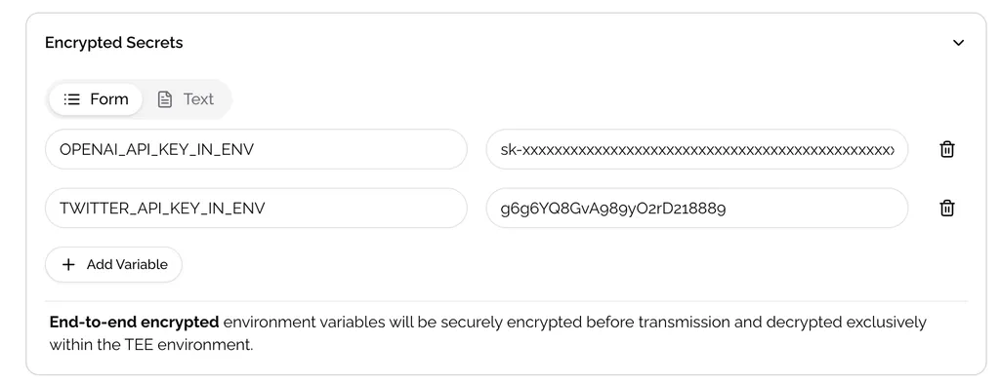

# Set Secure Environment Variables

## Best Practices for Environment Variables

When your application requires environment variables, **never set them directly in the Docker Compose file**. Instead, use the **Encrypted Secrets** section to ensure your sensitive data remains secure.

### Configuration Steps

1. **Declare Environment Variables in Docker Compose**

   Define your environment variables in the Docker Compose file using variable substitution:
   
   ```yaml
   services:
     your-service:
       environment:
         - OPENAI_API_KEY=${OPENAI_API_KEY_IN_ENV}
         - TWITTER_API_KEY=${TWITTER_API_KEY_IN_ENV}
   ```
   
   > **Important:** Do not use double quotation marks around variables:  
   > ❌ `OPENAI_API_KEY="${OPENAI_API_KEY_IN_ENV}"`

2. **Set Values in Encrypted Secrets**

   Configure the actual values in the **Encrypted Secrets** section of the Cloud UI.

<figure><figcaption>Encrypted Secrets configuration interface</figcaption></figure>

We recommend using **Text** type for environment variables if you have many variables to set.
