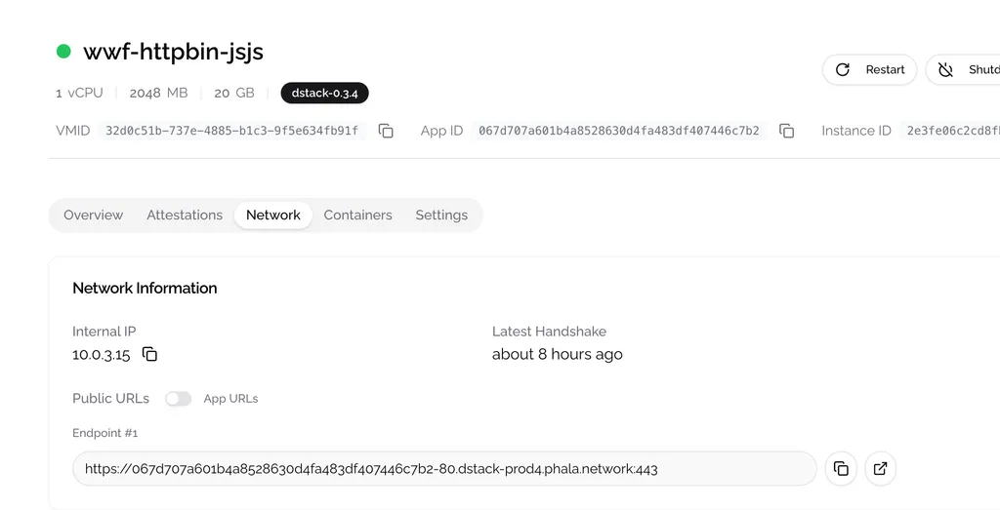

# Access Your Applications

To export your service publicly, you need to configure the PORT exposing when deploying your application. After deployment, click **View Details** in the top-right corner of the CVM instance card and switch to the **Network** tab below. You will see the list of **Endpoint** there. These URLs are generated automatically by parsing the PORT configurations in the Docker Compose file. The format for the URL prefix is `<app id or instance id>-<port>.<server cluster>.phala.network:443`.

<figure><figcaption></figcaption></figure>
