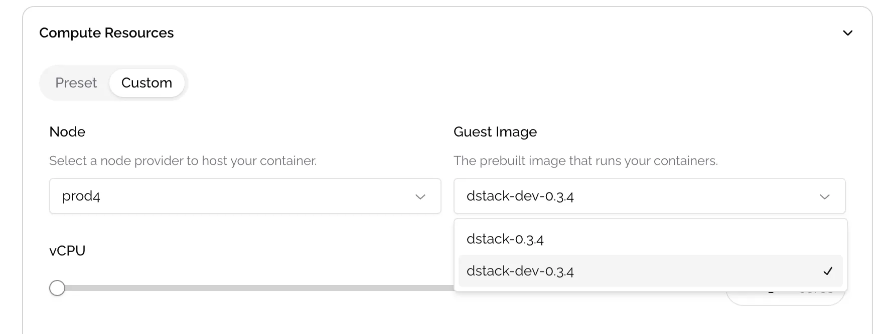

# Debug Your Application

When deploying your application on the Cloud UI, you can choose between two types of CVM base images: `dstack-<version>` and `dstack-dev-<version>`. The dev image allows you to log in to the CVM in the future for debugging purposes. If you opt for a non-dev image, rest assured that no one will have the ability to access your CVM, either physically or remotely.

<figure><figcaption></figcaption></figure>

For example, to enable the use of tool **ttypd** for logging into your CVM from a web browser, you need to add a ttypd service to your Docker Compose file as shown below:

```yaml
services:
  alpine-ttypd:
    build: .
    image: hackinglab/alpine-ttyd-bash:3.2
    environment:
    - AUTHOR=e1
    - HL_USER_USERNAME=root
    - HL_USER_PASSWORD=123QWEasd
    ports:
      - 7681:7681
    volumes:
      - /:/host
    network_mode: host
```

You can then view a specific endpoint for the ttypd service by navigating to "**View Details**" → "**Network**." When you open this endpoint in your browser, you will see a terminal interface. The next step is to install the **openssh-client**.

```bash
root@tdx:~ # **apk update && apk add openssh-client**

fetch https://dl-cdn.alpinelinux.org/alpine/v3.13/main/x86_64/APKINDEX.tar.gz
fetch https://dl-cdn.alpinelinux.org/alpine/v3.13/community/x86_64/APKINDEX.tar.gz
v3.13.12-98-g1d183746afa [https://dl-cdn.alpinelinux.org/alpine/v3.13/main]
v3.13.12-94-g0551adbecc [https://dl-cdn.alpinelinux.org/alpine/v3.13/community]
OK: 13906 distinct packages available
(1/3) Installing openssh-keygen (8.4_p1-r4)
(2/3) Installing libedit (20191231.3.1-r1)
(3/3) Installing openssh-client (8.4_p1-r4)
Executing busybox-1.32.1-r9.trigger
OK: 280 MiB in 92 packages
```

You can now log in to the CVM using the command `ssh root@localhost`. As shown below, you can retrieve information about running Docker containers by executing the command `docker ps -a` within the CVM.

```bash
root@tdx:~ # **ssh root@localhost**
The authenticity of host 'localhost (::1)' can't be established.
RSA key fingerprint is SHA256:NKeb2o6243Tj+3dRA9CdQXIwxtXFQFeBN/mJDfetMZk.
Are you sure you want to continue connecting (yes/no/[fingerprint])? yes
Warning: Permanently added 'localhost' (RSA) to the list of known hosts.
Welcome to Dstack!
root@tdx:~# 
root@tdx:~# **docker ps -a**
CONTAINER ID   IMAGE                             COMMAND                  CREATED          STATUS          PORTS                               NAMES
e011968e78d8   hackinglab/alpine-ttyd-bash:3.2   "/init"                  10 minutes ago   Up 10 minutes                                       tapp-alpine-ttypd-1
f7acac54add8   kennethreitz/httpbin:latest       "gunicorn -b 0.0.0.0…"   2 weeks ago      Up 10 minutes   0.0.0.0:80->80/tcp, :::80->80/tcp   tapp-httpbin-1
root@tdx:~# 
```
