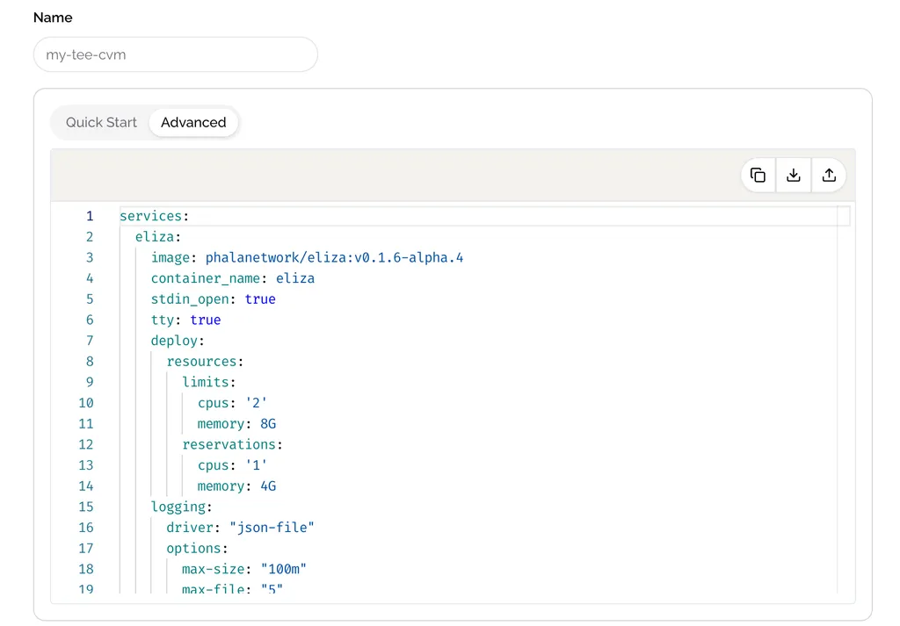

# Deploy with Docker Compose

Switch to the **Advanced** tab in the deployment section to edit the Docker Compose file. Deploying with Docker Compose on Phala TEE Cloud is the same as on a general server. You can specify the image name, such as **`image: phalanetwork/eliza:v0.1.6-alpha.4`**, and configure the **PORT** exposing. You can also configure multiple services within the same Docker Compose file, and these Docker containers will run inside the same CVM.

If you want to keep your Docker image private, we support private deployment. Check the **Deploy with Private Docker Image** section for more information.

<figure><figcaption></figcaption></figure>
