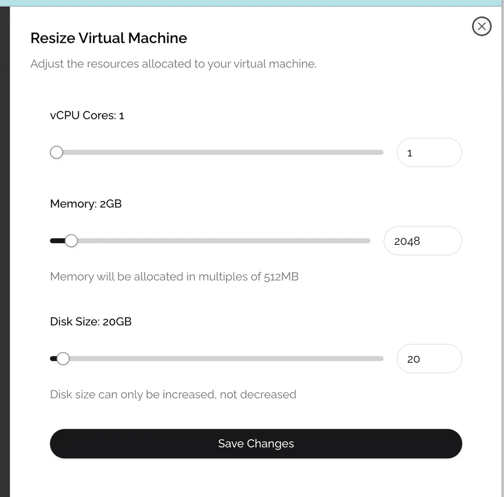

# Resizing CVM Resources

## Dynamic Resource Allocation

Phala TEE Cloud provides flexible compute resource management, allowing you to scale your application's resources up or down based on your needs.

## How to Resize Your CVM

1. Navigate to your CVM dashboard
2. Locate the CVM you wish to modify
3. Click the **Resize** button on the CVM card
4. Adjust the CPU, memory, and storage allocations using the sliders
5. Review the new configuration and pricing
6. Confirm your changes

<figure><figcaption></figcaption></figure>

## Important Considerations

- **Restart Required**: The resize operation will trigger a restart of your CVM
- **Downtime**: Your application will experience brief downtime during the resize process
- **Data Persistence**: All data stored in persistent volumes will be preserved during resizing
- **Billing Changes**: Resource adjustments will be reflected in your billing from the moment the resize completes

## Recommended Approach

For production applications, consider:
- Scheduling resize operations during low-traffic periods
- Testing your application with the new resource configuration in a staging environment first
- Monitoring application performance after resizing to ensure optimal resource allocation
