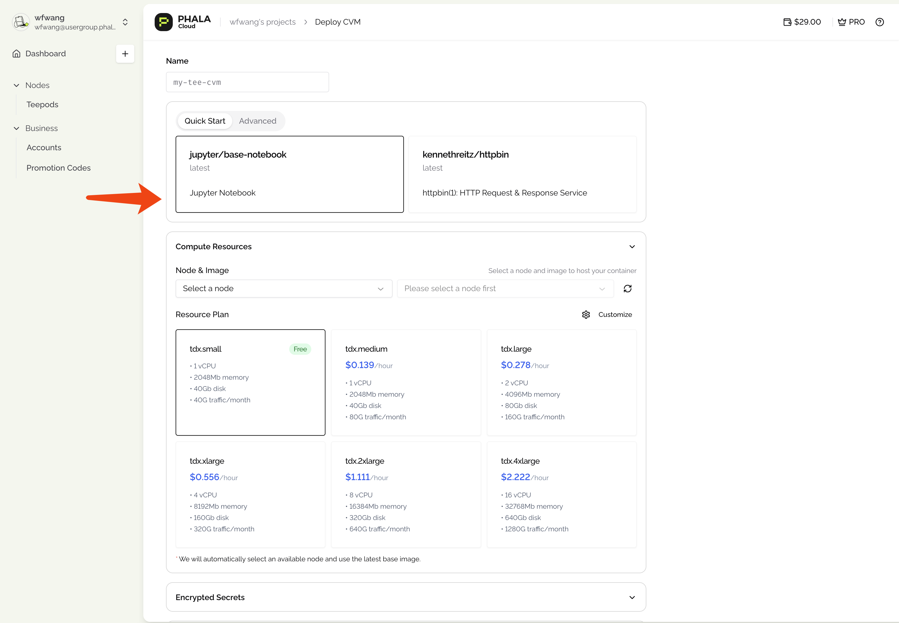
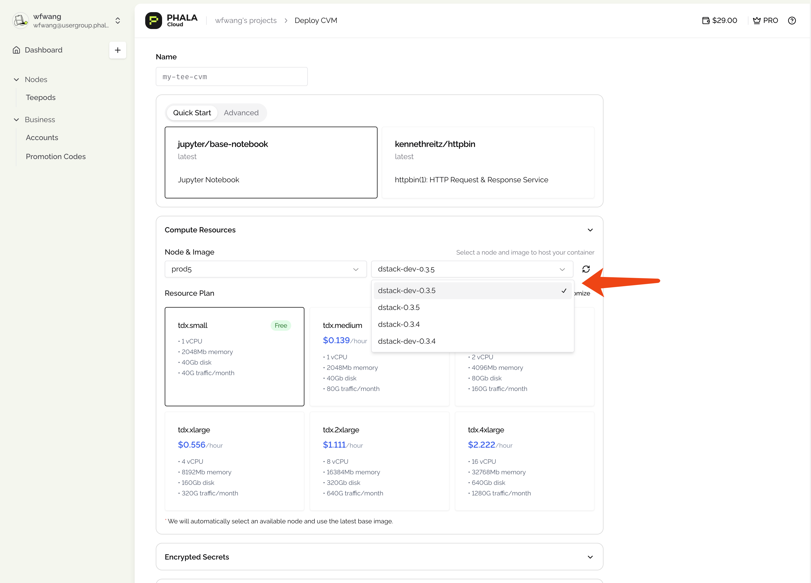
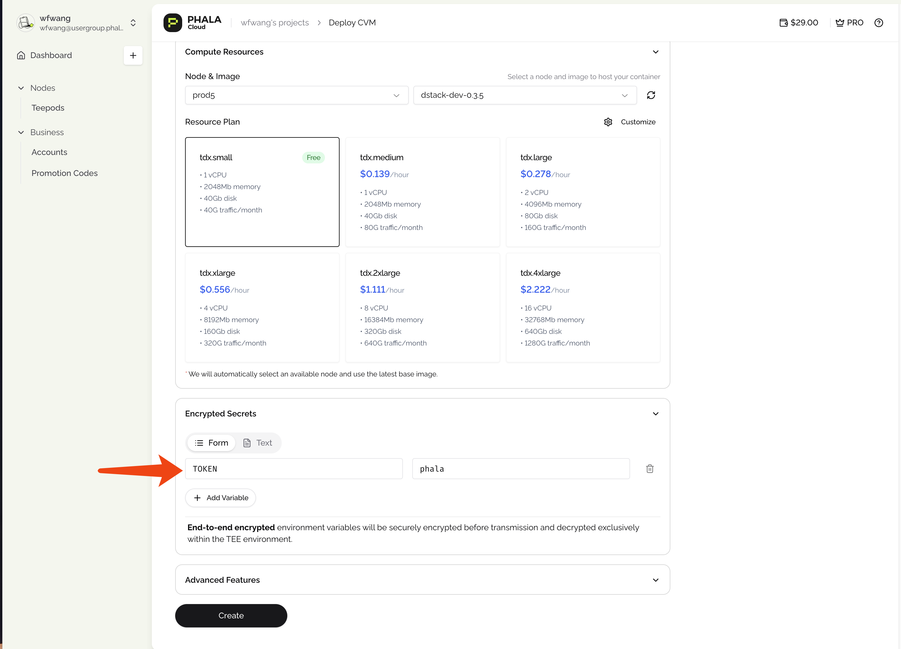
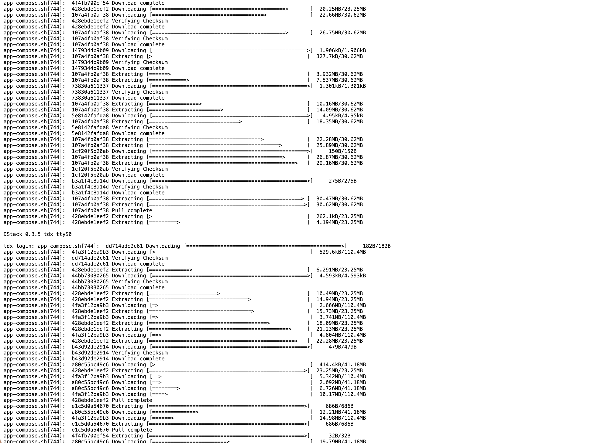
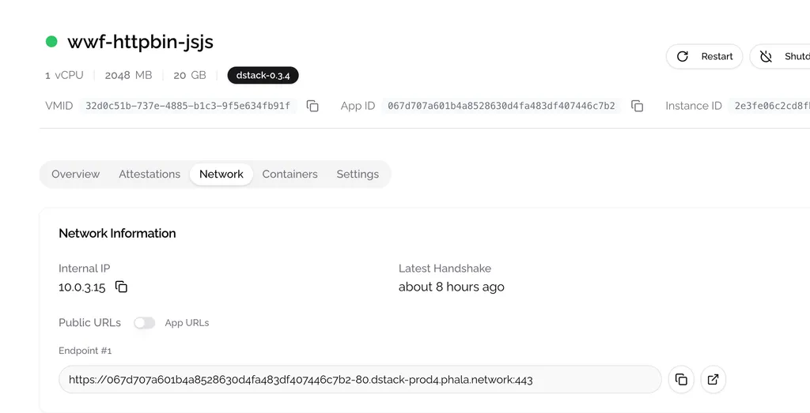
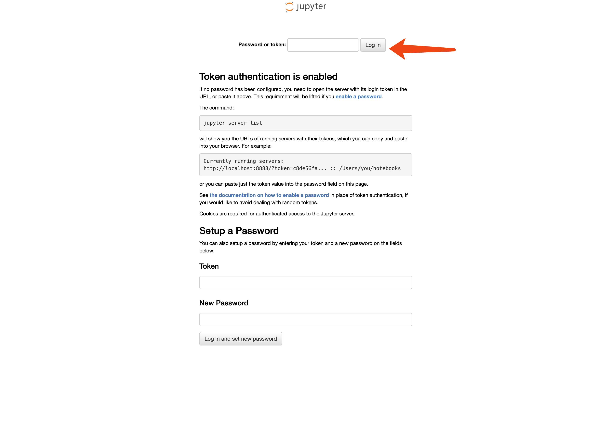
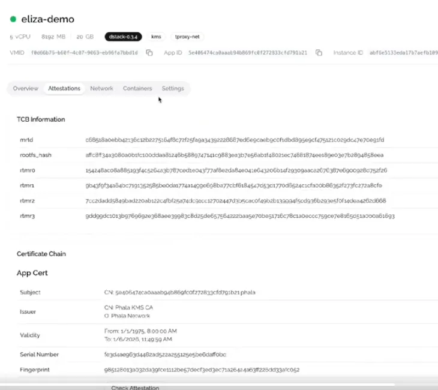

# Start from Cloud UI


Make sure you have gone through the [Sign-up for Cloud Account](sign-up-for-cloud-account.md) section before continuing.


## Step 1- Create a CVM with Template

Click the **Deploy** -> **From Docker Compose** in the top-right corner of the cloud [homepage](https://cloud.phala.network/register?invite=PHALAWIKI) to access the deployment dashboard. Once there, you need to:

1. Set your application name
2.  Choose a template you want to get started or use your Docker compose file by navigate to **Advanced** tab. In this guide, we will use the template **`jupyter/base-notebook`** for example.

    <figure><figcaption></figcaption></figure>
3.  Choose the compute resources. There are some preset plans available, or you can customize them for more flexibility. In **Node & Image** section, we recommend choosing **dstack-dev-** as guest image if you are deploying for testing. It will enable the debug feature that you can login to the virtual machine in the future.

    <figure><figcaption></figcaption></figure>
4.  Set the environment variables. In this guide, we will set the environment variable **`TOKEN`** to **`phala`** for testing. Later you will use this token to login to the notebook.

    <figure><figcaption></figcaption></figure>
5.  Click the **Create** button to start the deployment process. You will need to wait for a while as the backend sets everything up. In the meantime, you can view the CVM bootstrap logs by clicking the top-right icon in CVM card, and choose **Serial Logs**. Note this is the logs of confidential virtual machine, not your application logs.

    <figure><figcaption></figcaption></figure>
6.  After the deployment is complete, navigate through **View Details → Network** to see the endpoint information. You can use these endpoints to access the application if you have service serve on. You will find the endpoint is composed of application id and port. In this example, which is https://7ea38363423bf111180406f5c37c40fa48482d40-**8080**.dstack-prod5.phala.network, the application id is **7ea38363423bf111180406f5c37c40fa48482d40** and the port is **8080**. The reason why we have a port number **8080** here is that the default port of jupyter notebook is 8888, but we configure the port mapping to 8080 in the docker compose file. You can check the docker compose file in **Compose File** tab and you will find **ports:\n - 8080:8888** in the Compose File content.

    <figure><figcaption></figcaption></figure>

    If you access the endpoint, you will see the jupyter notebook interface. Type the token you set in the previous step and you will be able to access the jupyter notebook.

    <figure><figcaption></figcaption></figure>

    If you want to view the logs of your application, you can switch to **Containers** tab and click **View Logs** to view container logs. For example, the logs of the container **jupyter** are as follows:

    ```
    2025-03-04T03:18:05.828657314Z Entered start.sh with args: start-notebook.sh --NotebookApp.token=phala
    2025-03-04T03:18:05.842663875Z Running hooks in: /usr/local/bin/start-notebook.d as uid: 0 gid: 0
    2025-03-04T03:18:05.842682502Z Done running hooks in: /usr/local/bin/start-notebook.d
    2025-03-04T03:18:05.856699933Z Granting jovyan passwordless sudo rights!
    2025-03-04T03:18:05.864340938Z Running hooks in: /usr/local/bin/before-notebook.d as uid: 0 gid: 0
    2025-03-04T03:18:05.864358165Z Sourcing shell script: /usr/local/bin/before-notebook.d/10activate-conda-env.sh
    2025-03-04T03:18:06.527587460Z Done running hooks in: /usr/local/bin/before-notebook.d
    2025-03-04T03:18:06.527720112Z Running as jovyan: start-notebook.sh --NotebookApp.token=phala
    2025-03-04T03:18:06.542227731Z WARNING: Use start-notebook.py instead
    2025-03-04T03:18:07.221798177Z [I 2025-03-04 03:18:07.221 ServerApp] jupyter_lsp | extension was successfully linked.
    2025-03-04T03:18:07.225295903Z [I 2025-03-04 03:18:07.225 ServerApp] jupyter_server_terminals | extension was successfully linked.
    2025-03-04T03:18:07.226629073Z [W 2025-03-04 03:18:07.226 LabApp] 'token' has moved from NotebookApp to ServerApp. This config will be passed to ServerApp. Be sure to update your config before our next release.
    2025-03-04T03:18:07.228942619Z [W 2025-03-04 03:18:07.228 ServerApp] ServerApp.token config is deprecated in 2.0. Use IdentityProvider.token.
    2025-03-04T03:18:07.229062498Z [I 2025-03-04 03:18:07.229 ServerApp] jupyterlab | extension was successfully linked.
    2025-03-04T03:18:07.231919391Z [I 2025-03-04 03:18:07.231 ServerApp] nbclassic | extension was successfully linked.
    2025-03-04T03:18:07.235213471Z [I 2025-03-04 03:18:07.235 ServerApp] notebook | extension was successfully linked.
    2025-03-04T03:18:07.236333327Z [I 2025-03-04 03:18:07.236 ServerApp] Writing Jupyter server cookie secret to /home/jovyan/.local/share/jupyter/runtime/jupyter_cookie_secret
    2025-03-04T03:18:07.433001809Z [I 2025-03-04 03:18:07.432 ServerApp] notebook_shim | extension was successfully linked.
    2025-03-04T03:18:07.447337226Z [W 2025-03-04 03:18:07.447 ServerApp] WARNING: The Jupyter server is listening on all IP addresses and not using encryption. This is not recommended.
    2025-03-04T03:18:07.447791187Z [I 2025-03-04 03:18:07.447 ServerApp] notebook_shim | extension was successfully loaded.
    2025-03-04T03:18:07.449649812Z [I 2025-03-04 03:18:07.449 ServerApp] jupyter_lsp | extension was successfully loaded.
    2025-03-04T03:18:07.450667373Z [I 2025-03-04 03:18:07.450 ServerApp] jupyter_server_terminals | extension was successfully loaded.
    2025-03-04T03:18:07.451876678Z [I 2025-03-04 03:18:07.451 LabApp] JupyterLab extension loaded from /opt/conda/lib/python3.12/site-packages/jupyterlab
    2025-03-04T03:18:07.451953256Z [I 2025-03-04 03:18:07.451 LabApp] JupyterLab application directory is /opt/conda/share/jupyter/lab
    2025-03-04T03:18:07.452411500Z [I 2025-03-04 03:18:07.452 LabApp] Extension Manager is 'pypi'.
    2025-03-04T03:18:07.491767074Z [I 2025-03-04 03:18:07.491 ServerApp] jupyterlab | extension was successfully loaded.
    2025-03-04T03:18:07.494788105Z [I 2025-03-04 03:18:07.494 ServerApp] nbclassic | extension was successfully loaded.
    2025-03-04T03:18:07.497626731Z [I 2025-03-04 03:18:07.497 ServerApp] notebook | extension was successfully loaded.
    2025-03-04T03:18:07.499274664Z [I 2025-03-04 03:18:07.499 ServerApp] Serving notebooks from local directory: /home/jovyan
    2025-03-04T03:18:07.499368871Z [I 2025-03-04 03:18:07.499 ServerApp] Jupyter Server 2.15.0 is running at:
    2025-03-04T03:18:07.499442171Z [I 2025-03-04 03:18:07.499 ServerApp] http://localhost:8888/lab?token=...
    2025-03-04T03:18:07.499491353Z [I 2025-03-04 03:18:07.499 ServerApp]     http://127.0.0.1:8888/lab?token=...
    2025-03-04T03:18:07.499530802Z [I 2025-03-04 03:18:07.499 ServerApp] Use Control-C to stop this server and shut down all kernels (twice to skip confirmation).
    2025-03-04T03:18:07.517241317Z [I 2025-03-04 03:18:07.517 ServerApp] Skipped non-installed server(s): bash-language-server, dockerfile-language-server-nodejs, javascript-typescript-langserver, jedi-language-server, julia-language-server, pyright, python-language-server, python-lsp-server, r-languageserver, sql-language-server, texlab, typescript-language-server, unified-language-server, vscode-css-languageserver-bin, vscode-html-languageserver-bin, vscode-json-languageserver-bin, yaml-language-server
    ```

## Step2 - Verify TEE Proof

1.  Check the default RA Report

    We provide a default [Remote Attestation Report](https://sgx101.gitbook.io/sgx101/sgx-bootstrap/attestation#remote-attestation-primitives) (also known as TEE proof), which is displayed in the Worker Dashboard. To view the entire report, click **View Details → Attestation**.

    <figure><figcaption></figcaption></figure>
2. By clicking the **Check Attestation** button in the certificate chain section, you will be redirected to the [quote explorer](https://proof.t16z.com/), where you can verify the quote. You can share this quote with anyone, as it serves as proof that your program is running inside a genuine TEE.

## Next Steps

Now that you've deployed your first confidential application, you can:

1. **Migrate your existing applications** to TEE by following our [Migration Guide](../migrate-to-tee/migration.md)
2. **Build an AI agent** in minutes with the no-code [Eliza Agent Builder](https://cloud.phala.network/eliza) - check out the [tutorial](https://phala.network/posts/guide-to-exploring-the-phala-cloud-agent-builder) to get started
3. **Explore advanced features** like debugging, log management, and scaling your applications
