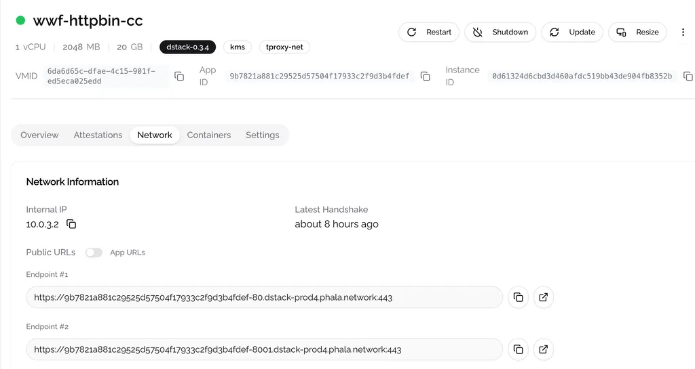

# Expose Service Port

In Docker, you can specify the **HTTP ports** you want to expose by [**configuring port publishing**](https://docs.docker.com/get-started/docker-concepts/running-containers/publishing-ports/#publishing-ports) using the format **HOST\_PORT:CONTAINER\_PORT**. This configuration forwards requests sent to **HOST\_PORT** to the container’s program listening on **CONTAINER\_PORT**.

When deploying your Docker program to Phala Cloud, the process remains the same. You should specify the port mapping in the Docker Compose file using the **ports** field, as shown below, we expose the port 8000 to the port 80 on the host for httpbin service and the port 8001 to the port 5432 on the host for postgres service.

```yaml
services:
  httpbin:
    image: kennethreitz/httpbin:latest
    ports:
      - "8000:80"

  db:
    image: postgres
    ports:
      - "8001:5432"
    environment:
      POSTGRES_PASSWORD: ${POSTGRES_PASSWORD}
```

> \[!NOTE] The environment variable value need to be set through **Secure Environment Variables** in the dashboard. Here we set the `POSTGRES_PASSWORD` to `postgres`.

After deployment, you will see two public endpoints on the dashboard, one for httpbin service and the other for postgres service. These URLs can be used to publicly access the service running in Docker. Behind the scenes, our service parses the Docker Compose file and automatically configures the network forwarding.

<figure><figcaption></figcaption></figure>

If you can access the service, it means you've successfully migrated your application into a TEE. Next step is to [**generate a RA report**](generate-ra-report.md) to prove the integrity of your application.
