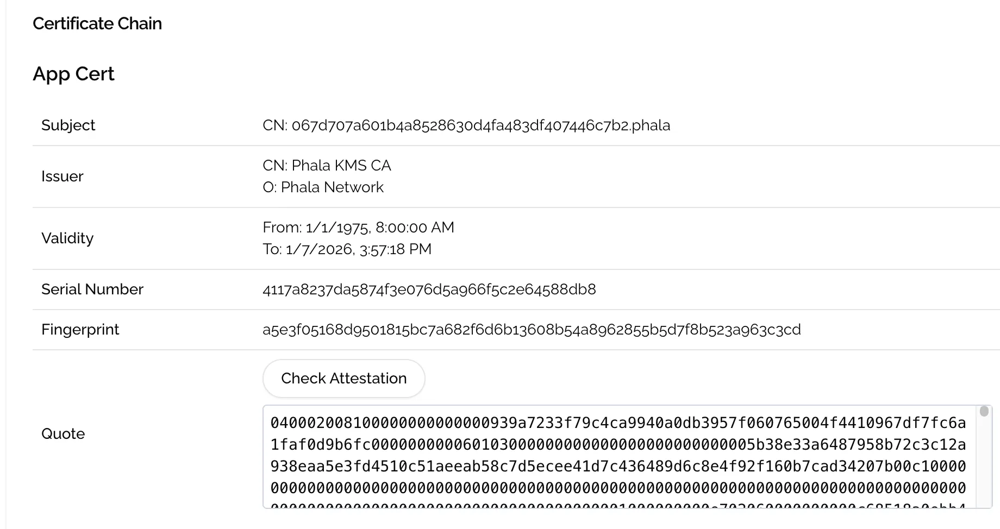

# Generate RA Report Inside the Container

The cloud will generate a default RA report for your application when it is bootstrapped. You can view this report on the dashboard under the **Attestation** tab and verify it by clicking the **Check** **Attestation** button.

<figure><figcaption></figcaption></figure>

There are two steps needed to generate a new RA report, rather than using the default one, which allows you to prove the execution of your code.

### Config docker compose file

You first need to mount the Dstack API socket file to the container by configuring **volumes** in the Docker Compose file.

```yaml
version: '3'
services:
  jupyter:
    image: quay.io/jupyter/base-notebook
    ports:
      - 8080:8888
    volumes:
      - /var/run/tappd.sock:/var/run/tappd.sock
    environment:
      - GRANT_SUDO=yes
    user: root
    command: "start-notebook.sh --NotebookApp.token=${TOKEN}"
```

### Generate RA report inside your application code

In your application, you can generate the RA report using the [Dstack SDK](https://www.npmjs.com/package/@phala/dstack-sdk?activeTab=readme), which supports Python, JS, and Go. The `user-data` argument allows you to attach your own data to the RA report.

```javascript
import { TappdClient } from '@phala/dstack-sdk';

const client = new TappdClient();

// Show the information of the Base Image.
await client.info();

// Get a TDX quote for the given custom data and hash algorithm.
const quoteResult = await client.tdxQuote('user-data', 'sha256');
console.log(quoteResult.quote); // TDX quote in hex format
console.log(quoteResult.event_log); // Event log
const rtmrs = quoteResult.replayRtmrs(); // Replay RTMRs
```

You can implement the above code in your application as an public API that anyone can call to generate a new RA report.

### Conclusion

In practice, this is a method to bind the RA report to your application. For example, you can generate a key pair and set the public key as the `user-data`. This way, anyone can verify the execution of your application by extract the public key from the RA report and checking the signature with the public key.