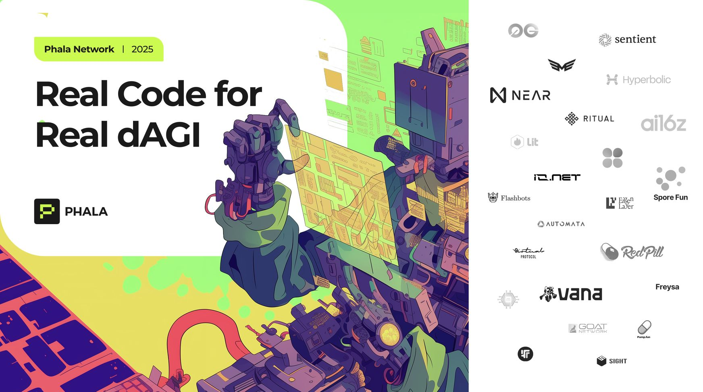
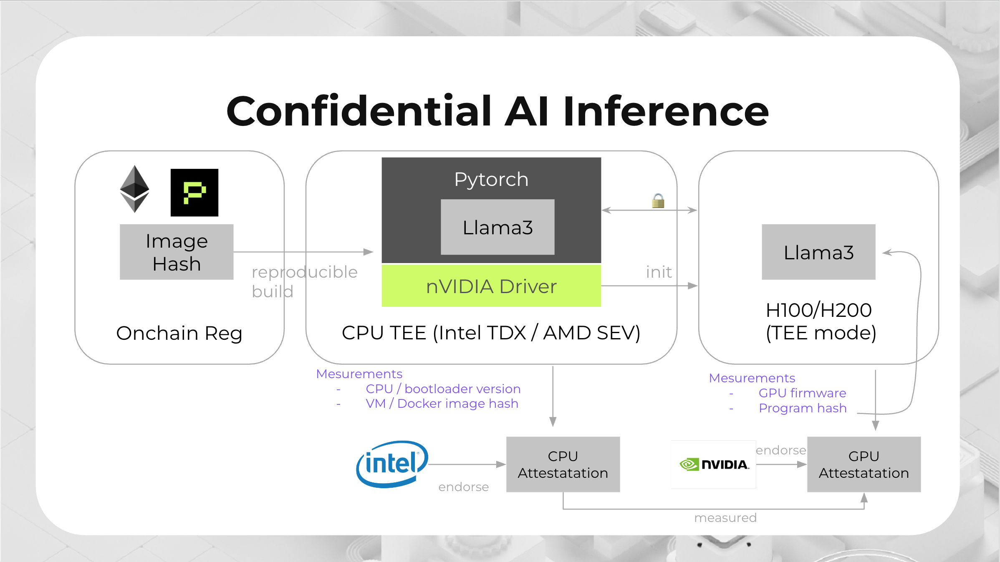

# Building Confidential AI with TEE


Check Phala Network's [2025 dAGI report](https://phala.network/reports/2025RealCodeForRealdAGI.pdf) to see how TEE is used in AI full stack.


## Introduction

<figure><figcaption></figcaption></figure>

AI has become a transformative force across industries, but its widespread adoption faces significant challenges related to data privacy, model security, and computational trust. As AI systems process increasingly sensitive information and make critical decisions, ensuring the confidentiality and integrity of both the data and the AI models themselves has become paramount.

TEE offer a compelling solution to these challenges by providing hardware-enforced isolation for AI workloads. By running AI models and AI agents programs within secure enclaves, organizations can protect sensitive data, prevent unauthorized access to proprietary models, and provide verifiable guarantees about the execution environment.

## The Need for TEE in AI Systems

The integration of TEE technology with AI addresses several critical challenges:

* **Data Privacy Concerns**: AI training and inference often require access to sensitive personal, financial, or proprietary data. TEEs ensure this data remains encrypted and protected even during processing.

* **Model Protection**: Valuable AI models represent significant intellectual property that needs protection from theft, tampering, or unauthorized access. TEEs can safeguard these assets throughout their lifecycle.

* **Verifiable Computation**: Users need assurance that AI computations are performed correctly and that results haven't been manipulated. TEE attestation provides cryptographic proof of the execution environment's integrity.

* **Preventing Data Leakage**: Even in systems designed for privacy, subtle information leakage can occur through side channels or model outputs. TEEs provide an additional layer of protection against such vulnerabilities.

<figure><figcaption></figcaption></figure>

## Key Benefits of TEE for AI Applications

1. **Confidential AI Inference**: Run inference on sensitive data without exposing either the data or the model to the host system or service provider.

2. **Secure Model Training**: Protect training data and emerging model parameters during the training process, preventing data poisoning or model extraction attacks.

3. **Trustless AI Marketplaces**: Enable secure sharing and monetization of AI models without risking intellectual property theft.

4. **Verifiable AI Results**: Provide cryptographic proof that AI outputs were generated by specific models running in secure environments, enhancing trust in critical applications.

5. **Regulatory Compliance**: Meet stringent data protection requirements by ensuring data remains encrypted throughout the AI pipeline.

6. **Autonomous AI Agents**: Enable AI agents to securely manage cryptographic keys and digital assets without exposing sensitive credentials.

## Case Studies

### TEE in Agent Frameworks

<table data-card-size="large" data-view="cards"><thead><tr><th></th><th data-hidden data-card-cover data-type="files"></th><th data-hidden data-card-target data-type="content-ref"></th></tr></thead><tbody><tr><td>🤖 Eliza: Secure AI Agent Framework with TEE Integration</td><td><a href="../../.gitbook/assets/tee_eliza.png">tee_eliza.png</a></td><td><a href="https://eliza.how/packages/plugins/tee">Eliza TEE Plugin</a></td></tr><tr><td>🎮 Virtuals: Game Agents Running in Secure TEE Environment</td><td><a href="../../.gitbook/assets/tee_game_agents.png">tee_game_agents.png</a></td><td><a href="https://github.com/game-by-virtuals/game-node/tree/main/game-starter#to-run-project-in-phala-tee">Virtuals Game Agent</a></td></tr></tbody></table>

### Other TEE-AI Integrations

<table data-card-size="large" data-view="cards"><thead><tr><th></th><th data-hidden data-card-cover data-type="files"></th><th data-hidden data-card-target data-type="content-ref"></th></tr></thead><tbody><tr><td>📡 Vana Network: Decentralized Data Privacy with TEE</td><td><a href="../../.gitbook/assets/tee_vana.png">tee_vana.png</a></td><td><a href="https://phala.network/posts/phala-network-and-vana-network-join-forces-to-usher-in-new-era-for-decentralized-data-privacy">Phala x Vana</a></td></tr><tr><td>🌐 0G: Confidential AI Computing in Decentralized Networks</td><td><a href="../../.gitbook/assets/tee_0g.png">tee_0g.png</a></td><td><a href="https://phala.network/posts/phala-network-and-0g-partner-for-enhanced-confidential-ai-computing">Phala x 0G</a></td></tr><tr><td>💰 Fairblock: Unruggable AI with MPC-TEE Hybrid Architecture</td><td><a href="../../.gitbook/assets/fairblock_tee_registry.png">tee_fairblock.png</a></td><td><a href="https://phala.network/posts/phala-x-fairblock-a-blueprint-for-unruggable-ai-with-an-mpctee-hybrid-architecture">Phala x Fairblock</a></td></tr><tr><td>🌱 Spore.fun: Autonomous AI Evolution in Secure Environments</td><td><a href="../../.gitbook/assets/tee_spore.png">tee_spore.png</a></td><td><a href="https://www.spore.fun/blog/wtf">Spore.fun</a></td></tr></tbody></table>
