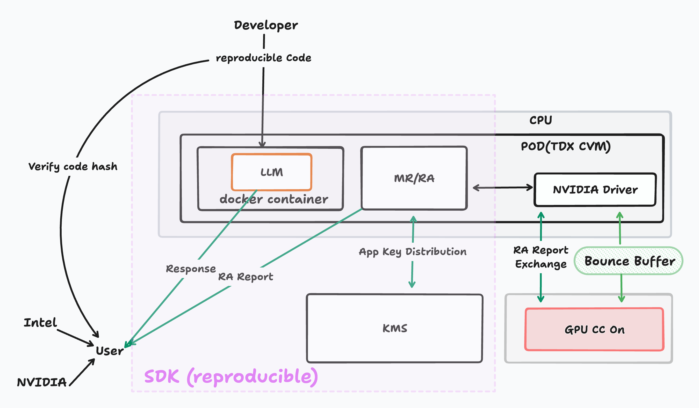

# Implementation of Confidential AI Inference

This chapter details the implementation of our Confidential AI Inference middleware, focusing on secure LLM deployment, execution, and verification.

## Architecture Overview

The middleware implements several core modules that work together to provide a secure and verifiable environment for AI inference:

- **GUEST-IMAGE**: Tooling for TDX guest image creation using Yocto, including kernel bootstrap and disk encryption
- **MR/RA**: Attestation service for TDX quote generation and RTMR extension
- **RA-TLS**: Secure communication channel establishment using Remote Attestation
- **POD**: TDX host service for CVM (Confidential VM) management
- **KMS**: Decentralized Key Management Service with on-chain DAO and off-chain node implementation

<figure><figcaption></figcaption></figure>

### Implement confidentiality and integrity of LLM with CPU/GPU TEE

[TEE](https://en.wikipedia.org/wiki/Trusted_execution_environment) naturally provide isolated environments for secure computation, it establishing trust in the execution environment through Remote Attestation (RA). We assume readers already have base knowledge of TEE and how Remote Attestation work.

- **CPU RA (TDX DCAP quote in our implementation) and GPU RA**

    The RA report generation is the precondition of building the whole trust-chain.

    1. When a TDX is launched, the middleware will measures the initial state of the TDX, including the BIOS, bootloader, rootfs, and OS kernel to produce the RA report from CPU side.
    2. When the GPU is initialized, the NVIDIA driver (running inside CVM, whose code has been measured in last step) measures the GPU’s firmware and configuration. These measurements are used to generate an RA report from GPU side.
    3. The CVM get access to the GPU  RA report, and extract the `nonce` generated during GPU attestation, then generate CPU RA report (TDX report in our implementation) with the nonce bind to the report. This binding make sure the CPU RA report reflects the specific GPU attestation result.

- **Create secure communication channel between user and LLM**

    The communication channel between user and the CVM (with LLM running inside) can be secured using end-to-end encryption protocols like RA-TLS, here is how we implement it.

    1. The RA report is securely transmitted to the user after we produce it in last step through MR/RA modules. The user perform the RA verification locally to ensures that the LLM is running in a genuine TEE.
    2. Once the attestation report is verified, the user and the LLM environment perform a secure key exchange, the progress follows the TLS key exchange standard.
    3. All data transmitted between the user and the LLM is encrypted using the session key

    **Note that the data movement between CPU and GPU memory is through bounce buffer, it's encrypted and signed** in CVM and send to the bounce buffer where the GPU can copy it to the internal memory, decrypt it. Check [HCC-Whitepaper](https://images.nvidia.com/aem-dam/en-zz/Solutions/data-center/HCC-Whitepaper-v1.0.pdf) for more details.

- **Implement data encryption by using the application key acquired from external KMS by providing the RA**

    CVM communicates with a decentralized Key Management Service (KMS) first by build a secure communicate channel with KMS (same as how we build between user and LLM), that derives deterministic encryption keys for the application. The keys will be utilized to encrypt storage specific to the application and to protect the its data integrity. With KMS operating independently from any specific TEE instance, applications avoid vendor lock-in and can be securely migrated between different hardware environments without any data loss.

    The RA report need to be send to KMS when apply for the application key, the application key will be returned to CVM during CVM initiation after KMS verified the RA report. This can make sure we prepared the encryption disk for LLM hosting. Because the application key is derived by passing the RA report, where in the 64 bytes of user data field, we fill it with the hash of LLM docker image hash, bootstrap arguments, environment variables, which make sure the application key is bind with the specific LLM instance.

### Implement verifiability - reproducible build for the application and full environment

In the RA report, we have the base image's hash and the image's startup parameter. That means both the middleware, also including NVIDIA GPU driver and the LLM docker image itself should be  open source and reproducible so that we can make sure the specific LLM model is running. For example, we need to guarantee LLM checksum is verified after downloading, ensures that the code and models used in the inference process are exactly as intended.

We use Yocto for Kernel Builder, Nix for Docker Build.

1. We define a custom Yocto layer with recipes for the kernel, initrd, and rootfs, the output images are hashed to create a unique identifier of the middleware implementation.
2. We use Nix to build the LLM Docker image, ensuring that the exact same environment can be reproduced on different machines.
3. Both the middleware hash and docker image hash are added to the user field of the RA report, ensuring that the exact build is verifiable.

The RA report provided by the middleware (more specifically in our implementation, is [DCAP](https://www.intel.com/content/dam/develop/public/us/en/documents/intel-sgx-dcap-ecdsa-orientation.pdf) based TDX quote) can be verified by any parity with the TDX collaterals provided by Intel. There are many on-chain and off-chain DCAP verification libraries we can reuse, for example Phala's [dcap-qvl](https://github.com/Phala-Network/dcap-qvl) written in pure Rust or Automata’s Solidity [implementation](https://github.com/automata-network/automata-dcap-attestation).

## Decentralized Root of Trust

We use a decentralized key management service (KMS) to manage the root of trust. The KMS is a decentralized system that allows users to securely manage their keys and control access to their confidential data. The KMS is implemented using a combination of on-chain and off-chain mechanisms.

More details about the KMS will be documented in future updates. There is a [post](https://collective.flashbots.net/t/early-thoughts-on-decentralized-root-of-trust/3868) we published early in Flashbots' forum that proposed the design of DeRoT. And More details of the KMS design can be found at article [Key Management Protocol For Decentralized Root-of-Trust](https://collective.flashbots.net/t/key-management-protocol-for-decentralized-root-of-trust/4004).

