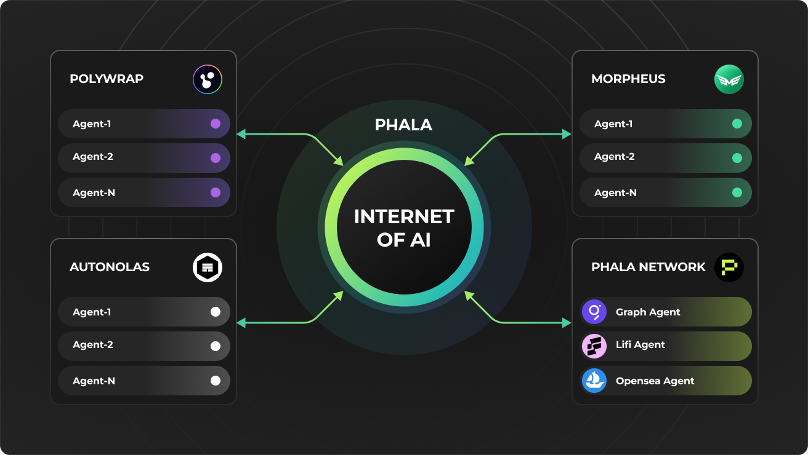

# 🔌 Integrations

<figure><figcaption></figcaption></figure>

In the previous section, you learned how to integrate with a 3rd party API with HTTP request. If you have not gone through the tutorial, we highly recommend going through the tutorial to better understand how building an integration with AI Agent Contract works.

Next, we will show a few example integrations to build agents by connecting to 3rd party APIs from projects like Airstack, The Graph, and Lens Protocol.

