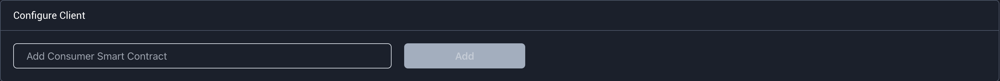

# LensAPI Oracle

## Introduction

The Lens Protocol is a Web3 social graph on the Polygon blockchain. It is designed to empower creators to own the links between themselves and their community, forming a fully composable, user-owned social graph. The protocol is built from the ground up with modularity in mind, allowing new features and fixes to be added while ensuring immutable user-owned content and social relationships.

With the rise of SocialFi platforms like Lens, there is an increasing need for Oracles that can bring data of all types on-chain via APIs. Phala Network's LensAPI Oracle is a solution designed to meet this demand, providing developers with a programmable Oracle template that can deploy customizable, no-code Oracles in minutes.&#x20;

<figure><figcaption><p>Simple overview of how the LensAPI Oracle works. </p></figcaption></figure>

## How to Use the LensAPI Oracle&#x20;

_We have a full demo of the deployment process available on our youtube channel, which you can find_ [_here_](https://www.youtube.com/watch?v=C6kCpItmT6o)_._&#x20;

### Prerequisites

Before you begin, make sure you have the following:

* Familiarity with Solidity and the Lens Protocol
* A [Phala wallet](../../../../introduction/basic-guidance/)
* A balance of Phala Network's native token $PHA to
  * pay for the gas fee to upload your Oracle's Phat Contracts to the Phala Blockchain
  * stake to access compute to run your Oracle&#x20;
* A balance of MATIC to pay for the transaction fees involved in running your Oracle

### Step 1: Get Started and Select your Data Fields&#x20;

To begin, access the [LensAPI Oracle deployment page](https://bricks.phala.network/blueprint/lens-oracle/deployment) on the Phat Bricks App. After navigating through the Overview page and naming your Oracle, you will arrive at the Data page.

The LensAPI Oracle allows your smart contract to query Lens user and post stats using profile IDs. On the Data page, you can define the fields you want to request from the Lens API. The supported data fields are:

* User Stats API
  * Total followers
  * Total followings
* Post Stats API
  * Total posts
  * Total comments
  * Total mirrors
  * Total publications
  * Total collects

You can also add custom Javascript expressions to enhance your query if necessary by selecting the "Customize your transform function" box.

<figure><figcaption><p>Getting Started Demo</p></figcaption></figure>

### Step 2: Deploy the Oracle

After reviewing your setup, it's time to deploy your Oracle.&#x20;

If it's your first time using Phat Bricks, you will be prompted to create a Phat Bricks user profile to manage your deployed projects. This process will be handled automatically by the app, and will entail the creation of new Phala and Polygon accounts. \
\
Keep in mind that you will need some $PHA token to pay the gas fee to upload your Oracle's Phat Contracts to the Phala Blockchain, as well as to stake to your Oracle. Phat Contract operates on a stake-to-compute model, where a minimum amount of 10 $PHA tokens are required for staking to keep your Oracle running on Phala Network. Unstake functionality will be released in the near future.

Finally, the Oracle sends data to your contract via Polygon transactions. The UI will ask you to fund the pre-generated Polygon gas fee account with some MATIC to pay the gas fees for your Oracle.

### Step 3: Connect your Smart Contract to the Oracle

Connecting your smart contracts on Polygon to the Oracle you just deployed can be done in a few lines of code.

The identity of Oracle is shown in the Project Details page as the `Oracle Endpoint` field.

<figure><figcaption></figcaption></figure>

Below is a code snippet demonstrating how to request and receive data from the LensAPI Oracle in Solidity. You can find the full sample [here](https://github.com/Phala-Network/phat-bricks/blob/master/evm/contracts/TestLensOracle.sol).

```solidity
    function request(string calldata profileId) public {
        // assemble the request
        uint id = nextRfequest;
        requests[id] = profileId;
        _pushMessage(abi.encode(id, profileId));
        nextRequest += 1;
    }

    function _onMessageReceived(bytes calldata action) internal override {
        require(action.length == 32 * 3, "cannot parse action");
        (uint respType, uint id, uint256 data) = abi.decode(
            action,
            (uint, uint, uint256)
        );
        if (respType == TYPE_RESPONSE) {
            emit ResponseReceived(id, requests[id], data);
            delete requests[id];
        } else if (respType == TYPE_ERROR) {
            emit ErrorReceived(id, requests[id], data);
            delete requests[id];
        }
    }
```

### Step 4: Configure the Client Address

A deployed Oracle is meant to serve one smart contract client at a time. Input the client contract address in the "Configure Client" field on the Project Details page.

<figure><figcaption></figcaption></figure>

This address can be updated at any time. Please note that the Oracle will respond to all unanswered requests sent by the smart contract, this may cause unexpected gas fee costs.

**Congratulations! You've just deployed your LensAPI Oracle!**

If you need any technical support with your Oracle, please reach out to us on [Discord](https://discord.gg/phala).
