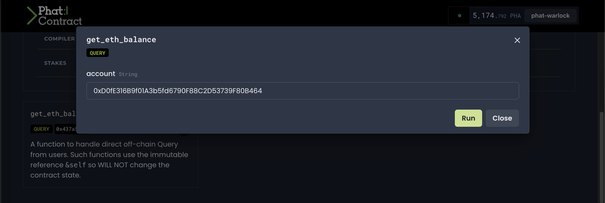

# Deploy Contract

## Deploy Your First Contract <a href="#create-and-compile-your-first-contract" id="create-and-compile-your-first-contract"></a>

Now that you have created and compiled your `phat_hello` contract, let's deploy the contract to the [PoC6 Testnet](https://polkadot.js.org/apps/?rpc=wss%3A%2F%2Fpoc6.phala.network%2Fws#/explorer). There are a couple ways to get you started.



> If you have not installed `swanky phala` CLI tool, follow these [steps](swanky-phala-cli-tool.md) to get started.

Go to your development workspace and ensure that you have updated your `devphase.config.json` file to include the PoC6 Testnet info. Within`networks` , add the following:

```bash
"networks": {
    "poc6": {
      "nodeUrl": "wss://poc6.phala.network/ws",
      "workerUrl": "https://phat-cluster-us.phala.network/poc6/pruntime/0xac5087e0"
    }
  },
```

`poc6` will be the `-n` flag value in the `swanky phala contract deploy` command.

Next, you will execute the following command to deploy your `phat_hello` compiled contract.


```bash
swanky phala contract deploy -c phat_hello -l 0x0000000000000000000000000000000000000000000000000000000000000001 -n poc6 -o new
```


The flags available for this command are defined as follows:

```bash
➜  Norwhich git:(master) ✗ swanky help phala contract deploy                                                                                     ~/Projects/TestingEnv/Norwhich
Deploy contract

USAGE
  $ swanky phala contract deploy -c <value> -o <value> [-t InkCode|SidevmCode|IndeterministicInkCode] [-n <value>] [-l <value>] [-a <value>] [-p <value>]

FLAGS
  -a, --account=<value>      [default: alice] Account used to deploy (managed account key)
  -c, --contract=<value>     (required) Contract name
  -l, --cluster=<value>      Target cluster Id
  -n, --network=<value>      [default: local] Target network to deploy (local default)
  -o, --constructor=<value>  (required) Contract constructor to call (name)
  -p, --params=<value>...    [default: ] Arguments supplied to the message
  -t, --type=<option>        [default: InkCode]
                             <options: InkCode|SidevmCode|IndeterministicInkCode>

DESCRIPTION
  Deploy contract

EXAMPLES
  $ swanky phala contract deploy -c [CONTRACT_NAME] -t [CONTRACT_TYPE] -o [CONSTRUCTOR] -n [NETWORK] -l [CLUSTER_ID] -a [ACCOUNT] -p [..Args]
```

Here is an expected output after executing the `swanky phala contract deploy` command.

```bash
➜  Norwhich git:(master) swanky phala contract deploy -c phat_hello -l 0x0000000000000000000000000000000000000000000000000000000000000001 -n poc6 -o new
Deploy contract
Validating compiled WASM of phat_hello contract...
phat_hello.wasm validated successfully!
⠙ Deploying contract phat_hello
Contract deployed
Contract Id: 0xac22b0163a70f1213d58b3891f20c5b493ca7a7802e2b0ee204a7c4994a4bb27
Cluster Id:  0x0000000000000000000000000000000000000000000000000000000000000001
✔️ Deploying contract phat_hello  OK
😎 Phat Contract deployed successfully! 😎
```

Now execute the `swanky phala contract call` command since we now have the Contract Id of the deployed Phat Contract. Here is what the help command looks like:

```bash
➜  phala-wiki-next git:(master) ✗ swanky help phala contract call                                                                            
USAGE
  $ swanky phala contract call -c <value> -i <value> -m <value> [-t InkCode|SidevmCode|IndeterministicInkCode] [-r query|tx] [-n <value>] [-l <value>] [-a <value>] [-p <value>]

FLAGS
  -a, --account=<value>    [default: alice] Account used to call (managed account key)
  -c, --contract=<value>   (required) Contract name
  -i, --id=<value>         (required) Contract ID
  -l, --cluster=<value>    Target cluster Id
  -m, --method=<value>     (required) Contract method to call (name)
  -n, --network=<value>    [default: local] Target network to deploy (local default)
  -p, --params=<value>...  [default: ] Arguments supplied to the message
  -r, --request=<option>   [default: query] Request type: transaction or query
                           <options: query|tx>
  -t, --type=<option>      [default: InkCode]
                           <options: InkCode|SidevmCode|IndeterministicInkCode>

DESCRIPTION
  Call a Phat Contract

EXAMPLES
  $ swanky phala contract call -c [CONTRACT_NAME] -t [CONTRACT_TYPE] -i [CONTRACT_ID] -r [REQUEST_TYPE] -m [METHOD] -n [NETWORK] -l [CLUSTER_ID] -a [ACCOUNT] -p [..ARGS]
```

To call the `phat_hello` contract we will need the following:

* `-i` Contract Id: `0xac22b0163a70f1213d58b3891f20c5b493ca7a7802e2b0ee204a7c4994a4bb27`
* `-l` Cluster Id: `0x0000000000000000000000000000000000000000000000000000000000000001`
* `-n` Network: `poc6`
* `-m` Method Name (Camel Case): `getEthBalance`
* `-p` Method Argument Parameters: `0x307844306645333136423966303141336235666436373930463838433244353337333946383042343634`
  * Note that this is the value of `stringToHex(0xD0fE316B9f01A3b5fd6790F88C2D53739F80B464)`

Now that we can compose a `swanky phala contract call` command, this would be an expected output:

```bash
➜  phala-wiki-next git:(master) ✗ swanky phala contract call -c phat_hello -i 0xac22b0163a70f1213d58b3891f20c5b493ca7a7802e2b0ee204a7c4994a4bb27 -l 0x0000000000000000000000000000000000000000000000000000000000000001 -n poc6 -m getEthBalance -p 0x307844306645333136423966303141336235666436373930463838433244353337333946383042343634
Executing call to Phat Contract
Call result:
{
  output: { ok: { ok: '20950198739626844' } },
  debugMessage: '',
  result: {
    ok: { flags: [], data: '0x0000443230393530313938373339363236383434' }
  },
  gasConsumed: { refTime: 1342177279, proofSize: 0 },
  gasRequired: { refTime: 65766686719, proofSize: 0 },
  storageDeposit: { charge: 2047 }
}
```



Go to the [Phat UI](https://phat.phala.network) website where you will see a landing page.

<figure><figcaption><p>Phat UI Landing Page</p></figcaption></figure>

Next, you will connect your Polkadot wallet ([Talisman](https://talisman.xyz/download), [SubWallet](https://chrome.google.com/webstore/detail/subwallet-polkadot-extens/onhogfjeacnfoofkfgppdlbmlmnplgbn?hl=en\&authuser=0), or [Polkadot.js](https://chrome.google.com/webstore/detail/polkadot%7Bjs%7D-extension/mopnmbcafieddcagagdcbnhejhlodfdd/related))

<figure><figcaption><p>Select a Polkadot Wallet</p></figcaption></figure>

For more info on these steps, check out the [Phat Contract Console ](../getting-started/phat-contract-console.md)section. Now that your account has PHA testnet tokens, upload the compile contract file `phat_hello.contract`

Here is a video example of the process. After the contract is deployed and instantiated into a cluster, choose any ETH address and query the balance.


Deploy and Call your Phat Contract


The query of an ETH balance will look like this:

<figure><figcaption><p>Choose ETH Account to Query</p></figcaption></figure>

<figure><figcaption><p>Query ETH Balance</p></figcaption></figure>


