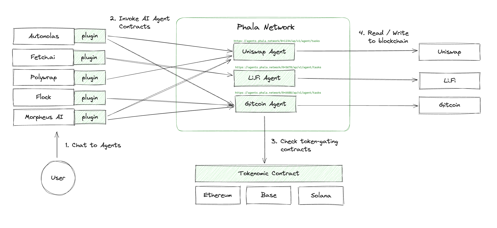

# Bricks and Blueprints

## Phat Contract’s No-Code Experience

Phat Bricks are prefabricated, audited Phat Contracts that perform common functions. These can be bundled together to form a Blueprint, a pre defined one click deployable solution to a common industry problem.

Developers can deploy Blueprints and integrate them with their dApps in minutes via the [app](http://bricks.phala.network/), bringing complex functionality to Smart Contracts without needing to write a single line of code.

To deploy a Blueprint now click [here](http://bricks.phala.network/)!

## Example Use-Case

The LensAPI Oracle Blueprint showcases Phat Contract’s ability to interface with any API and bring data on-chain automatically.

SocialFi developers building on Lens can use this Blueprint to enable their smart contracts to read data from the Lens API, including user profile stats like followers, posts, comments, and post stats like collects, mirrors, and replies. The Blueprint is compatible with Polygon and any other EVM blockchain, and can be deployed here.

<figure><figcaption>
LensAPI Oracle Blueprint
</figcaption></figure>

Currently, all Bricks and Blueprints are created by the Phala Team. You can find the list of available blueprints in the app. We plan to add features allowing users to create their own in the near future.
