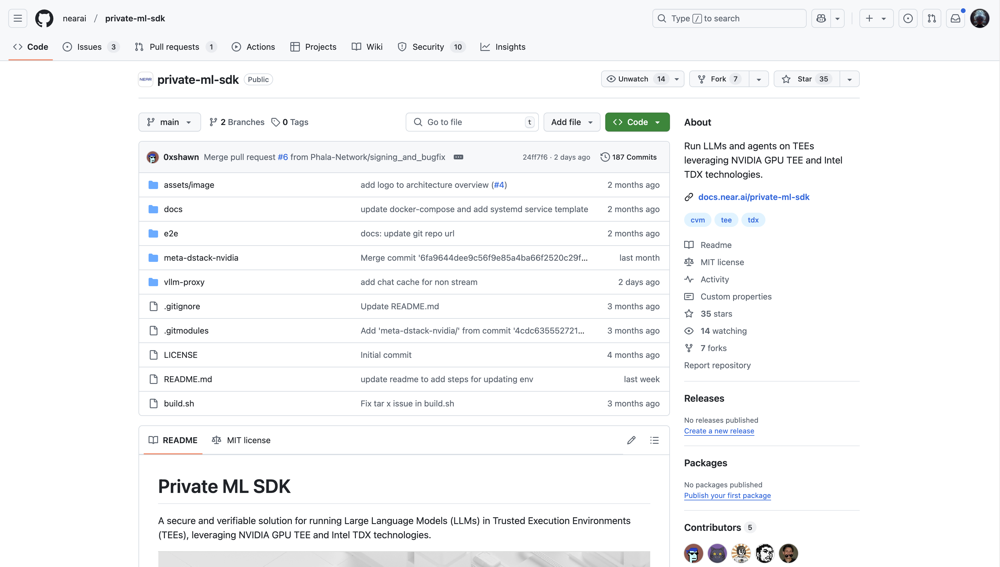
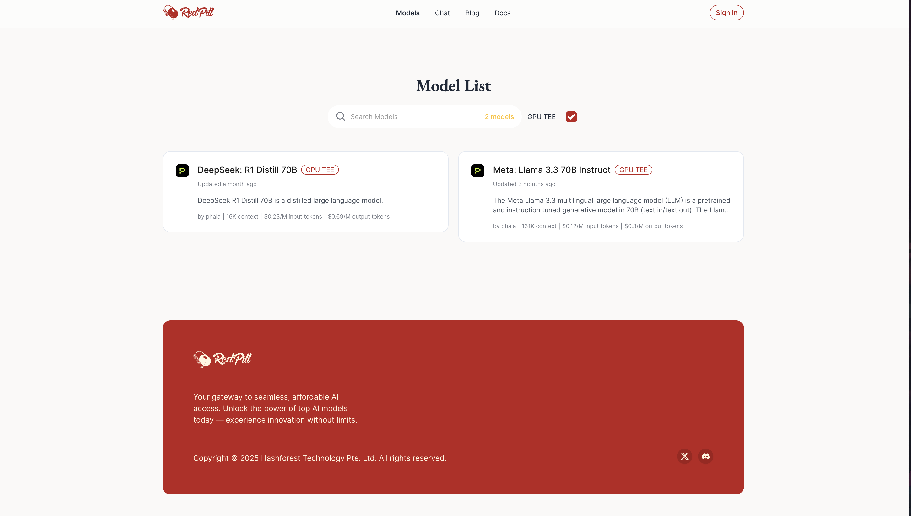

# 👩‍💻 Host LLM in GPU TEE

## Overview

Private AI or called confidential AI addresses critical concerns such as data privacy, secure execution, and computation verifiability, making it indispensable for sensitive applications. As illustrated in the diagram below, people currently cannot fully trust the responses returned by LLMs from services like OpenAI or Meta, due to the lack of cryptographic verification. By running the LLM inside a TEE, we can add verification primitives alongside the returned response, known as a Remote Attestation (RA) Report. This allows users to verify the AI generation results locally without relying on any third parties.

<figure><figcaption></figcaption></figure>

## Implementation

The implementation for running LLMs in GPU TEE is available in the [private-ml-sdk](https://github.com/nearai/private-ml-sdk) GitHub repository. This project is built by Phala Network and was made possible through a grant from NEARAI. The SDK provides the necessary tools and infrastructure to deploy and run LLMs securely within GPU TEE.

<figure><figcaption></figcaption></figure>

## Confidential AI Inference

[Redpill](https://red-pill.ai/) is a models marketplace that supports private AI inference. It currently supports two models that are running in GPU TEE, you can view them in the models page by clicking the `GPU TEE` checkbox:

- **[DeepSeek: R1 Distill 70B](https://red-pill.ai/models/phala/deepseek-r1-70b)**
- **[Meta: Llama 3.3 70B Instruct](https://red-pill.ai/models/phala/llama-3.3-70b-instruct)**

<figure><figcaption></figcaption></figure>

### Get TEE Attestation Report

After sign in on [Redpill](https://red-pill.ai/signin), you can get the API key from [here](https://red-pill.ai/keys).

The first step is verify if the LLM is running in GPU TEE before you chat with it. This can be done by verify its attestation report. To get the attestation report of the LLM inference, you can do this by sending a POST request to the Redpill API endpoint like below:

```sh
curl 'https://api.red-pill.ai/v1/attestation/report?model=phala/deepseek-r1-70b' \
  -H 'accept: application/json' \
  -H 'Content-Type: application/json' \
  -H 'Authorization: Bearer <Redpill_API_KEY>'
```

The response will be like:

```sh
{
  "signing_address": "...",
  "nvidia_payload": "...",
  "intel_quote": "..."
}
```

The `signing_address` is the account address generated inside TEE that will be used to sign the chat message later. You can go to https://etherscan.io/verifiedSignatures, click Verify Signature, and paste the `signing_address` and message message to verify it.

`nvidia_payload` and `intel_quote` are the attestation report from NVIDIA TEE and Intel TEE respectively. You can use them to verify the integrity of the TEE. See [Verify the Attestation](https://docs.red-pill.ai/confidential-ai-inference/get-started#verify-the-attestation) on Redpill docs for more details.

**Note: The trust chain works as follows: when you verify the attestation report, you trust the model provider (Redpill) and the TEE providers (NVIDIA and Intel). You then trust the open-source, reproducible code by verifying the source code [here](https://github.com/nearai/private-ml-sdk). Finally, you trust the cryptographic key derived inside the TEE. This is why we only need to verify the signature of the message during chat.**

### Chat With Private AI

We provide OpenAI-compatible API for you to send chat request to the LLM running inside TEE, where you just need to replace the API endpoint to `https://platform.openai.com/docs/api-reference/chat`. A simple request could be like:

```sh
curl -X 'POST' \
  'https://api.red-pill.ai/v1/chat/completions' \
  -H 'accept: application/json' \
  -H 'Content-Type: application/json' \
  -H 'Authorization: Bearer <Redpill_API_KEY>' \
  -d '{
  "messages": [
    {
      "content": "You are a helpful assistant.",
      "role": "system"
    },
    {
      "content": "What is your model name?",
      "role": "user"
    }
  ],
  "stream": true,
  "model": "phala/deepseek-r1-70b"
}'
```

Check more details on [Redpill model page, for example, deepseek-r1-70b](https://red-pill.ai/models/phala/deepseek-r1-70b)

## References

1. [HCC-Whitepaper](https://images.nvidia.com/aem-dam/en-zz/Solutions/data-center/HCC-Whitepaper-v1.0.pdf)
2. [Intel SGX DCAP Orientation](https://www.intel.com/content/dam/develop/public/us/en/documents/intel-sgx-dcap-ecdsa-orientation.pdf)
3. [Phala's dcap-qvl](https://github.com/Phala-Network/dcap-qvl)
4. [Automata's Solidity Implementation](https://github.com/automata-network/automata-dcap-attestation)
5. [Phala Nvidia H200 TEE Benchmark Paper](https://arxiv.org/pdf/2409.03992)
6. [Phala DeRoT Post on FlashBots forum](https://collective.flashbots.net/t/early-thoughts-on-decentralized-root-of-trust/3868)
7. [Phala Key Management Protocol Post on Flashbots forum](https://collective.flashbots.net/t/key-management-protocol-for-decentralized-root-of-trust/4004)
8. [Private ML SDK](https://github.com/nearai/private-ml-sdk)
