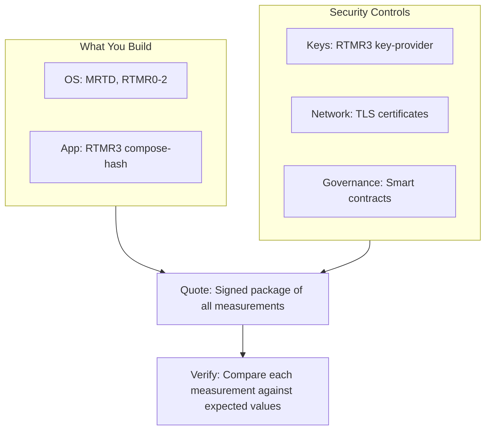

Hardware attestation alone isn't enough. Anyone in the cloud supply chain could substitute OS images, swap Docker containers, or inject malicious keys, even with valid TEE hardware.

This guide shows you how to verify the **complete chain of trust**: OS integrity, application code, key management, network certificates, and governance. You'll learn to check every link from source code to the running CVM, eliminating all attack vectors.

## The Complete Trust Chain



Five trust chains feed into one cryptographically signed attestation quote. Verification confirms each measurement matches your expected values.

## What is TCB (Trusted Computing Base)?

The Trusted Computing Base (TCB) represents all components critical for security. In dstack, the TCB consists of cryptographic measurements that prove integrity across three layers.

A **measurement** is a cryptographic hash (like a fingerprint) of a component. TEE hardware records these measurements in the remote attestation report during boot.

Once recorded in the cryptographically signed quote, measurements cannot be modified. This makes them unforgeable proof of what code is running. Change even one byte in any component, and the measurements won't match your expected values.

**Hardware & Firmware** use MRTD for virtual firmware and RTMR0 for hardware configuration like CPU count and memory size.

**Operating System** uses RTMR1 for the Linux kernel and RTMR2 for kernel parameters and initrd.

**Application** uses RTMR3 for your compose hash and runtime info.

All RTMRs (0-3) use the same hash chain structure. Each starts at zero and is "extended" by hashing in events during boot (RTMR = SHA384(RTMR || event)).

For verification, **only RTMR3 event logs matter**. RTMR0-2 event logs contain low-level hardware/firmware details you can ignore. Just use dstack-mr to reproduce the final RTMR0-2 values directly.

For RTMR3, you need to replay the event log. First verify the replay hashes to the RTMR3 in the quote. Then compare each event's payload (compose-hash, key-provider) against your reference values.

## 1. OS Trust: Verifying the Base System

### Attack Vector
Anyone in the cloud compute supply chain (cloud provider, network operator, data center staff, or compromised infrastructure) could substitute the dstack OS image with a modified version containing backdoors or data exfiltration code.

### How It's Secured

The dstack OS is built from the [meta-dstack](https://github.com/Dstack-TEE/meta-dstack) repository using Yocto. This means you can reproduce it from any specific git commit. The OS produces four measurements (MRTD, RTMR0-2) that cryptographically prove firmware, hardware config, kernel, and boot parameters.

Only OS images with approved hashes can boot, enforced by the `DstackKms.allowedOsImages` smart contract.

### How to Verify

1. **Get VM configuration and TCB info:** Retrieve your CVM's configuration and expected measurements:
   ```javascript
   import { DstackClient } from '@phala/dstack-sdk';

   const client = new DstackClient();
   const appInfo = await client.info();

   // VM configuration used for measurements
   console.log('VM Config:', appInfo.vm_config);
   // Expected measurements from attestation
   console.log('TCB Info:', appInfo.tcb_info);
   ```

   <Warning>
   **Hardware Config Affects Measurements**

   RTMR values depend on the VM configuration: CPU cores, memory size, and GPU passthrough settings in `vm_config`. Always use the actual VM configuration from your deployment when calculating expected measurements.
   </Warning>

2. **Download or build OS image:**

   **Option A: Download pre-built image** (faster, but trusts the release):
   ```bash
   # Determine your OS version from appInfo.tcb_info.os_version
   # Download from meta-dstack releases
   wget https://github.com/Dstack-TEE/meta-dstack/releases/download/v0.5.4/dstack-0.5.4.tar.gz
   tar xzf dstack-0.5.4.tar.gz
   ```

   **Option B: Build from source** (maximum verification, reproducible):
   ```bash
   # Clone meta-dstack at the specific commit for your version
   git clone https://github.com/Dstack-TEE/meta-dstack.git
   cd meta-dstack
   git checkout <COMMIT_HASH_FOR_VERSION>

   # Follow reproducible build instructions
   # See: https://github.com/Dstack-TEE/meta-dstack#reproducible-builds
   ```

   Building from source is the ultimate verification. You independently reproduce the exact OS image from a git commit, removing any need to trust pre-built releases.

3. **Calculate expected measurements:** Use dstack-mr with your VM config:
   ```bash
   # Clone the dstack repository to build the measurement tool
   git clone https://github.com/Dstack-TEE/dstack.git
   cd dstack

   # Extract CPU and memory from appInfo.vm_config
   # Example vm_config: {"cpu": 4, "memory": 4294967296, "gpus": 0}
   # memory is in bytes (4294967296 = 4G)

   # Calculate measurements using CPU cores and memory size from vm_config
   cargo run --bin dstack-mr measure \
     -c 4 \
     -m 4G \
     ../dstack-0.5.4/metadata.json
   ```

   <Note>
   **VM Config Parameters**

   The `-c` (CPU cores) and `-m` (memory size) must match `appInfo.vm_config` exactly. Memory sizes use human-readable formats (e.g., "4G" for 4GB). GPU count (`--num-gpus`) also affects measurements if your CVM uses GPU passthrough.
   </Note>

4. **Compare against attestation:** The calculated MRTD and RTMR0-2 must match `appInfo.tcb_info.mrtd`, `appInfo.tcb_info.rtmr0`, `appInfo.tcb_info.rtmr1`, and `appInfo.tcb_info.rtmr2`.

See [trust-center](https://github.com/Phala-Network/trust-center) for a complete reference implementation of this verification process.

## 2. Application Trust: Verifying Your Code

### Attack Vector
Someone could deploy different Docker images than what you built, running malicious code in your CVM.

### How It's Secured

**Image digest pinning:** Always use SHA256 digests (not tags) in docker-compose.yaml. Tags like `nginx:latest` are mutable. The image they point to can change, making verification impossible. Digests are immutable cryptographic hashes of the exact image content.
```yaml
services:
  app:
    # Get digest: docker pull nginx:latest && docker inspect nginx:latest | grep -A 1 RepoDigests
    image: nginx@sha256:eee5eae48e79b2e75178328c7c585b89d676eaae616f03f9a1813aaed820745a
```

**Compose-hash in RTMR3:** Your entire Docker Compose configuration is hashed and recorded in RTMR3. The CVM verifies image digests match the compose-hash before pulling from the registry. **Even a compromised Docker registry cannot substitute different images** because the digest verification happens inside the TEE.

**RTMR3 event log replay:** Replaying the event log proves the events haven't been tampered with. The replayed RTMR3 must match the RTMR3 in the TDX quote. Only then can you trust the event payloads (compose-hash, key-provider) for verification.

**On-chain whitelist:** Only compose hashes registered in the `DstackApp` smart contract can boot.

### How to Verify

<Note>
**Where to Run Verification Code**

Steps 1-2 fetch data from your CVM. Run these from **outside the CVM** (your local machine or verification server). Step 3 replays event logs to verify RTMR3. This **must run outside the CVM** since you're verifying what the CVM claims. Only verification that happens outside the TEE provides security guarantees.
</Note>

1. **Get application info and compose config** (run **outside CVM**):
   ```javascript
   import { DstackClient } from '@phala/dstack-sdk';
   import crypto from 'crypto';

   const client = new DstackClient();
   const appInfo = await client.info();

   // The actual app-compose.json used in deployment
   const appComposeConfig = appInfo.tcb_info.app_compose;
   console.log('App compose config:', appComposeConfig);
   ```

2. **Calculate compose hash** (run **outside CVM**):
   ```javascript
   import { getComposeHash } from '@phala/dstack-sdk';

   // Use the SDK's deterministic hash function
   // This ensures proper key sorting and special value handling (NaN/Infinity → null)
   const calculatedHash = getComposeHash(JSON.parse(appComposeConfig));
   console.log('Calculated hash:', calculatedHash);
   ```

   <Note>
   **Deterministic Serialization Required**

   The compose-hash requires deterministic JSON serialization with lexicographic key sorting and NaN/Infinity converted to null. Always use the SDK's `getComposeHash()` function rather than computing SHA256 directly. This ensures your hash matches the one in RTMR3.
   </Note>

3. **Extract compose-hash from RTMR3** (run **outside CVM**):
   ```javascript
   const quote = await client.getQuote();

   // RTMR3 is built by extending events during boot
   // The event log lets you verify the final RTMR3 value matches what you expect
   const events = JSON.parse(quote.event_log);
   const composeHashEvent = events.find(e => e.event === 'compose-hash');
   const attestedHash = composeHashEvent.event_payload;
   console.log('Attested hash:', attestedHash);

   // CRITICAL: Replay all events to verify RTMR3
   const rtmrs = quote.replayRtmrs();
   console.log('Replayed RTMR3:', rtmrs.rtmr3);
   // Verify: rtmrs.rtmr3 MUST match quote.rtmr3 from the TDX quote
   ```

   <Note>
   **Event Log Replay**

   Since RTMR3 is built by extending each event sequentially (RTMR3 = SHA384(RTMR3 || event)), you can replay the event log yourself to verify the final RTMR3 value matches the one in the TDX quote. The SDK's `replayRtmrs()` method does this automatically.
   </Note>

4. **Compare hashes:** The calculated hash must match the attested hash from RTMR3.

5. **Verify on-chain whitelist (if using on-chain governance):**
   ```bash
   # Check if compose-hash is registered in DstackApp contract
   cast call <DstackApp_ADDRESS> "allowedComposeHashes(bytes32)" <COMPOSE_HASH>
   # Returns true if registered, false otherwise
   ```

### Linking Images to Source Code

The compose-hash proves which Docker images were deployed by their SHA256 digests. To link these digests back to source code, you need verifiable build provenance.

**Recommended: Use Sigstore for GitHub-endorsed builds.** Sigstore cryptographically links container images to specific GitHub commits and workflows. When you build images via GitHub Actions, Sigstore automatically signs the build with GitHub's identity, creating unforgeable proof that the image came from a specific commit.

This works for both your application and platform components:
- [dstack-gateway releases](https://github.com/Dstack-TEE/dstack/releases?q=%22dstack-gateway%22&expanded=true) (example of Sigstore signatures)
- [dstack-kms releases](https://github.com/Dstack-TEE/dstack/releases?q=%22dstack-kms%22&expanded=true)
- [dstack-verifier releases](https://github.com/Dstack-TEE/dstack/releases?q=%22dstack-verifier%22&expanded=true)

Set up Sigstore signing in your GitHub Actions workflow to provide the same cryptographic build provenance for your own applications.

**Alternative: Reproducible builds.** For maximum verifiability, use reproducible builds where anyone can rebuild from source and get identical digests. Publish your Dockerfile and build instructions. This requires careful environment control but removes the need to trust any build service.

## 3. Key Trust: Verifying the KMS

### Attack Vector
A malicious KMS could leak all keys used by your application: disk encryption keys, TLS private keys, and signing keys. This would compromise your application even if everything else was verified.

### How It's Secured

Your application uses multiple keys: disk encryption, TLS certificates, and signing keys. All of these derive from two KMS root key pairs using deterministic Key Derivation Functions (KDFs).

The Root CA Key (P256) derives your TLS certificates and disk encryption keys. The Root K256 Key (secp256k1) derives Ethereum-compatible signing keys. Each derived key combines your app's unique ID with a purpose string for cryptographic separation.

Here's why this matters: verify the KMS is trustworthy, and you've automatically verified all derived keys too.

The KMS root CA public key is recorded in RTMR3 as the `key-provider` event. This binds your app to a specific KMS instance. You can't silently swap to a different KMS without changing the attestation.

### How to Verify

1. **Extract key-provider from RTMR3:**
   ```javascript
   const client = new DstackClient();
   const quote = await client.getQuote();

   // Parse event log to find key-provider event
   const events = JSON.parse(quote.event_log);
   const keyProviderEvent = events.find(e => e.event === 'key-provider');
   const keyProviderData = JSON.parse(keyProviderEvent.event_payload);

   console.log('KMS name:', keyProviderData.name);
   console.log('KMS ID:', keyProviderData.id); // KMS root CA public key hash
   ```

2. **Verify the KMS itself:**

   The KMS is a separate TEE instance that must be verified through its own chain of trust. You need to validate the KMS's TDX quote (hardware), verify it runs a trusted dstack OS version, confirm the compose-hash matches audited source, and check the governance model.

   **Why this matters:** The KMS controls all cryptographic operations. A compromised KMS can leak keys, decrypt your disk, or impersonate your application, even after everything else passes verification.

   For Phala Cloud production, the KMS instances are operated by Phala Network with publicly verifiable attestations.

See [trust-center](https://github.com/Phala-Network/trust-center) for a complete reference implementation that verifies the entire KMS chain of trust.

## 4. Network Trust: Verifying TLS Certificates

### Attack Vector
Anyone could issue a valid TLS certificate for your domain and impersonate your TEE. This includes the domain owner, cloud provider, or a compromised Certificate Authority.

Without verification, users can't tell the legitimate TEE-controlled certificate from a fraudulent one used for man-in-the-middle attacks.

### How It's Secured

Your TLS certificates are generated and controlled entirely within the TEE. For custom domains, the TEE creates its own ACME account and TLS private keys inside encrypted memory. The private keys never leave the TEE.

Evidence files published at `/evidences/` prove the TEE controls the certificate through **cryptographic binding**. The TEE puts a hash of the certificate evidence into the TDX quote's `report_data` field. This proves the TEE created both the quote and the certificate evidence at the same time.

**CAA (Certification Authority Authorization) DNS records** add another layer of protection. They restrict which Certificate Authorities can issue certificates for your domain, preventing unauthorized issuance even if DNS is compromised.

### How to Verify

The verification process differs based on your domain type:

**For custom domains**, verify the evidence files:
1. Download evidence files from `https://your-domain.com/evidences/`
2. Verify the certificate fingerprint matches what's being served
3. Check that the TDX quote contains the hash of the evidence files
4. Confirm CAA records restrict certificate issuance to the TEE's ACME account

**For Phala Cloud domains** (`*.phala.network`), the gateway TEE handles TLS termination with mutual attestation to your CVM.

See **[Domain Attestation](/phala-cloud/networking/domain-attestation)** for complete step-by-step verification.

## 5. Governance: Who Can Update Your Code

### Attack Vector
Without governance verification, a malicious developer could update the application at any time to introduce backdoors. This could happen even if the previous version was fully attested, verified, and trusted by users.

### How It's Secured

The `DstackApp` and `DstackKms` contracts define which compose hashes (application versions), OS images (system versions), and devices are allowed. Code updates pushed to Phala Cloud must pass contract authorization. The new compose-hash must be whitelisted on-chain before deployment.

### How to Verify

**Application governance:**
```bash
# Check if your app's compose-hash is whitelisted
cast call <DstackApp_ADDRESS> "allowedComposeHashes(bytes32)" <COMPOSE_HASH>

# Monitor for new authorized versions
cast logs <DstackApp_ADDRESS> --event "ComposeHashAdded(bytes32,address)"
```

<Accordion title="KMS governance (advanced)">
The `DstackKms` contract governs which KMS instances are trusted and which OS images they can run. This is separate from your application's governance. KMS instances are whitelisted by their "aggregated MR" (a combined hash of MRTD and all RTMRs):

```bash
# Check if a KMS aggregated MR is whitelisted
# Aggregated MR = hash of (MRTD + RTMR0 + RTMR1 + RTMR2 + RTMR3)
cast call <DstackKms_ADDRESS> "kmsAllowedAggregatedMrs(bytes32)" <AGGREGATED_MR_HASH>
```

Note: `DstackKms.allowedOsImages` controls which OS versions the KMS can run, not your application.
</Accordion>

## Complete Verification Checklist

Verify the full chain of trust by checking each layer independently. Start with the system layer to confirm the base OS is trustworthy:

**System Layer:**
- [ ] OS measurements (MRTD, RTMR0-2) match expected values
- [ ] OS image hash is whitelisted in DstackKms contract

Next, verify your application code is what you deployed:

**Application Layer:**
- [ ] RTMR3 compose-hash matches your calculated hash
- [ ] Compose-hash is whitelisted in DstackApp contract
- [ ] Docker image digests are pinned

Finally, check the security controls protecting your application:

**Security Layer:**
- [ ] RTMR3 key-provider matches trusted KMS
- [ ] Smart contract permissions match your security policy
- [ ] ReportData contains your expected challenge/response

Only when all three layers pass can you trust the CVM runs your exact code in a genuine TEE.

## Tools and Resources

- **[meta-dstack](https://github.com/Dstack-TEE/meta-dstack)** - Reproducible OS builds
- **[dstack-mr](https://github.com/Dstack-TEE/dstack/tree/master/dstack-mr)** - Calculate OS measurements (use via `cargo run --bin dstack-mr`)
- **[dstack SDK](https://www.npmjs.com/package/@phala/dstack-sdk)** - `getComposeHash()` utility function and `GetQuoteResponse.replayRtmrs()` method for RTMR3 verification
- **[Smart Contracts](https://github.com/Dstack-TEE/dstack/tree/master/kms/auth-eth/contracts)** - DstackKms and DstackApp source

## Real-World Example: Confidential AI

For a complete implementation of the full chain of trust, see how Confidential AI verifies:
- Hardware stack (NVIDIA GPUs + Intel TDX)
- OS integrity from reproducible builds
- Application code via compose-hash
- KMS trust for key derivation
- Request/response integrity signatures

Learn more: **[Confidential AI Verification](/phala-cloud/confidential-ai/verify/overview)**

## Next Steps

- **[Attestation Fields](/phala-cloud/attestation/attestation-fields)** - Understand each measurement field
- **[Verifying Attestation](/phala-cloud/attestation/verifying-attestation)** - Verification workflow
- **[dstack Attestation Guide](https://github.com/Dstack-TEE/dstack/blob/master/attestation.md)** - Technical details
