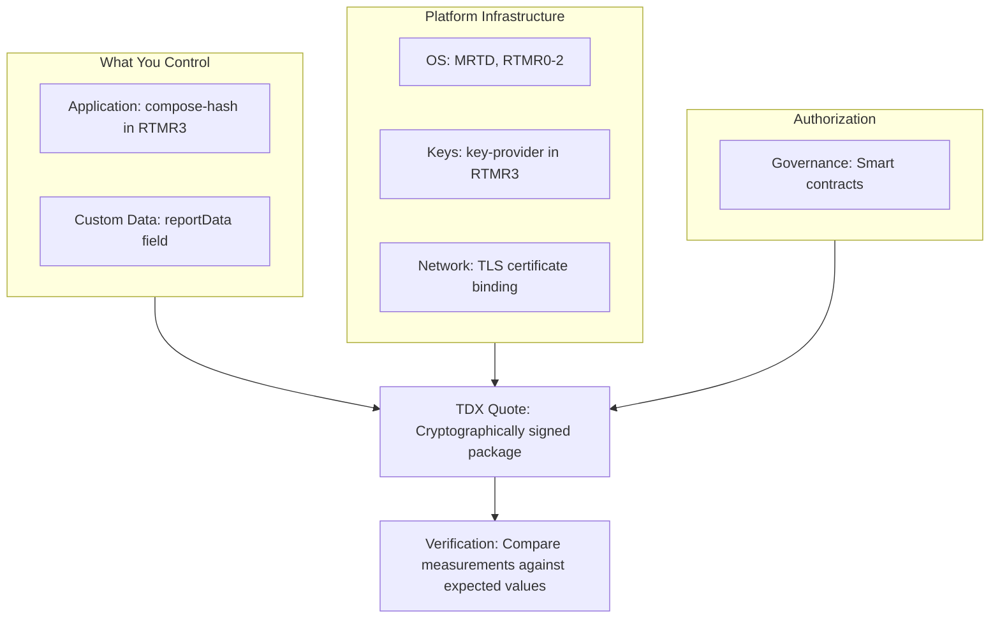
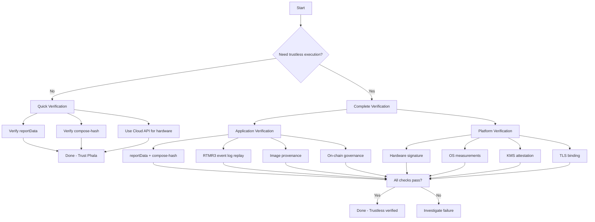

Complete security checklist ensuring no verification gaps exist. This guide proves why each verification item is necessary and why together they're sufficient for trustless execution.

## Why Complete Verification Matters

Hardware attestation alone proves your code runs in genuine TEE hardware. But anyone in the supply chain could still compromise your security:

**Cloud provider** could substitute OS images with backdoored versions.

**Docker registry** could serve malicious container images.

**Malicious KMS** could leak encryption keys and TLS certificates.

**Network attacker** could impersonate your domain with fraudulent certificates.

**Unauthorized developer** could deploy malicious code updates.

Each of these attacks bypasses hardware attestation. You need to verify the **complete chain of trust** from source code to running CVM.

## The Complete Trust Chain



Six trust chains feed into one cryptographically signed attestation quote. Verification confirms each measurement matches your expected values.

## Application Verification Checklist

These items prove your specific application code runs unmodified:

### ☐ reportData Binding

**What it prevents:** Replay attacks where old attestation quotes are reused.

**How it works:** The 64-byte `reportData` field contains your custom challenge (nonce) or public key. The TEE includes this in the signed quote.

**Why it's necessary:** Without reportData verification, an attacker could replay an old valid quote instead of generating a fresh one. Challenge-response proves the quote was generated specifically for you.

**How to verify:** See [Quickstart: Step 2](/phala-cloud/attestation/quickstart#step-2-verify-the-challenge)

```javascript
// Verify reportData contains your challenge
const reportData = Buffer.from(quote.quote.reportData, 'hex');
const receivedChallenge = reportData.subarray(0, 32);
assert(receivedChallenge.equals(challenge));
```

### ☐ compose-hash Matching

**What it prevents:** Code substitution attacks where different Docker images are deployed.

**How it works:** Your entire docker-compose.yaml (including all image SHA256 digests) is hashed into RTMR3. The CVM verifies image digests before pulling from the registry.

**Why it's necessary:** Without compose-hash verification, a compromised registry could serve malicious images. The TEE prevents this by verifying digests match the compose-hash recorded in RTMR3.

**How to verify:** See [Verify Your Application: Complete Verification](/phala-cloud/attestation/verify-your-application#complete-verification-trustless)

```javascript
import { getComposeHash } from '@phala/dstack-sdk';

// Calculate expected hash
const expectedHash = getComposeHash(JSON.parse(appCompose));

// Extract from RTMR3 event log
const events = JSON.parse(quote.event_log);
const attestedHash = events.find(e => e.event === 'compose-hash').event_payload;

assert(expectedHash === attestedHash);
```

### ☐ Docker Digest Pinning

**What it prevents:** Image tampering where registry serves different images for the same tag.

**How it works:** All images must use SHA256 digests (not tags) in docker-compose.yaml. Tags like `nginx:latest` are mutable. Digests are immutable.

**Why it's necessary:** Without digest pinning, the compose-hash would be meaningless. A tag could point to different images over time, making verification impossible.

**How to verify:** See [Verify Your Application: Understanding Image Digests](/phala-cloud/attestation/verify-your-application#understanding-image-digests)

```yaml
# Good: Immutable digest
image: nginx@sha256:eee5eae48e79b2e75178328c7c585b89d676eaae616f03f9a1813aaed820745a

# Bad: Mutable tag
image: nginx:latest
```

### ☐ RTMR3 Event Log Replay

**What it prevents:** Event log tampering where attacker modifies compose-hash or key-provider events.

**How it works:** RTMR3 uses a hash chain (RTMR3 = SHA384(RTMR3 || event)). You replay all events to recalculate RTMR3 and verify it matches the quote.

**Why it's necessary:** Without replay verification, you can't trust the event payloads. An attacker could modify events and claim different compose-hash values.

**How to verify:** See [Verify Your Application: Step 4](/phala-cloud/attestation/verify-your-application#step-4-replay-rtmr3-event-log)

```javascript
// Replay events to verify RTMR3
const rtmrs = quoteResponse.replayRtmrs();
assert(rtmrs.rtmr3 === quoteResponse.quote.rt_mr3);
```

### ☐ Image Provenance

**What it prevents:** Supply chain attacks where build infrastructure is compromised.

**How it works:** Link Docker image digests back to source code using Sigstore (GitHub-endorsed builds) or reproducible builds.

**Why it's necessary:** The compose-hash proves which images ran, but not whether those images came from your source code. Provenance links images to specific git commits.

**How to verify:** See [Verify Your Application: Linking Images to Source Code](/phala-cloud/attestation/verify-your-application#linking-images-to-source-code)

### ☐ Application Governance

**What it prevents:** Unauthorized updates where malicious developers deploy unapproved versions.

**How it works:** Only compose hashes whitelisted in the `DstackApp` smart contract can boot.

**Why it's necessary:** Without on-chain governance, any developer with deploy access could push malicious code. The contract enforces authorization.

**How to verify:** See [Verify Your Application: Step 6](/phala-cloud/attestation/verify-your-application#step-6-verify-on-chain-governance-optional)

```bash
cast call <DstackApp_ADDRESS> "allowedComposeHashes(bytes32)" <COMPOSE_HASH>
```

## Platform Verification Checklist

These items prove Phala's infrastructure is secure:

### ☐ Hardware Measurements

**What it prevents:** Fake TEE hardware or compromised firmware.

**How it works:** Intel signs the TDX quote with hardware root of trust. The signature proves genuine Intel TDX hardware generated the quote.

**Why it's necessary:** Without hardware verification, an attacker could fake a quote using software simulation. The cryptographic signature prevents this.

**How to verify:** Use Phala Cloud API (verifies Intel signature automatically) or see [Verify the Platform: Hardware & Firmware](/phala-cloud/attestation/verify-the-platform#1-hardware--firmware-verification)

```bash
curl -X POST "https://cloud-api.phala.network/api/v1/attestations/verify" \
  -H "Content-Type: application/json" \
  -d '{"hex": "YOUR_QUOTE_HEX"}'
```

### ☐ OS Measurements

**What it prevents:** Backdoored OS images with malware or data exfiltration code.

**How it works:** MRTD and RTMR0-2 contain hashes of virtual firmware, hardware config, kernel, and boot parameters. These measurements are recorded during boot.

**Why it's necessary:** Without OS verification, a compromised cloud provider could substitute the OS with a backdoored version. Measurements make OS tampering detectable.

**How to verify:** See [Verify the Platform: Operating System Verification](/phala-cloud/attestation/verify-the-platform#2-operating-system-verification)

```bash
# Calculate expected measurements
cargo run --bin dstack-mr measure -c 4 -m 4G ../dstack-0.5.4/metadata.json

# Compare against quote
```

### ☐ OS Reproducibility

**What it prevents:** Compromised build infrastructure injecting malicious code.

**How it works:** The dstack OS is built from [meta-dstack](https://github.com/Dstack-TEE/meta-dstack) using Yocto. Anyone can rebuild from a specific git commit and get identical measurements.

**Why it's necessary:** Without reproducibility, you must trust Phala's pre-built releases. Reproducible builds let you verify independently.

**How to verify:** See [Verify the Platform: Step 2 Option B](/phala-cloud/attestation/verify-the-platform#step-2-download-or-build-os-image)

```bash
git clone https://github.com/Dstack-TEE/meta-dstack.git
cd meta-dstack
git checkout <COMMIT>
# Follow reproducible build instructions
```

### ☐ OS Whitelist

**What it prevents:** Unauthorized OS versions with unknown security properties.

**How it works:** Only OS image hashes whitelisted in `DstackKms.allowedOsImages` can boot.

**Why it's necessary:** Without on-chain governance, any OS version could run. The whitelist ensures only audited OS versions are used.

**How to verify:** See [Verify the Platform: Step 5](/phala-cloud/attestation/verify-the-platform#step-5-verify-on-chain-os-whitelist)

```bash
cast call <DstackKms_ADDRESS> "allowedOsImages(bytes32)" <OS_IMAGE_HASH>
```

### ☐ KMS Identity

**What it prevents:** Malicious KMS instances leaking encryption keys and TLS certificates.

**How it works:** The KMS root CA public key hash is recorded in RTMR3 as the `key-provider` event. This binds your app to a specific KMS instance.

**Why it's necessary:** All your keys (disk encryption, TLS, signing keys) derive from the KMS root keys. A malicious KMS compromises everything. RTMR3 binding prevents silent KMS substitution.

**How to verify:** See [Verify the Platform: Key Management Verification](/phala-cloud/attestation/verify-the-platform#3-key-management-verification)

```javascript
const events = JSON.parse(quote.event_log);
const keyProvider = events.find(e => e.event === 'key-provider');
console.log('KMS ID:', JSON.parse(keyProvider.event_payload).id);
```

### ☐ KMS Attestation

**What it prevents:** Compromised KMS running malicious code.

**How it works:** The KMS itself is a TEE instance with its own attestation quote. You verify the KMS's hardware, OS, and application code independently.

**Why it's necessary:** Binding to a KMS in RTMR3 is meaningless if that KMS is compromised. You must verify the KMS's complete chain of trust.

**How to verify:** See [Verify the Platform: Step 2](/phala-cloud/attestation/verify-the-platform#step-2-verify-the-kms-itself)

### ☐ KMS Governance

**What it prevents:** Unauthorized KMS instances with unknown security properties.

**How it works:** Only KMS instances with whitelisted "aggregated MR" (combined hash of all measurements) can operate.

**Why it's necessary:** Without governance, any KMS instance could be used. The whitelist ensures only audited KMS instances are trusted.

**How to verify:** See [Verify the Platform: Step 3](/phala-cloud/attestation/verify-the-platform#step-3-verify-kms-governance)

```bash
cast call <DstackKms_ADDRESS> "kmsAllowedAggregatedMrs(bytes32)" <AGGREGATED_MR>
```

### ☐ TLS Certificate Binding

**What it prevents:** Certificate impersonation attacks where attacker issues fraudulent certificates.

**How it works:** The TEE generates TLS certificates and publishes evidence files at `/evidences/`. The quote's `reportData` contains a hash of the evidence, cryptographically binding certificate to quote.

**Why it's necessary:** Without binding, anyone (domain owner, CA, cloud provider) could issue valid certificates for your domain. Binding proves the TEE controls the certificate.

**How to verify:** See [Domain Attestation](/phala-cloud/networking/domain-attestation)

```javascript
// Verify evidence hash in reportData
const evidenceHash = crypto.createHash('sha256').update(evidenceFiles).digest();
assert(quote.reportData.includes(evidenceHash));
```

### ☐ CAA Records

**What it prevents:** Unauthorized certificate issuance even if DNS is compromised.

**How it works:** CAA DNS records restrict which Certificate Authorities can issue certificates for your domain.

**Why it's necessary:** Without CAA records, any CA could issue certificates. CAA records add defense-in-depth against compromised CAs or DNS attacks.

**How to verify:** See [Domain Attestation: CAA Records](/phala-cloud/networking/domain-attestation)

```bash
dig CAA yourdomain.com
```

## Why This Is Sufficient

The verification checklist covers the complete Trusted Computing Base (TCB). Here's why no gaps exist:

**Hardware root of trust:** Intel's signature proves genuine TDX hardware. All measurements are recorded by this hardware during boot before any software runs.

**Measurement immutability:** Once recorded in the signed quote, measurements cannot be modified. Change one byte anywhere in the TCB, and measurements won't match.

**Cryptographic binding:** Each layer binds to the next through measurements. OS binds to hardware (MRTD, RTMR0-2). Application binds to OS (RTMR3). Keys bind to KMS (key-provider). Certificates bind to quote (reportData).

**Complete coverage:** The checklist covers all TCB components. Nothing runs in the CVM that isn't measured or verified.

**Governance enforcement:** Smart contracts ensure only authorized versions can boot. On-chain authorization prevents malicious updates even with compromised infrastructure.

**No trust assumptions:** With complete verification, you don't need to trust Phala Cloud, Docker registries, build infrastructure, or Certificate Authorities. Everything is cryptographically verified.

## Security Proof

**Theorem:** If all checklist items pass, the CVM runs your exact code in genuine TEE hardware with no security gaps.

**Proof by contradiction:** Assume an attacker compromises the CVM despite passing all checks.

The attacker must modify at least one component (hardware, firmware, OS, application, keys, or certificates). But:

1. **Hardware/firmware tampering** changes MRTD, mr_seam, or tee_tcb_svn, failing hardware verification.
2. **OS tampering** changes RTMR0-2, failing OS measurement verification.
3. **Application tampering** changes compose-hash in RTMR3, failing compose-hash verification.
4. **Image substitution** changes image digests, failing the TEE's digest check before pulling.
5. **KMS substitution** changes key-provider in RTMR3, failing KMS identity verification.
6. **Certificate impersonation** fails because evidence hash won't match reportData.
7. **Unauthorized updates** fail on-chain governance checks.

Any modification causes verification to fail. Therefore, if all checks pass, no compromise is possible. QED.

## Complete Verification Checklist

Use this checklist for security audits. All items must pass for complete trustless verification:

**Application Layer (What You Control):**
- [ ] reportData contains expected challenge/public key
- [ ] compose-hash matches calculated hash
- [ ] All Docker images use SHA256 digests (not tags)
- [ ] RTMR3 event log replays to quoted RTMR3
- [ ] Image digests link to audited source code (Sigstore or reproducible builds)
- [ ] compose-hash is whitelisted in DstackApp contract (if using governance)

**Platform Layer (Infrastructure):**
- [ ] TDX quote signature is valid (Intel root certificates)
- [ ] `tee_tcb_svn` matches latest security patches
- [ ] MRTD and RTMR0-2 match calculated OS measurements
- [ ] VM config (CPU, memory, GPU) matches deployment
- [ ] OS image hash is whitelisted in DstackKms contract
- [ ] (Optional) OS rebuilt reproducibly from source
- [ ] KMS ID from `key-provider` event is known and trusted
- [ ] KMS's own attestation quote is valid
- [ ] KMS aggregated MR is whitelisted in DstackKms contract

**Network Layer (Custom Domains Only):**
- [ ] TLS certificate fingerprint matches served certificate
- [ ] Evidence files at `/evidences/` cryptographically bind to quote
- [ ] CAA DNS records restrict certificate issuance

**Governance Layer:**
- [ ] Smart contract addresses are verified and trusted
- [ ] Contract permissions match security policy
- [ ] Contract ownership and upgrade mechanisms are understood

## Verification Workflow



## Tools and Resources

- **[Quickstart](/phala-cloud/attestation/quickstart)** - Quick verification (reportData + Cloud API)
- **[Verify Your Application](/phala-cloud/attestation/verify-your-application)** - Complete application verification
- **[Verify the Platform](/phala-cloud/attestation/verify-the-platform)** - Complete platform verification
- **[Attestation Fields](/phala-cloud/attestation/attestation-fields)** - Field reference
- **[Domain Attestation](/phala-cloud/networking/domain-attestation)** - TLS certificate verification
- **[trust-center](https://github.com/Phala-Network/trust-center)** - Reference implementation
- **[dstack SDK](https://www.npmjs.com/package/@phala/dstack-sdk)** - `getComposeHash()` and `replayRtmrs()`
- **[meta-dstack](https://github.com/Dstack-TEE/meta-dstack)** - Reproducible OS builds
- **[Smart Contracts](https://github.com/Dstack-TEE/dstack/tree/master/kms/auth-eth/contracts)** - DstackKms and DstackApp

## Real-World Example

For a complete implementation of the full chain of trust, see how Confidential AI verifies:
- Hardware stack (NVIDIA GPUs + Intel TDX)
- OS integrity from reproducible builds
- Application code via compose-hash
- KMS trust for key derivation
- Request/response integrity signatures

Learn more: **[Confidential AI Verification](/phala-cloud/confidential-ai/verify/overview)**

## Next Steps

<CardGroup cols={2}>
  <Card
    icon="rocket"
    href="/phala-cloud/attestation/quickstart"
    title="Quickstart"
    arrow="true"
  >
    Quick verification guide
  </Card>

  <Card
    icon="code"
    href="/phala-cloud/attestation/verify-your-application"
    title="Verify Your Application"
    arrow="true"
  >
    Prove your exact code is running
  </Card>

  <Card
    icon="server"
    href="/phala-cloud/attestation/verify-the-platform"
    title="Verify the Platform"
    arrow="true"
  >
    Verify OS, KMS, and infrastructure
  </Card>

  <Card
    icon="book"
    href="/phala-cloud/attestation/attestation-fields"
    title="Field Reference"
    arrow="true"
  >
    Understand all quote fields
  </Card>
</CardGroup>
