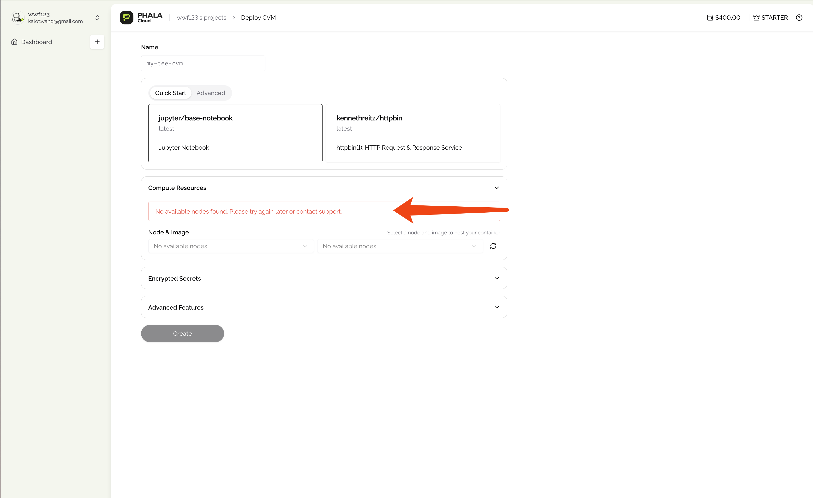

Join our support groups: 🌍 [Global](https://t.me/+nbhjx1ADG9EyYmI9), 🇨🇳 [Chinese](https://t.me/+4PcAE9qTZ1kzM2M9)

## Errors in Cloud UI

1.  No available nodes found. Please try again later or contract support.

    This error indicates that there are no available nodes for deployment. Generally, this is because you are in the free tier and you have already deployed the maximum number of CVMs. Please upgrade to a paid plan to continue or delete your old CVMs.

    <Frame caption="No available nodes found error">
        
    </Frame>

## Errors in CVM Logs

1.  **exec /usr/local/bin/docker-entrypoint.sh: exec format error**

    When you see this error in the CVM logs, it indicates that your Docker images are not compatible with the x86 platform. This may happen if you built the image on an ARM or another platform. To resolve this issue, specify the platform by using the argument **`--platform linux/amd64`** when building your Docker images.
