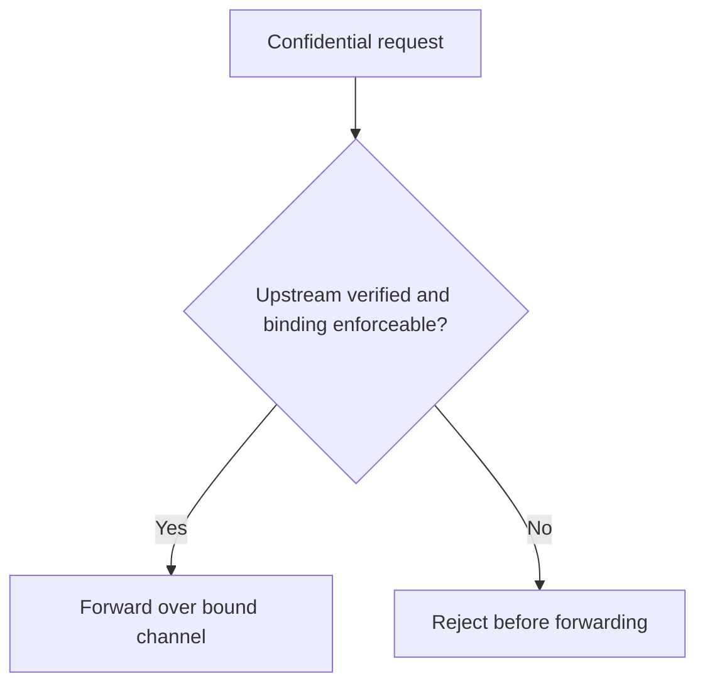

Verifying an upstream's attestation is not enough by itself. The gateway must also prove it sends the prompt to the same verified endpoint. Channel binding closes that gap.

For a confidential response, gateway verification and binding are one fact: if the provider cannot be verified and bound, the prompt is not forwarded.

## Binding Types

| Binding | What it is | How it is enforced |
| --- | --- | --- |
| `tls_spki_sha256` | SHA-256 digest of the upstream TLS public key (SPKI). | The gateway pins the HTTPS connection to that key before forwarding. |
| `e2ee_public_key_sha256` | SHA-256 digest of the upstream E2EE public key. | The gateway encrypts the provider-facing request to the verified enclave key. |

The binding type depends on the provider. See [Providers](/phala-cloud/confidential-ai/confidential-model/providers).

## Fail-Closed Forwarding

When `upstream.verified.required` is `true`, the gateway must verify the upstream and enforce the binding before forwarding. If verification fails, or if the binding cannot be enforced on the live connection, the gateway rejects instead of sending the prompt.

For a routed model, `required` is `false`. The gateway can forward over ordinary TLS, and the receipt records `upstream.verified.result = failed`.

## How to Confirm Binding

You do not enforce the provider binding from your client. You verify that the gateway did:

1. Verify the [Attestation Report](/phala-cloud/confidential-ai/confidential-model/api-reference/attestation).
2. Fetch the [Receipt](/phala-cloud/confidential-ai/confidential-model/api-reference/receipts).
3. Read `upstream.verified.channel_bindings` and confirm `result: verified`, `required: true`, and a `session_id`.
4. Fetch the [Session](/phala-cloud/confidential-ai/confidential-model/api-reference/sessions) for deeper evidence when needed.

## Related

<CardGroup cols={2}>
  <Card title="Trust Boundary" icon="shield-halved" href="/phala-cloud/confidential-ai/confidential-model/trust-boundary" />
  <Card title="TCB and Claims" icon="list-check" href="/phala-cloud/confidential-ai/confidential-model/tcb-and-claims" />
</CardGroup>
