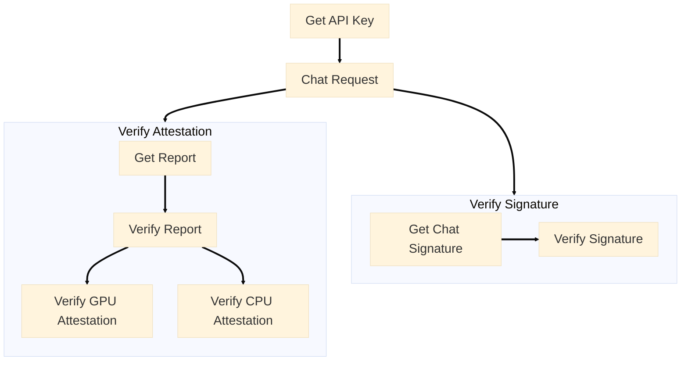

<Check>
Run LLMs in secure GPU TEE with [99% native performance](/phala-cloud/confidential-ai/benchmark). Our OpenAI-compatible API gives you enterprise-grade privacy without sacrificing speed or ease of use.
</Check>

<Tip>
Your data stays encrypted during processing, and you can verify the integrity of every response. This gives you enterprise-grade privacy with the simplicity of a standard API.
</Tip>

## Overview

We will introduce the usage of AI API. Here is the workflow of how to use Confidential AI API, including attestation verifying and signature verifying.



## Prerequisites Before API Requests

### 1. Add Funds

You need at least $5 in your account. Go to **Dashboard** and click **Deposit**.

### 2. Enable the API

<Frame>
    
</Frame>

Navigate to **Dashboard** → **Confidential AI API** and click **Enable**. Then create your first API key and click the key to copy.

<Frame>
    
</Frame>

### 3. Choose Your Model

We support 6+ [models](https://redpill.ai/models) running in GPU TEE. Click the **GPU TEE** checkbox to see all options:

* [**DeepSeek: DeepSeek V3 0324**](https://redpill.ai/models/phala/deepseek-chat-v3-0324)
* [**Meta: Llama 3.3 70B Instruct**](https://redpill.ai/models/phala/llama-3.3-70b-instruct)
* [**OpenAI: GPT OSS 120B**](https://redpill.ai/models/phala/gpt-oss-120b)
* [**Qwen: Qwen3 Coder**](https://redpill.ai/models/phala/qwen3-coder)
* [**Qwen2.5 7B Instruct**](https://redpill.ai/models/phala/qwen-2.5-7b-instruct)

<Frame>
    
</Frame>

## Make Your First Request

Use our OpenAI-compatible endpoint to chat with secure AI:

```http
https://api.redpill.ai/v1/chat/completions
```

Here's a simple `curl` example:

```bash CLI
curl -X 'POST' \
  'https://api.redpill.ai/v1/chat/completions' \
  -H 'accept: application/json' \
  -H 'Content-Type: application/json' \
  -H 'Authorization: Bearer <YOUR_API_KEY>' \
  -d '{
  "messages": [
    {
      "content": "You are a helpful assistant.",
      "role": "system"
    },
    {
      "content": "What is your model name?",
      "role": "user"
    }
  ],
  "stream": true,
  "model": "phala/deepseek-chat-v3-0324"
}'
```

You'll get a streaming response like this:

```text
data: {"id":"chatcmpl-0cdf7629fcfa4135bbdb9936e737e95c","object":"chat.completion.chunk","created":1740415146,"model":"phala/deepseek-chat-v3-0324","choices":[{"index":0,"delta":{"content":""},"logprobs":null,"finish_reason":"stop","stop_reason":128001}]}
...
data: [DONE]
```

## Verify Your AI is Running Securely

Every response comes with cryptographic proof that it ran in a secure TEE. Here's how to verify this.

### Get the Attestation Report

Request an attestation report for any model:

```sh CLI
curl \
  'https://api.redpill.ai/v1/attestation/report?model=phala/deepseek-chat-v3-0324' \
  -H 'accept: application/json' \
  -H 'Content-Type: application/json' \
  -H 'Authorization: Bearer <YOUR_API_KEY>'
```

The response includes:

```sh
{
  "signing_address": "...",
  "nvidia_payload": "...",
  "intel_quote": "...",
  "all_attestations": [
    {
      "signing_address": "...",
      "nvidia_payload": "...",
      "intel_quote": "..."
    }
  ]
}
```

The `signing_address` is a cryptographic key generated inside the TEE. It's used to sign chat responses, proving they came from the verified hardware.

The `all_attestations` list contains attestations from all GPU nodes in our network. Use any `signing_address` from this list to verify the integrity of that specific node.

### Verify GPU Attestation

Copy the `nvidia_payload` and verify with NVIDIA:

```sh CLI
curl -X POST https://nras.attestation.nvidia.com/v3/attest/gpu \
 -H "accept: application/json" \
 -H "content-type: application/json" \
 -d "<NVIDIA_PAYLOAD_FROM_ABOVE>"
```

### Verify Intel TDX Attestation

Verify the Intel TDX attestation quote using the `intel_quote` value at the [TEE Attestation Explorer](https://proof.t16z.com/).

## Verify Chat Signatures

Every chat response includes a cryptographic signature. Here's how to verify them.

### Get the Signature

When you chat with an LLM, the response contains an `id` field with prefix start with `chatcmpl-`.

<Note>Use this ID to retrieve the signature within 20 minutes.</Note>

```text Sample Response
...
data: {"id":"chatcmpl-0cdf7629fcfa4135bbdb9936e737e95c","object":"chat.completion.chunk","created":1740415146,"model":"phala/deepseek-chat-v3-0324","choices":[{"index":0,"delta":{"content":""},"logprobs":null,"finish_reason":"stop","stop_reason":128001}]}
data: [DONE]
```

Use the response `id` to get the signature:

```sh
# URL format
GET https://api.redpill.ai/v1/signature/{request_id}?model={model_id}&signing_algo=ecdsa
```

For example, with the previous response ID `chatcmpl-0cdf7629fcfa4135bbdb9936e737e95c`:

```shell Get Signature Response
# Example
curl -X GET https://api.redpill.ai/v1/signature/chatcmpl-0cdf7629fcfa4135bbdb9936e737e95c?model=phala/deepseek-chat-v3-0324&signing_algo=ecdsa

# Response output
{
  "text": "65b0adb47d0450971803dfb18d0ce4af4a64d27420a43d5aad4066ebf10b81b5:e508d818744d175a62aae1a9fb3f373c075460cbe50bf962a88ac008c843dff1",
  "signature": "0xf28f537325c337fd96ae6e156783c904ca708dcd38fb8a476d1280dfc72dc88e4fcb5c3941bdd4f8fe5238a2253b975c6b02ea6a0a450b5b0f9296ab54cf24181b",
  "signing_address": "0xc51268C9b46140619CBC066A34441a6ca51F85f9",
  "signing_algo": "ecdsa"
}
```

**Response Fields:**
- `text`: The message to verify
- `signature`: The cryptographic signature
- `signing_address`: The public key in TEE
- `signing_algo`: The signature algorithm used

<Tip>
**How do we generate `text`?**

`text` content is generated by `SHA256(request body) + ":" + SHA256(response body)`

**Example**
<Accordion title="Request Body and Hash">
```json
{
  "messages": [
    {
      "content": "You are a helpful assistant.",
      "role": "system"
    },
    {
      "content": "What is your model name?",
      "role": "user"
    }
  ],
  "stream": true,
  "max_tokens": 10,
  "stream_options": {
    "include_usage": true
  },
  "model": "deepseek/deepseek-chat-v3-0324"
}
```

Python3 example of the request body sha256 calculation:
```python
from hashlib import sha256
request_sha256 = sha256(request_body.encode('utf-8')).hexdigest()
sha256(body.encode('utf-8')).hexdigest()
```

The value of `request_sha256` would be: `65b0adb47d0450971803dfb18d0ce4af4a64d27420a43d5aad4066ebf10b81b5`

</Accordion>

<Accordion title="Response Body and Hash">
```text
data: {"id":"chatcmpl-aae3e785047c4c229e40df4ff639b956","object":"chat.completion.chunk","created":1756303541,"model":"deepseek/deepseek-chat-v3-0324","choices":[{"index":0,"delta":{"role":"assistant","content":""},"logprobs":null,"finish_reason":null}]}\n\n
data: {"id":"chatcmpl-aae3e785047c4c229e40df4ff639b956","object":"chat.completion.chunk","created":1756303541,"model":"deepseek/deepseek-chat-v3-0324","choices":[{"index":0,"delta":{"content":"I"},"logprobs":null,"finish_reason":null}]}\n\n
data: {"id":"chatcmpl-aae3e785047c4c229e40df4ff639b956","object":"chat.completion.chunk","created":1756303541,"model":"deepseek/deepseek-chat-v3-0324","choices":[{"index":0,"delta":{"content":" am"},"logprobs":null,"finish_reason":null}]}\n\n
data: {"id":"chatcmpl-aae3e785047c4c229e40df4ff639b956","object":"chat.completion.chunk","created":1756303541,"model":"deepseek/deepseek-chat-v3-0324","choices":[{"index":0,"delta":{"content":" based"},"logprobs":null,"finish_reason":null}]}\n\n
data: {"id":"chatcmpl-aae3e785047c4c229e40df4ff639b956","object":"chat.completion.chunk","created":1756303541,"model":"deepseek/deepseek-chat-v3-0324","choices":[{"index":0,"delta":{"content":" on"},"logprobs":null,"finish_reason":null}]}\n\n
data: {"id":"chatcmpl-aae3e785047c4c229e40df4ff639b956","object":"chat.completion.chunk","created":1756303541,"model":"deepseek/deepseek-chat-v3-0324","choices":[{"index":0,"delta":{"content":" OpenAI"},"logprobs":null,"finish_reason":null}]}\n\n
data: {"id":"chatcmpl-aae3e785047c4c229e40df4ff639b956","object":"chat.completion.chunk","created":1756303541,"model":"deepseek/deepseek-chat-v3-0324","choices":[{"index":0,"delta":{"content":"'s"},"logprobs":null,"finish_reason":null}]}\n\n
data: {"id":"chatcmpl-aae3e785047c4c229e40df4ff639b956","object":"chat.completion.chunk","created":1756303541,"model":"deepseek/deepseek-chat-v3-0324","choices":[{"index":0,"delta":{"content":" GPT"},"logprobs":null,"finish_reason":null}]}\n\n
data: {"id":"chatcmpl-aae3e785047c4c229e40df4ff639b956","object":"chat.completion.chunk","created":1756303541,"model":"deepseek/deepseek-chat-v3-0324","choices":[{"index":0,"delta":{"content":"-"},"logprobs":null,"finish_reason":null}]}\n\n
data: {"id":"chatcmpl-aae3e785047c4c229e40df4ff639b956","object":"chat.completion.chunk","created":1756303541,"model":"deepseek/deepseek-chat-v3-0324","choices":[{"index":0,"delta":{"content":"4"},"logprobs":null,"finish_reason":null}]}\n\n
data: {"id":"chatcmpl-aae3e785047c4c229e40df4ff639b956","object":"chat.completion.chunk","created":1756303541,"model":"deepseek/deepseek-chat-v3-0324","choices":[{"index":0,"delta":{"content":"o"},"logprobs":null,"finish_reason":"length","stop_reason":null}]}\n\n
data: {"id":"chatcmpl-aae3e785047c4c229e40df4ff639b956","object":"chat.completion.chunk","created":1756303541,"model":"deepseek/deepseek-chat-v3-0324","choices":[],"usage":{"prompt_tokens":18,"total_tokens":28,"completion_tokens":10}}\n\n
data: [DONE]\n\n
```

Python3 example of the response body sha256 calculation:
```python
from hashlib import sha256
h = sha256()
async for chunk in response.aiter_text():
    h.update(chunk.encode()) # chunk should include the \n\n
response_sha256 = h.hexdigest()
```

The sha256 of the response body is `e508d818744d175a62aae1a9fb3f373c075460cbe50bf962a88ac008c843dff1`
</Accordion>

**Notice**

Sometime the api gateway may change the request body fields (i.e., `model`, or `stream_options`), so the request body sha256 may not be the same as your original request body sha256.
</Tip>

<Note>Signatures are stored in memory for only 20 minutes after the response is generated.</Note>

### Verify on Etherscan

Go to [Etherscan's Signature Verification](https://etherscan.io/verifiedSignatures) and click "Verify Signature":

- **Address**: Use the `signing_address` from the attestation API
- **Message**: Use the `text` field from the signature response
- **Signature Hash**: Use the `signature` field from the signature response

<Frame>
    
</Frame>
