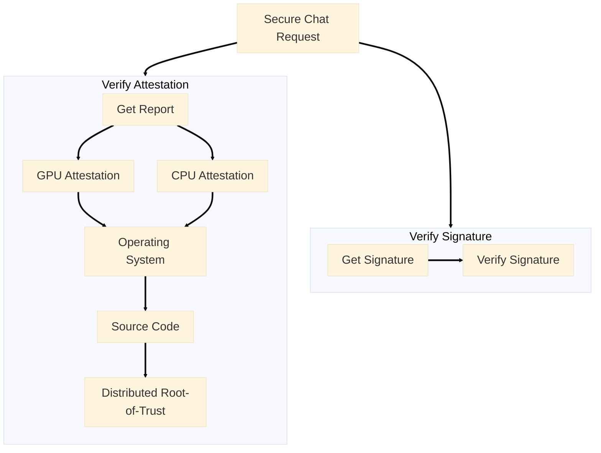

## Get API Key

### 1. Add Funds & Enable the API

You need at least $5 in your account. Go to **Dashboard** and click **Deposit** to add funds.

Navigate to **Dashboard** → **Confidential AI API** and click **Enable**. Then create your first API key and click the key to copy.

<Frame>
    
</Frame>

### 2. Available Models

We support [6+ models](https://redpill.ai/models) running in GPU TEE. Click the **GPU TEE** checkbox to see all options:

* [**DeepSeek: DeepSeek V3 0324**](https://redpill.ai/models/phala/deepseek-chat-v3-0324)
* [**Meta: Llama 3.3 70B Instruct**](https://redpill.ai/models/phala/llama-3.3-70b-instruct)
* [**OpenAI: GPT OSS 120B**](https://redpill.ai/models/phala/gpt-oss-120b)
* [**Qwen: Qwen3 Coder**](https://redpill.ai/models/phala/qwen3-coder)
* [**Qwen2.5 7B Instruct**](https://redpill.ai/models/phala/qwen-2.5-7b-instruct)

## Make Your Secure Request

<CodeGroup>
```bash Python
# Install OpenAI SDK: `pip3 install openai`

from openai import OpenAI

client = OpenAI(api_key="<YOUR_API_KEY>", base_url="https://api.redpill.ai/api/v1")

response = client.chat.completions.create(
    model="phala/deepseek-chat-v3-0324",
    messages=[
        {"role": "system", "content": "You are a helpful assistant"},
        {"role": "user", "content": "What is your model name?"},
    ],
    stream=True
)
print(response.choices[0].message.content)
```

```typescript TypeScript
import OpenAI from 'openai';

const openai = new OpenAI({
    baseURL: 'https://api.redpill.ai/api/v1',
    apiKey: '<YOUR_API_KEY>',
  },
});

async function main() {
  const completion = await openai.chat.completions.create({
    model: 'phala/deepseek-chat-v3-0324',
    messages: [
      {
        role: 'user',
        content: 'What is the meaning of life?',
      },
    ],
  });
  console.log(completion.choices[0].message);
}

main();
```

```bash CLI
curl -X 'POST' \
  'https://api.redpill.ai/v1/chat/completions' \
  -H 'accept: application/json' \
  -H 'Content-Type: application/json' \
  -H 'Authorization: Bearer <YOUR_API_KEY>' \
  -d '{
  "messages": [
    {
      "content": "You are a helpful assistant.",
      "role": "system"
    },
    {
      "content": "What is your model name?",
      "role": "user"
    }
  ],
  "stream": true,
  "model": "phala/deepseek-chat-v3-0324"
}'
```
</CodeGroup>


## Verify Your AI is Running Securely

Every response comes with cryptographic proof that it ran in a secure TEE. This proof is generated by the TEE and ensures the response is secure and trustworthy: Attestation(step 1 ~ 4) and Signature(step 5).

<Steps>
  <Step title="TEE Hardware">
    Verify the physical hardware (CPU/GPU) is genuine and running in a secure TEE.
  </Step>
  <Step title="Operating System">
    Verify that dstack OS is a valid trusted computing base with no backdoors.
  </Step>
  <Step title="Source Code">
    Verify that the docker compose file with application image and configuration is secure.
  </Step>
  <Step title="Distributed Root-of-Trust">
    Verify that KMS of dstack, ensuring no unauthorized access.
  </Step>
  <Step title="Signature">
    Verify the integrity of request and response content.
  </Step>
</Steps>


If you want to learn how to verify each step, check out the following guides:

<CardGroup cols={2}>
  <Card
    icon="shield-check"
    href="/phala-cloud/confidential-ai/verify/verify-attestation"
    title="Verify Attestation"
    arrow="true"
  >
    Learn how to verify TEE hardware, operating system, source code, and distributed root-of-trust attestations
  </Card>

  <Card
    icon="signature"
    href="/phala-cloud/confidential-ai/verify/verify-signature"
    title="Verify Signature"
    arrow="true"
  >
    Learn how to verify cryptographic signatures to ensure request and response integrity
  </Card>
</CardGroup>