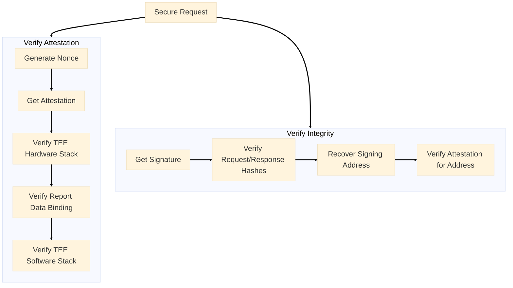

## Why verification matters

Verification ensures your AI workloads run securely in genuine TEE hardware. You get cryptographic proof that:

- **Hardware is authentic** - GPUs and CPUs are from trusted vendors and running in secure TEE mode
- **Software is untampered** - The entire software stack from OS to application code is verified
- **Responses are trustworthy** - Every AI response comes with proof it ran in a secure TEE

The verification process follows these steps:

<Steps>
  <Step title="TEE Hardware Stack">
    Verify the physical hardware stack, including CPU and GPU, is genuine and running in a secure TEE. Confirm the signing key is cryptographically bound to the hardware.
  </Step>
  <Step title="TEE Software Stack">
    Verify that the software stack, including operating system, Docker compose configuration, container build provenance, network end-to-end encryption, and distributed root-of-trust, is secure and trustworthy.
  </Step>
  <Step title="Integrity Proof">
    Verify the integrity of request and response content through cryptographic signatures.
  </Step>
</Steps>

Here's how the verification workflow looks:

### How the trust chain works

These verification steps create a complete security chain:

- **Fresh Nonce** prevents replay attacks - ensures attestations are generated fresh for your request
- **TEE Hardware Stack** establishes the physical foundation - genuine NVIDIA GPUs and Intel CPUs with TEE enabled
- **Report Data Binding** proves the signing key belongs to the TEE - signing address and nonce are cryptographically embedded in hardware-signed attestation
- **TEE Software Stack** extends trust to the software layer - verified OS, exact Docker compose configuration, and container build provenance
- **Integrity Proof** ensures data authenticity - cryptographic signatures prove responses came from the verified TEE

Together, they guarantee your AI workloads run securely across the entire system with end-to-end cryptographic proof.

Click the cards below to learn more about details.

<CardGroup cols={2}>
  <Card
    icon="shield-check"
    href="/phala-cloud/confidential-ai/verify/verify-attestation"
    title="Verify Attestation"
    arrow="true"
  >
    Learn how to verify hardware authenticity, report data binding, operating system integrity, Docker compose configuration, container build provenance, network end-to-end encryption, and distributed root-of-trust
  </Card>

  <Card
    icon="signature"
    href="/phala-cloud/confidential-ai/verify/verify-signature"
    title="Integrity Proof"
    arrow="true"
  >
    Learn how to verify cryptographic signatures to ensure request and response integrity
  </Card>
</CardGroup>