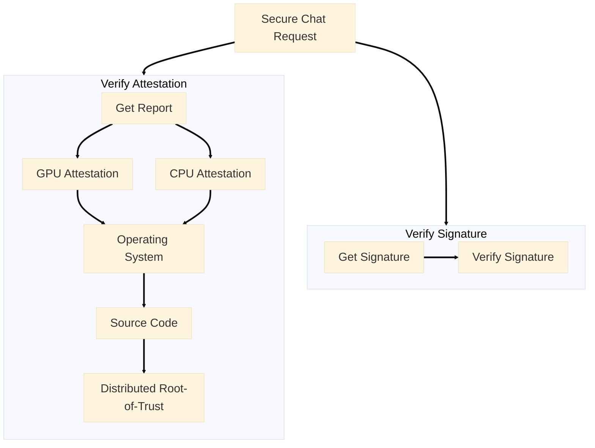

Every response comes with cryptographic proof that it ran in a secure TEE. This proof is generated by the TEE and ensures the response is secure and trustworthy: Attestation(step 1 ~ 4) and Signature(step 5).

<Steps>
  <Step title="TEE Hardware">
    Verify the physical hardware (CPU/GPU) is genuine and running in a secure TEE.
  </Step>
  <Step title="Operating System">
    Verify that dstack OS is a valid trusted computing base with no backdoors.
  </Step>
  <Step title="Source Code">
    Verify that the docker compose file with application image and configuration is secure.
  </Step>
  <Step title="Distributed Root-of-Trust">
    Verify that KMS of dstack, ensuring no unauthorized access.
  </Step>
  <Step title="Signature">
    Verify the integrity of request and response content.
  </Step>
</Steps>

<CardGroup cols={2}>
  <Card
    icon="shield-check"
    href="/phala-cloud/confidential-ai/verify/verify-attestation"
    title="Verify Attestation"
    arrow="true"
  >
    Learn how to verify TEE hardware, operating system, source code, and distributed root-of-trust attestations
  </Card>

  <Card
    icon="signature"
    href="/phala-cloud/confidential-ai/verify/verify-signature"
    title="Verify Signature"
    arrow="true"
  >
    Learn how to verify cryptographic signatures to ensure request and response integrity
  </Card>
</CardGroup>