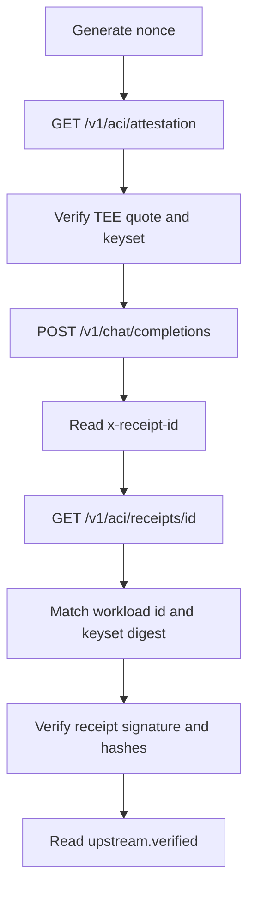

## Why verification matters

Confidential AI verification answers two questions:

- **Who served my request?** The gateway attestation report proves the API was served by a specific workload running in a genuine TEE.
- **What happened to my request?** The signed receipt binds your request and response hashes to that attested workload and records whether the upstream model provider was verified.

For confidential responses, the receipt also shows that the upstream provider was verified and channel-bound before your prompt was forwarded. For routed responses, the gateway is still attested, but the upstream provider is not.

## Verification workflow

<Steps>
  <Step title="Fetch gateway attestation">
    Generate a fresh nonce and call `GET /v1/aci/attestation`. Verify the TEE quote, keyset endorsement, freshness, and source provenance.
  </Step>
  <Step title="Make an inference request">
    Call an OpenAI-compatible endpoint such as `POST /v1/chat/completions` and capture the `x-receipt-id` header.
  </Step>
  <Step title="Fetch the signed receipt">
    Call `GET /v1/aci/receipts/{id}`. Confirm the receipt's `workload_id` and `workload_keyset_digest` match the attestation report.
  </Step>
  <Step title="Verify hashes and upstream status">
    Check request and response hashes, verify the receipt signature against the attested keyset, and read `upstream.verified`.
  </Step>
</Steps>

```mermaid
flowchart TD
  A[Generate nonce] --> B[GET /v1/aci/attestation]
  B --> C[Verify TEE quote and keyset]
  C --> D[POST /v1/chat/completions]
  D --> E[Read x-receipt-id]
  E --> F[GET /v1/aci/receipts/id]
  F --> G[Match workload id and keyset digest]
  G --> H[Verify receipt signature and hashes]
  H --> I[Read upstream.verified]
```

## What a passing verification proves

- The gateway is a genuine TEE workload with a known identity.
- The receipt was signed by a key published in the attested gateway keyset.
- The response bytes you received match the response hash in the receipt.
- For a confidential response, the upstream provider was verified and the request channel was bound before forwarding.

## Canonical and legacy endpoints

| Purpose | Canonical endpoint | Legacy alias |
| --- | --- | --- |
| Gateway attestation | `GET /v1/aci/attestation?nonce=` | `GET /v1/attestation/report` |
| Per-response proof | `GET /v1/aci/receipts/{id}` | `GET /v1/signature/{id}` |
| Upstream security context | `GET /v1/aci/sessions/{session_id}` | None |

Use the canonical `/v1/aci/*` endpoints for new integrations.

<CardGroup cols={2}>
  <Card
    icon="shield-check"
    href="/phala-cloud/confidential-ai/verify/verify-attestation"
    title="Verify Attestation"
    arrow="true"
  >
    Understand the attestation report, nonce binding, gateway keyset, and source provenance.
  </Card>

  <Card
    icon="receipt"
    href="/phala-cloud/confidential-ai/verify/verify-signature"
    title="Verify a Response"
    arrow="true"
  >
    Verify a signed receipt, response hashes, and confidential upstream status.
  </Card>
</CardGroup>
