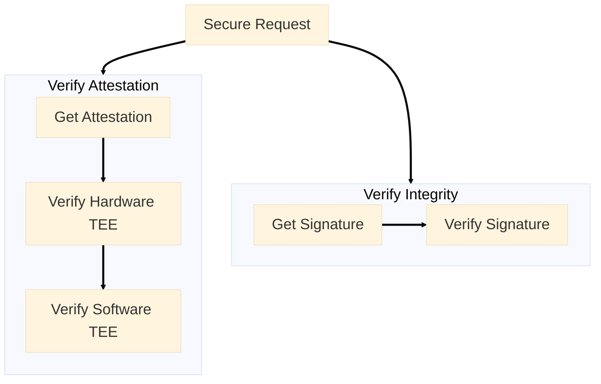

## Why you need to verify

The verification process of Confidential AI includes:

- **Attestation Verification** ensure that the hardware and software stack are secure and trustworthy. Attestation verification provides assurance that your workloads are protected from tampering and unauthorized access. This verification includes **Hardware TEE** and **Software TEE**.
- **Integrity Verification** ensure the integrity of your AI workloads, every response comes with cryptographic proof that it ran in a secure TEE. This proof is generated by the TEE and ensures the response is secure and trustworthy.

So the verification process includes:

<Steps>
  <Step title="Hardware TEE">
    Verify the physical hardware stack, including CPU and GPU, is genuine and running in a secure TEE.
  </Step>
  <Step title="Software TEE">
    Verify that the software stack, including operating system, source code, network end-to-end encryption, and distributed root-of-trust, is secure and trustworthy.
  </Step>
  <Step title="Integrity Proof">
    Verify the integrity of request and response content.
  </Step>
</Steps>

So the main workflow is as follows:

The Hardware TEE, Software TEE, and Integrity Proof form a progressive and interlinked trust chain, ensuring the security and integrity of AI workloads in a TEE. Hardware TEE establishes the physical security foundation, Software TEE extends trust to the software layer, and Integrity Proof ensures the trustworthiness of data processing. These steps together guarantee the security and integrity of AI workloads across the entire system.

Click the cards below to learn more about details.

<CardGroup cols={2}>
  <Card
    icon="shield-check"
    href="/phala-cloud/confidential-ai/verify/verify-attestation"
    title="Verify Attestation"
    arrow="true"
  >
    Learn how to verify TEE hardware, operating system, source code, and distributed root-of-trust attestations
  </Card>

  <Card
    icon="signature"
    href="/phala-cloud/confidential-ai/verify/verify-signature"
    title="Integrity Proof"
    arrow="true"
  >
    Learn how to verify cryptographic signatures to ensure request and response integrity
  </Card>
</CardGroup>