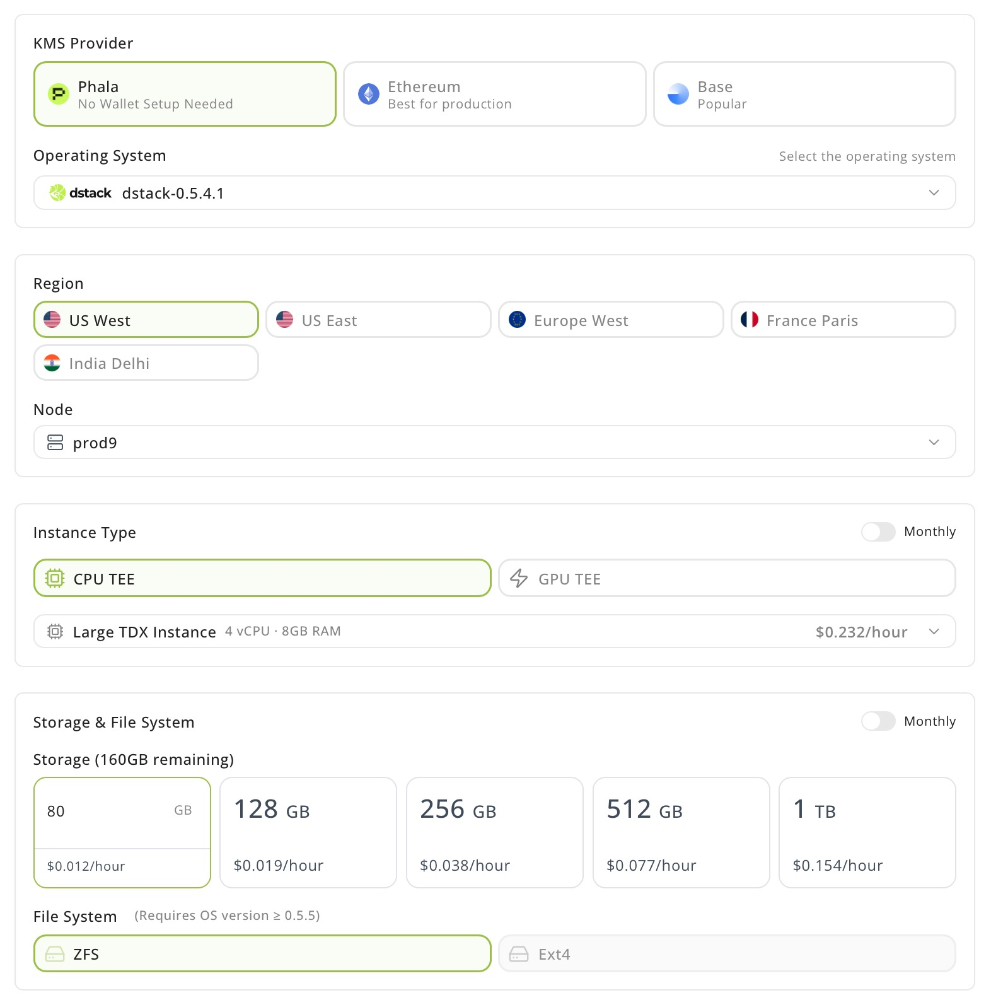
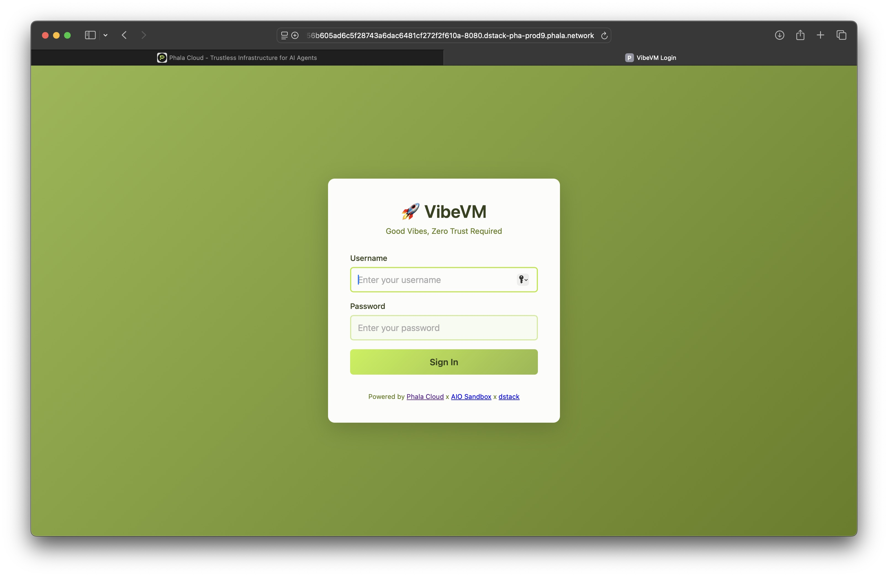
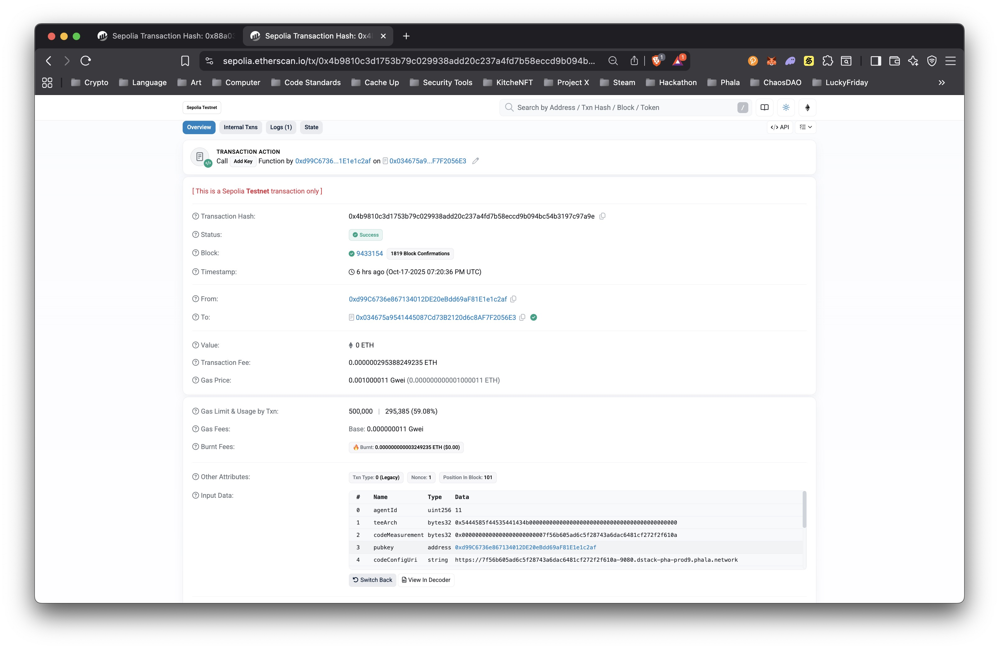
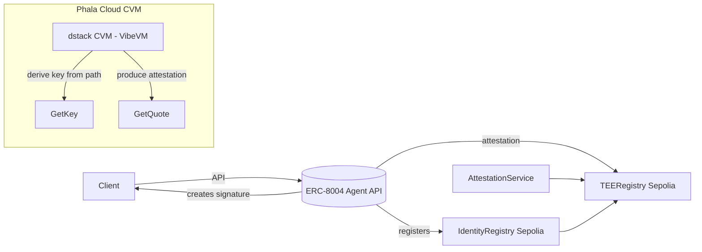

## TL;DR

- **ERC-8004** gives us on-chain primitives to register and discover *trustless agents*.
- To make those registrations meaningful, you want verifiable runtime evidence, not just a signature.
- **Confidential VMs (CVMs)** running **dstack** to deliver **deterministic key derivation** + **remote attestation** so your agent can prove *where* it executed.
- **Phala Cloud** wraps this in a bow: VibeVM templates, an on-chain KMS/registry workflow, and (optionally) confidential inference (GPU TEE) support.
- This post walks the whole flow: deploy a CVM → produce attestation → register identity on Sepolia → verify via **TEERegistry**.

<iframe width="100%" height="400" src="https://www.youtube.com/embed/OP99InL0cU8" title="Deploy ERC-8004 Agent Overview" frameborder="0" allow="accelerometer; autoplay; clipboard-write; encrypted-media; gyroscope; picture-in-picture" allowfullscreen></iframe>

---

## Why Trustless Agents Matter

Distributed systems increasingly outsource work to off-chain agents—indexers, oracles, model inference, payment relays. When an agent signs a statement or moves value, a bare signature only proves **key possession**, not execution context. The missing link is provenance: *did this response come from the runtime I expect?*

**ERC-8004** gives us a compact on-chain model for agent identity and discovery. Pair it with TEE-backed CVMs and you get the runtime receipts you've been wishing for: **attested execution**.

---

## What's broken today (and how we fix it)

- Agents are usually deployed ad hoc; signed responses alone don't say anything about *where* the code ran.
- Keys can be copied; logs can be forged; environments can be jailbroken.
- What agents actually need:
    1. **Deterministic key material** derived inside the runtime.
    2. **Remote attestation** that binds keys + code measurements to a platform identity.
    3. **On-chain discovery** so other contracts/clients can programmatically verify them.

ERC-8004 covers the on-chain identity/registry. **TEEs + CVMs** supply runtime evidence. **Phala Cloud** ties it all together with templates, SDKs, and an on-chain governance/KMS model.

---

## Deploy Your ERC-8004 Agent in TEE

### Pre-reqs

- [Phala Cloud](https://phala.com) account
- GitHub account (token only needed if cloning private repos)
- Wallet with **ETH Sepolia** funds for registration/funding

### 1) Deploy VibeVM: the TEE coding environment

- Go to [https://cloud.phala.network/templates/VibeVM](https://cloud.phala.network/templates/VibeVM) → **Deploy**

<iframe width="100%" height="400" src="https://www.youtube.com/embed/G1CjuPQ1SyE" title="Deploy VibeVM" frameborder="0" allow="accelerometer; autoplay; clipboard-write; encrypted-media; gyroscope; picture-in-picture" allowfullscreen></iframe>

### 2) Configure the CVM

- **OS:** `dstack-dev-0.5.x` or newer
- **Instance:** Large TDX, **4 vCPU**, **8 GB RAM**, **>40 GB storage**
- **Set Encrypted Secrets (remember to change the password):**

    ```bash
    VIBEVM_AUTH_ENABLED=true
    VIBEVM_USERNAME=vibe
    VIBEVM_PASSWORD=vibevm4454
    GITHUB_REPO=https://github.com/Phala-Network/erc-8004-tee-agent
    # optional if the repo is private
    GH_TOKEN=<token>
    ```



<Note>
**Tip:** GH_TOKEN only needed for private repos.
</Note>

### 3) Deploy & open VibeVM

- Click **Deploy** and let provisioning finish.
- Open **View details → Networks** and click the URL with port **8080** to open the frontend.


### 4) Sign into the VibeVM frontend

- Use the credentials you set.
- You'll land in a VSCode server with the repo already cloned.



### 5) Prep the agent

In the VSCode server terminal:

```bash
cd erc-8004-tee-agent
cp .env.example .env
# Edit .env:
# AGENT_DOMAIN=<your-domain>
# REDPILL_API_KEY=<your-key>  # generate in Phala dashboard: /dashboard/confidential-ai-api
```


### 6) Build & run

```bash
pip3 install -e .
python3 deployment/local_agent_server.py
```

Service should come up at:

```
https://<dstack-app-id>-8000.<dstack-gateway-domain>
```


### 7) Register & fund the agent

- Visit your agent domain and step through the registration + wallet-connect funding flow.
- This calls **IdentityRegistry** on **Sepolia** to record the agent and posts the attestation to **TEERegistry**.
- Example demo transactions (Sepolia):
    - IdentityRegistry: [0x88a03a29fe2c9a5881bbbdece91cd75c4e816a4dcda3f4ed2610bc119c517011](https://sepolia.etherscan.io/tx/0x88a03a29fe2c9a5881bbbdece91cd75c4e816a4dcda3f4ed2610bc119c517011)
    - TEERegistry verify: [0x4b9810c3d1753b79c029938add20c237a4fd7b58eccd9b094bc54b3197c97a9e](https://sepolia.etherscan.io/tx/0x4b9810c3d1753b79c029938add20c237a4fd7b58eccd9b094bc54b3197c97a9e)


### 8) Verify attestation via TEERegistry

- Use the TEERegistry contract UI or explorer to confirm the attestation entry matches your IdentityRegistry entry.
- [View TEERegistry verification transaction](https://sepolia.etherscan.io/tx/0x4b9810c3d1753b79c029938add20c237a4fd7b58eccd9b094bc54b3197c97a9e)



### 9) Talk to the agent

- Hit the Agent API. You should get signed responses whose key matches what you registered, and whose runtime is backed by the TEE attestation on-chain.

<iframe width="100%" height="400" src="https://www.youtube.com/embed/f4Ii_sb7KMg" title="Interact with Agent" frameborder="0" allow="accelerometer; autoplay; clipboard-write; encrypted-media; gyroscope; picture-in-picture" allowfullscreen></iframe>

## Architecture



## Conclusion

ERC-8004 + TEE on **Phala Cloud** give you a practical path to trustless agents: deterministic keys, remote attestations, and on-chain identity—wrapped in a dev flow that feels like spinning up a regular VM, just with superpowers.

## Resources

- [ERC‑8004 EIP](https://eips.ethereum.org/EIPS/eip-8004)
- [VibeVM Template](https://cloud.phala.network/templates/VibeVM)
- [Agent Template Repository](https://github.com/Phala-Network/erc-8004-tee-agent)
- [Phala Cloud](https://phala.com)
