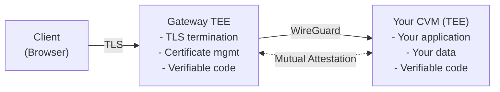

## Network Privacy Through Hardware

Run your application on Phala Cloud without trusting us to keep your data private—the hardware guarantees it. Intel TDX encrypts your application's memory with keys that never leave the CPU. The host OS cannot decrypt your data because the hardware prevents it.

When clients connect to your application, traffic passes through multiple layers of encryption. Each layer protects against different attacks. You can verify all of this through cryptographic attestation.

## How It Works: The Big Picture

Your application runs inside a Confidential VM (CVM). When clients connect, their requests flow through a gateway that's also hardware-protected:



Both the gateway and your CVM run inside Intel TDX Trusted Execution Environments. The infrastructure operator cannot access their memory or keys because the hardware prevents it. Before any connection is established, the gateway and your CVM verify each other through cryptographic attestation. This ensures you're always connecting to genuine TEE instances, not imposters.

TLS certificate private keys are generated inside the TEE and never leave. The keys get sealed to specific hardware measurements, so only verified TEE instances can use them. DNS security records lock your domain to the TEE's certificate account, preventing unauthorized certificate issuance.

For network topology and routing details, see [Architecture](/phala-cloud/networking/architecture).

## Security Model

### What We Protect Against

**Compromised host OS**: Hardware encrypts your CVM's memory with keys the host cannot access. Even with root access, attackers cannot read your application's memory or network traffic.

**Malicious infrastructure operator**: The gateway runs in its own TEE. Even with full infrastructure access, the operator cannot access the gateway's memory, keys, or decrypt your traffic. Both gateway and CVM verify each other before establishing connections.

**Certificate compromise**: Certificate private keys are generated inside TEEs and cryptographically bound to hardware measurements. DNS security records prevent unauthorized certificate issuance. Even a compromised certificate authority cannot issue valid certificates without TEE control.

**Certificate misissuance**: Public certificate transparency logs track all certificate issuance. Combined with DNS security records, this provides detection and prevention of unauthorized certificates.

### What You Need to Trust

The security model shifts trust from people and organizations to hardware and verifiable code.

**You don't need to trust the infrastructure.** The gateway operator can't access gateway memory, keys, or traffic because the gateway runs in its own TEE. Other CVMs on the same host can't reach your data due to hardware-enforced isolation. Even the host operating system can't inspect your memory because TEE protection prevents it. Infrastructure providers have no access that can compromise TEEs.

**You still need to trust three things.** First, your own application code—application vulnerabilities are your responsibility. Second, the TDX hardware security itself, as Intel's hardware implementation forms the root of trust. Third, the certificate authorities like Let's Encrypt must be trustworthy, though this risk is mitigated by CAA records and CT monitoring.

### Out of Scope

**Application security**: Network security doesn't protect against application vulnerabilities. Your code must handle input validation, authentication, and authorization correctly.

**Availability attacks**: DDoS protection and high availability are not guaranteed. Design your applications with redundancy and rate limiting as needed.

**Side-channel attacks**: Advanced timing attacks or speculative execution vulnerabilities may leak information. Follow secure coding practices and keep software updated.

## Gateway Security Architecture

The gateway routes traffic between clients and your CVM while maintaining zero-trust security. Understanding how the gateway works helps explain why even infrastructure operators can't compromise your connections.

### Gateway TEE Protection

The gateway itself runs inside an Intel TDX Confidential VM:
- Operator cannot access TLS keys or decrypt traffic
- Gateway code is verifiable through attestation
- All certificate operations happen inside the TEE

This means the infrastructure operator has no access to certificate private keys, TLS session keys, or plaintext traffic, even though they control the physical servers.

For network routing and load balancing details, see [Architecture: How Routing Works](/phala-cloud/networking/architecture#how-routing-works).

### Mutual Attestation Protocol

Before any traffic flows, the gateway and your CVM verify each other. This prevents man-in-the-middle attacks and ensures both sides are genuine TEE instances running verified code:

1. **Attestation First**: Both the gateway TEE and your CVM generate TDX attestation quotes
2. **Mutual Verification**: Each side verifies the other's attestation before proceeding
3. **Key Exchange**: Only after successful attestation do they exchange tunnel keys
4. **Tunnel Creation**: An encrypted tunnel is established using ChaCha20-Poly1305
5. **Continuous Encryption**: All traffic flows through this attested tunnel, invisible to the host

This attestation requirement ensures you're always connecting to genuine TEE instances, not imposters. Even after TLS termination at the gateway, your data remains encrypted until it reaches your container.

## Zero-Trust HTTPS (zt-https)

TLS certificate private keys are generated inside TEEs and never leave. The keys stay sealed to hardware measurements. Only verified TEE instances can use them. This means certificate private keys remain under TEE control at all times.

### How TEEs Control Certificates

Both Phala Cloud gateway domains (via gateway) and custom domains (via dstack-ingress) implement Zero-Trust HTTPS:

1. **TEE generates ECDSA keypair**: The private key is created inside TDX-encrypted memory and never leaves the TEE
2. **Registers with Let's Encrypt**: The TEE establishes its own certificate account using the key
3. **Seals credentials to hardware**: Keys are bound to specific TEE measurements, so only this exact TEE configuration can use them
4. **Requests certificates**: Certificate operations happen entirely inside the TEE

The private keys never exist outside the TEE. They're stored on encrypted disk that only the TEE can decrypt, sealed to hardware measurements. Even with full host access, attackers can't extract or use these keys because the hardware cryptographically binds them to the TEE instance.

### Certificate Architecture

Zero-Trust HTTPS uses three mechanisms to prevent unauthorized certificate issuance:

**CAA DNS Records**: Lock your domain to a specific ACME account
```
your-domain.com CAA 0 issue "letsencrypt.org;accounturi=https://acme-v02.api.letsencrypt.org/acme/acct/YOUR_TEE"
```
This prevents anyone else from getting valid certificates, even with domain control. The certificate authority checks this DNS record before issuing certificates.

**Certificate Transparency Monitoring**: Every certificate issuance gets logged publicly. Monitor these logs to detect any unauthorized certificates immediately. Certificate Transparency logs are append-only and publicly auditable.

**Cryptographic Evidence**: Custom domains publish proof at `/evidences/` containing:
- TDX attestation quote proving hardware backing
- SHA256 hash linking the certificate to the ACME account
- The actual certificate and account details

This creates an auditable chain: the hardware signs the evidence, the evidence contains the certificate, and the certificate serves your traffic. Any tampering breaks the cryptographic chain.

### Preventing Timeline Attacks

CAA records only protect future certificate issuance. Existing certificates remain valid until expiration. To ensure complete security:

1. **Check historical certificates**: Review all certificates ever issued for your domain
2. **Verify expiration**: Ensure pre-deployment certificates have expired
3. **Revoke if necessary**: Contact the CA to revoke any unexpired legacy certificates

This prevents attackers from using certificates obtained before your TEE deployment. Check Certificate Transparency logs for your domain to see all historical issuance.

### Verification Procedures

For step-by-step instructions on verifying certificate control and attestation:
- **Gateway domains** (`*.phala.network`): See [Domain Attestation: Gateway Domains](/phala-cloud/networking/domain-attestation#gateway-domains)
- **Custom domains**: See [Domain Attestation: Custom Domains](/phala-cloud/networking/domain-attestation#custom-domains)

These guides provide complete verification procedures including TDX quote validation, Certificate Transparency monitoring, and CAA record auditing.

## Advanced Privacy with Tor

Tor adds an additional layer of network-level anonymity on top of TEE protection.

Need network-layer anonymity? Deploy Tor inside your CVM:

```yaml
services:
  tor:
    image: torproject/tor
    volumes:
      - ./torrc:/etc/tor/torrc
  app:
    network_mode: "service:tor"
```

Users connect via .onion addresses. Traffic correlation becomes nearly impossible. TEE attestation still works, so you can cryptographically verify your Tor node runs in a genuine TEE. This combines TEE hardware protection with Tor's network-layer anonymity for maximum privacy.

## Compliance and Standards

Hardware-enforced security helps meet regulatory requirements. TEE isolation, encryption at rest and in transit, and cryptographic attestation provide technical controls for GDPR Article 32, HIPAA technical safeguards, and PCI DSS network segmentation.

The infrastructure provides several compliance-relevant protections:
- Memory encryption (TLS 1.3, WireGuard, TDX)
- Hardware isolation between tenants
- Cryptographic audit trails via attestation
- FIPS-approved cryptography

However, infrastructure security alone doesn't guarantee compliance. You still need to handle application-level requirements:
- Secure coding practices
- Authentication and authorization logic
- Data retention and deletion policies

Your application design and implementation ultimately determine whether you meet regulatory requirements.

## Technical References

- [Intel TDX Architecture Specification](https://intel.com/content/www/us/en/developer/articles/technical/intel-trust-domain-extensions.html)
- [WireGuard Protocol Paper](https://wireguard.com/papers/wireguard.pdf)
- [RFC 8555: ACME Protocol](https://datatracker.ietf.org/doc/html/rfc8555)
- [RFC 9162: Certificate Transparency](https://datatracker.ietf.org/doc/html/rfc9162)
