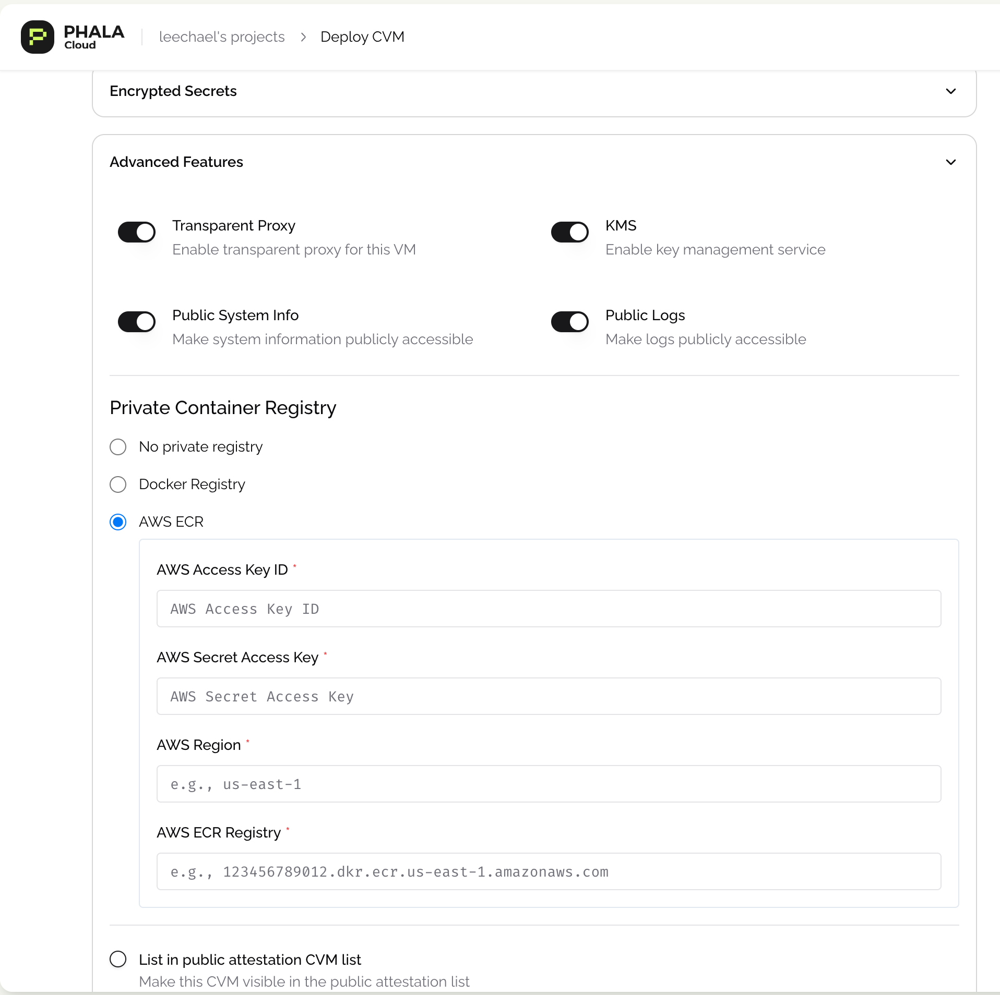

# Deploy Private Docker Image to CVM

> **Note:** This feature requires DStack version 0.3.5 or later

## Overview

Phala Cloud enables secure deployment of private Docker images from popular container registries, maintaining confidentiality throughout the deployment process. This capability is essential for organizations with proprietary code or sensitive applications.

## Configuration Methods

### Method 1: Using the Phala Cloud UI

The most straightforward approach is configuring registry access through the user interface:

1. Navigate to **Advanced Features** in the Phala Cloud dashboard
2. Select **Private Container Registry**
3. Enter your registry credentials
4. Save your configuration



> 💡 **Security Note:** All authorization information is protected with end-to-end encryption, ensuring your credentials remain confidential.

### Method 2: Using Encrypted Secrets

For automated deployments or enhanced security, you can set registry credentials as encrypted environment variables:

#### Docker Hub Registry

* To download images from Docker Registry, you need to set the following encrypted environment variables: DSTACK\_DOCKER\_USERNAME and DSTACK\_DOCKER\_PASSWORD.
* To download images from AWS ECR Private Registry, you need to set the following encrypted environment variables: DSTACK\_AWS\_ACCESS\_KEY\_ID, DSTACK\_AWS\_SECRET\_ACCESS\_KEY, and DSTACK\_AWS\_REGION, DSTACK\_AWS\_ECR\_REGISTRY.

## Deploy Private Docker Image with CLI

**Using a Private Docker Registry with** [**Phala Cloud CLI**](../../references/tee-cloud-cli/)

You can deploy images from a private Docker registry by setting the appropriate environment variables.

**🔐 DockerHub:**

Set these variables:

* `DSTACK_DOCKER_USERNAME` – Your DockerHub username _(required)_
* `DSTACK_DOCKER_PASSWORD` – Your DockerHub password or personal access token _(required)_
* `DSTACK_DOCKER_REGISTRY` – Registry URL (optional, defaults to DockerHub)

**🔐 AWS ECR:**

Set these variables:

* `DSTACK_AWS_ACCESS_KEY_ID` – AWS access key _(required)_
* `DSTACK_AWS_SECRET_ACCESS_KEY` – AWS secret key _(required)_
* `DSTACK_AWS_REGION` – AWS region of the ECR _(required)_
* `DSTACK_AWS_ECR_REGISTRY` – Full ECR registry URL _(required)_

Once set and added to your docker-compose.yml file, the CLI will automatically authenticate and pull your private image securely.

Example compose file that includes the encrypted environment variables to pull the private docker image.

```yaml
version: '3.8'

services:
  brave-search:
    image: hashwarlock/brave-search-mcp:v0.0.1
    ports:
      - "3000:3000"
    environment:
      - PORT=3000
      - NODE_ENV=production
      - BRAVE_API_KEY=${BRAVE_API_KEY}
      - DSTACK_DOCKER_USERNAME=${DSTACK_DOCKER_USERNAME}
      - DSTACK_DOCKER_PASSWORD=${DSTACK_DOCKER_PASSWORD}
    restart: unless-stopped
```

Once these are set, run the command:

```sh
phala cvms create --name brave-search --compose docker-compose.yml --teepod-id 3 -e .env
```

You will see a log that will clarify if you are using a private registry or not.

```sh
✓ Deleted DSTACK_SIMULATOR_ENDPOINT from current process
⟳ Fetching available TEEPods... ✓
⟳ Getting public key from CVM... ✓
ℹ 🔐 Using public DockerHub registry...
⟳ Encrypting environment variables... ✓
⟳ Creating CVM... ✓
✓ CVM created successfully

╭────────────┬────────────────────────────────────────────────────────────────────────────────────────────╮
├────────────┼────────────────────────────────────────────────────────────────────────────────────────────┤
│ CVM ID     │ 5952                                                                                       │
├────────────┼────────────────────────────────────────────────────────────────────────────────────────────┤
│ Name       │ brave-search                                                                               │
├────────────┼────────────────────────────────────────────────────────────────────────────────────────────┤
│ Status     │ creating                                                                                   │
├────────────┼────────────────────────────────────────────────────────────────────────────────────────────┤
│ App ID     │ app_9292e497bee0f6885df155c79635606c33b9c160                                               │
├────────────┼────────────────────────────────────────────────────────────────────────────────────────────┤
│ App URL    │ https://cloud.phala.network/dashboard/cvms/app_9292e497bee0f6885df155c79635606c33b9c160    │
╰────────────┴────────────────────────────────────────────────────────────────────────────────────────────╯
ℹ 
✓ Your CVM is being created. You can check its status with:
phala cvms get app_9292e497bee0f6885df155c79635606c33b9c160
```

## Setting with Phala Cloud API

When using Phala Cloud API to deploy, you still need to set above environment variables.

Check the [Phala Cloud API](https://cloud-api.phala.network/docs) for more details.

## Troubleshooting

If you encounter issues with private image deployment:

1. Verify your credentials are correct and have not expired
2. Ensure the image exists in the specified registry
3. Check that your account has pull permissions for the image
4. Review the CVM logs for detailed error messages

For additional assistance, join our support groups: 🌍 [Global](https://t.me/+nbhjx1ADG9EyYmI9), 🇨🇳 [Chinese](https://t.me/+4PcAE9qTZ1kzM2M9).
