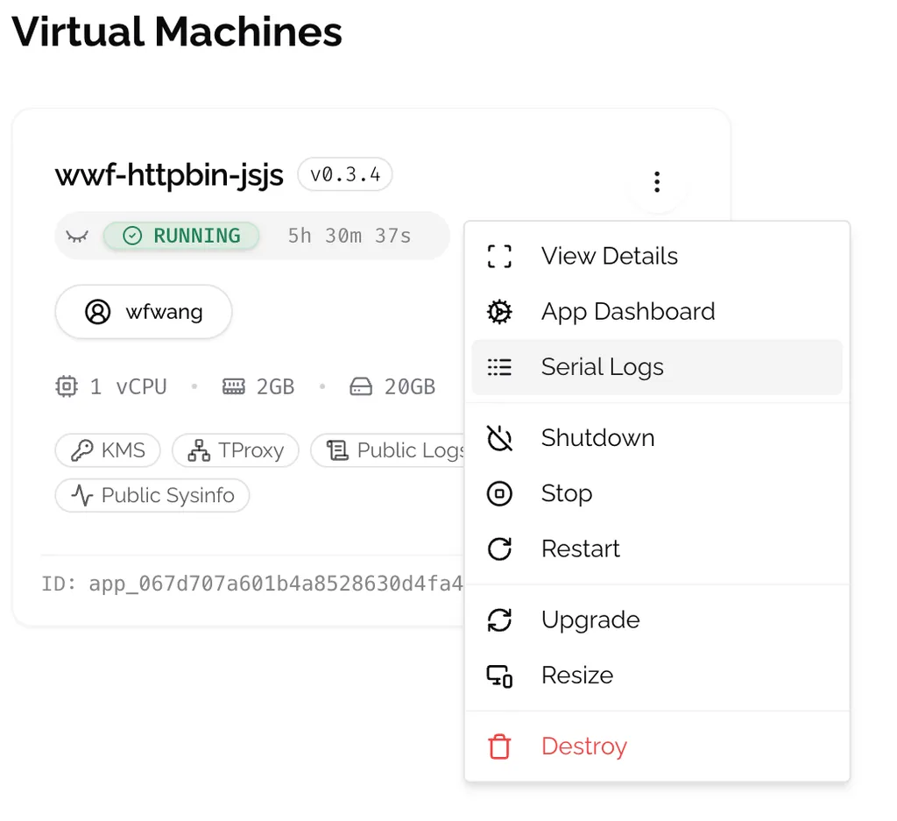
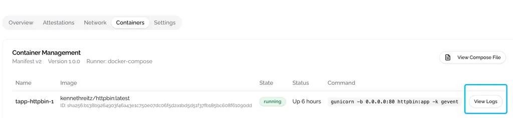

# Check Logs

## Log Types in Phala Cloud

Phala Cloud provides two distinct types of logs to help you monitor and troubleshoot your applications:

### CVM Logs

CVM logs show the bootstrapping process of your application, including:

* Default RA report generation
* Docker image downloads
* System initialization events

**How to access:** Click the **Serial Logs** button in the CVM card.

<figure><figcaption>
CVM logs showing system initialization details
</figcaption></figure>

### Docker Logs, e.g. your application's output log

Docker logs contain your application's runtime output, providing insights into its behavior and any issues that may arise during execution.

**Visibility settings:** During deployment, you can choose to make these logs public in the **Advanced Features** section. When public, anyone with the log URL can view them.

**How to access:** Navigate to the detailed page and locate the **Containers** section.

<figure><figcaption>
Container logs showing application output
</figcaption></figure>

## Set Private with Log Viewer

Head to the [Private Log Viewer](private-log-viewer.md) section if you want to set your logs as private.
