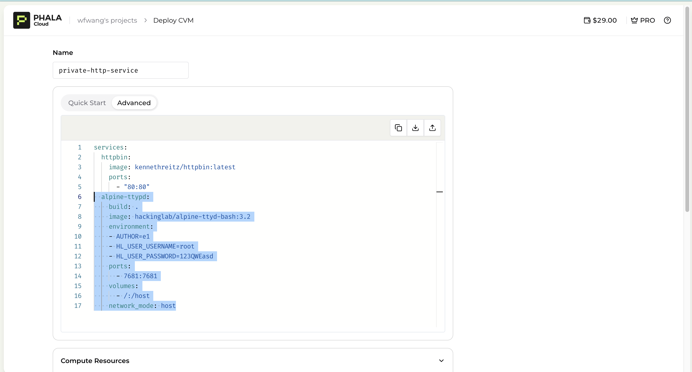
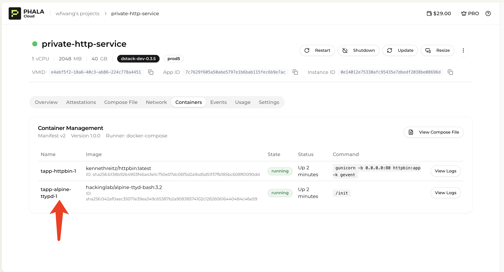
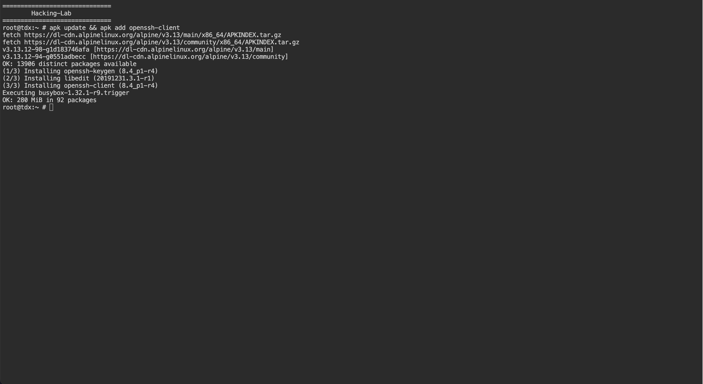
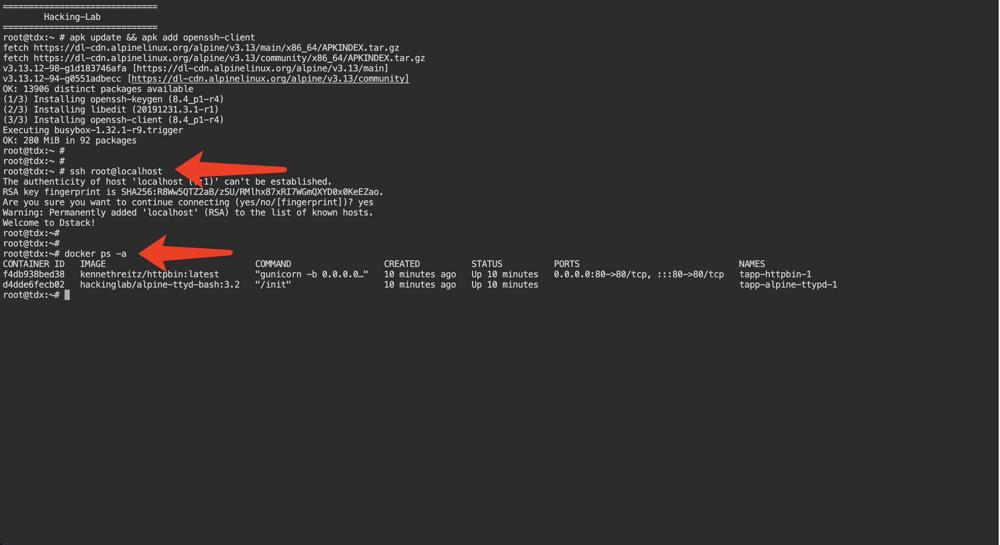

# Debug Your Application

When deploying your application on the Phala Cloud UI, you can choose between two types of CVM base images: `dstack-<version>` and `dstack-dev-<version>`. The dev image allows you to log in to the CVM in the future for debugging purposes. If you opt for a non-dev image, rest assured that no one will have the ability to access your CVM, either physically or remotely.


The `dstack-dev-<version>` images are not recommended for production environments.


<figure><figcaption></figcaption></figure>

For example, to enable the use of tool **ttypd** for logging into your CVM from a web browser, you need to add a ttypd service to your Docker Compose file as shown below:

```yaml
services:
  alpine-ttypd:
    build: .
    image: hackinglab/alpine-ttyd-bash:3.2
    environment:
    - AUTHOR=e1
    - HL_USER_USERNAME=root
    - HL_USER_PASSWORD=123QWEasd
    ports:
      - 7681:7681
    volumes:
      - /:/host
    network_mode: host
```

<figure><figcaption></figcaption></figure>

You can then view a specific endpoint for the ttypd service by navigating to "**View Details**" → "**Network**." and if you check the **Container** tab, you will see there is a container running for the ttypd service.

<figure><figcaption></figcaption></figure>

When you open this endpoint in your browser (in this case, `https://7c7629f605a50abe5797e1b6bab115fec6b9e7ac-7681.dstack-prod5.phala.network/`), you will see a terminal interface. The next step is to install the **openssh-client**.


The base image is not Debian-based, so you will not be able to use the `apt` package manager. Instead, you will use the `apk` package manager.


<figure><figcaption></figcaption></figure>

You can now log in to the CVM using the command `ssh root@localhost`. As shown below, you can retrieve information about running Docker containers by executing the command `docker ps -a` within the CVM.

<figure><figcaption></figcaption></figure>
