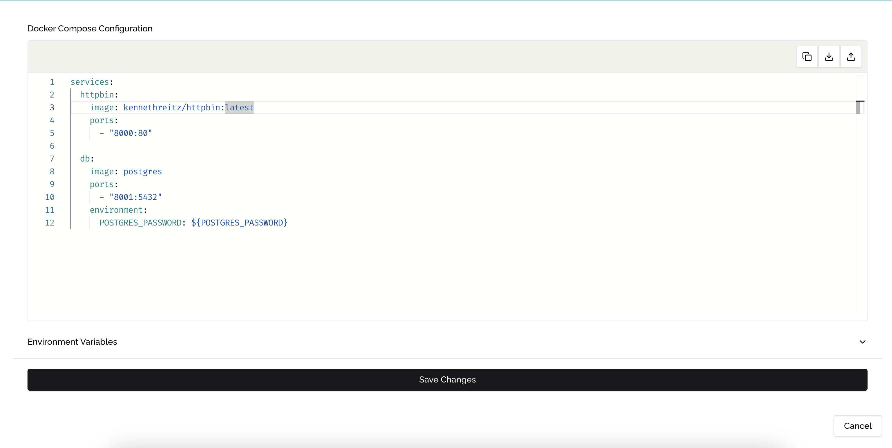

## Seamless Upgrades in TEE Environments

One of the key advantages of Phala Cloud is the ability to upgrade your application even while it's running inside a Trusted Execution Environment (TEE). Thanks to the flexible architecture of the Dstack SDK, your application isn't permanently bound to specific hardware configurations.

## Upgrade Process

1. Navigate to your CVM dashboard
2. Locate the CVM running the application you wish to upgrade
3. Click the **Upgrade** button to open the upgrade interface
4. In the upgrade window, you can:
   * Update your Docker Compose configuration
   * Modify environment variables
   * Adjust application settings

## Important Considerations

<Note type="warning">
**NOTE**

When restarting a Phala instance, it may not automatically pull the latest version of a **Docker image** if the **tag** has not changed. It's advisable to **increment Docker tags** for every new deployment to ensure the latest image is used. This behavior aligns with the need to update the Docker Compose file and execute an upgrade to pull the latest image

The new environment variables will completely replace all existing variables. Be sure to include all required variables in your update, even those you don't intend to change.
</Note>

## Completing the Upgrade

After configuring your upgrade parameters:

1. Review all changes carefully
2. Click the **Save Changes** button to initiate the upgrade
3. Monitor the upgrade process through the CVM logs

The platform will handle the secure transition to your updated application while maintaining the TEE security guarantees.

<Frame caption="Updating in Phala Cloud">
    

</Frame>

## Best Practices for Application Upgrades

* Test your upgrades in a development environment before applying to production
* Keep a backup of your current configuration before making changes
* Schedule upgrades during periods of low user activity
* Implement version tracking in your application to verify successful upgrades
