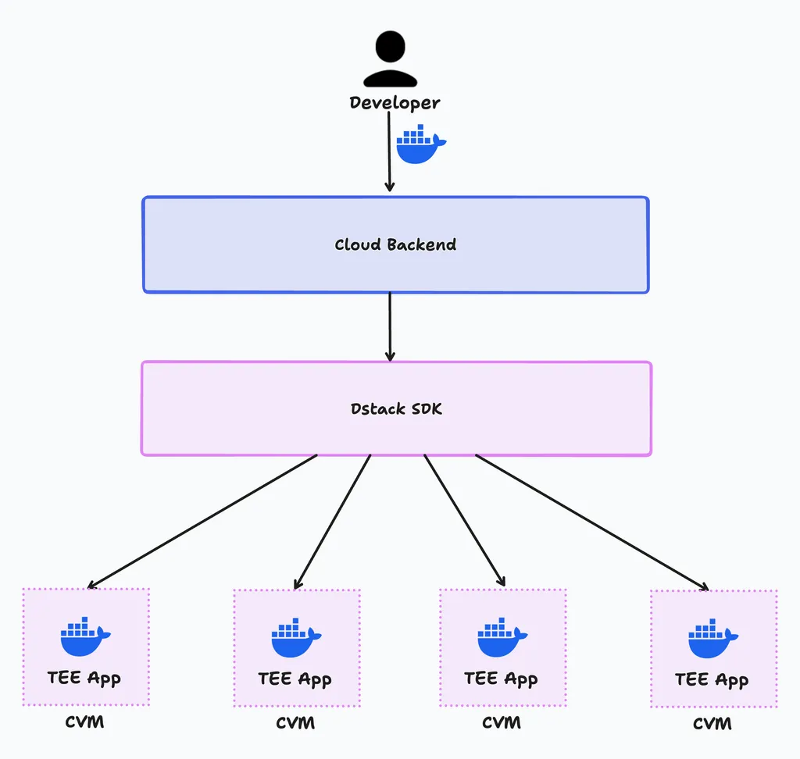

# 📋 References

### Dstack SDK

The [Dstack SDK](https://github.com/dstack-TEE/dstack) is designed to simplify the process for developers to deploy programs to CVM (Confidential VM) while adhering to security best practices by default. Phala Cloud is a platform built on top of the Dstack SDK, providing developers with a seamless experience for deploying and managing their TEE applications. For more information, please refer to the [Dstack documentation](https://docs.phala.network/dstack/overview).

<figure><figcaption></figcaption></figure>

### Trust Chain

Comming soon.

### Network Topology

Comming soon.
