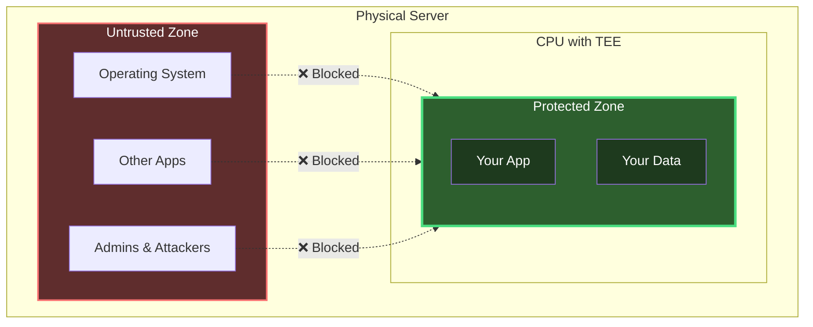
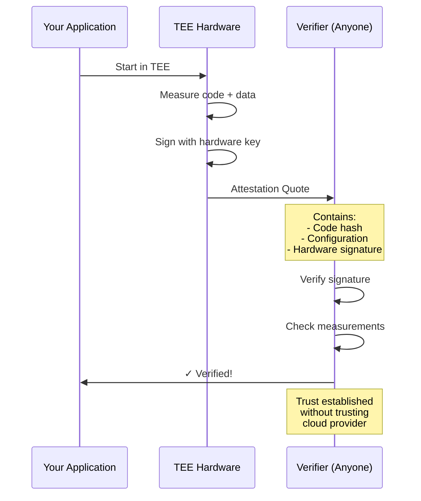

A Trusted Execution Environment (TEE) is a secure area within your processor that protects code and data with hardware-level isolation. Even if someone has root access to your server, they cannot access what's running inside the TEE.

Think of it like a vault built into your CPU. The processor encrypts everything inside this vault at the hardware level. The operating system, hypervisor, and even system administrators cannot peek inside or modify what's running there.

## How TEEs Protect Your Data

TEEs use several hardware mechanisms to keep your applications secure.

The CPU encrypts your application's memory automatically at the hardware level. Your code doesn't need to handle encryption, and the encryption keys never leave the processor.

The TEE isolates your code from everything else on the system. Even if the operating system gets compromised, your application keeps running safely in its protected environment. This isolation extends to the physical world - cloud providers, datacenter staff, and hardware maintainers cannot extract your data, even with physical access to the machine.

You can deploy standard Docker containers into a TEE without modifying your code. The TEE handles all security mechanisms transparently.

## Proving Security: Remote Attestation

TEEs provide cryptographic proof that your code runs in a genuine hardware-protected environment. This proof is called remote attestation.

When your application starts in a TEE, the hardware generates a signed report. This report includes measurements of your exact code, configuration, and the TEE's security state. Anyone can verify this report independently using the hardware manufacturer's public keys.

This means you can verify your code runs in a real TEE without trusting the cloud provider. The cryptographic signature comes from the CPU itself, not from any software that could be compromised.

## Why TEEs Matter for Your Applications

TEEs enable confidential computing for applications that handle sensitive data or valuable intellectual property.

**Confidential AI**: Run AI models where neither the cloud provider nor their staff can access your model weights or training data. This protects your AI intellectual property while still using cloud GPU acceleration. Learn more about [TEE with AI](/phala-cloud/cases/tee_with_ai).

**Private Computation**: Process sensitive data like healthcare records or financial information in the cloud while keeping the data encrypted during computation. The TEE ensures that only your authorized code can access the data in its unencrypted form.

**Secure Key Management**: Generate and store cryptographic keys inside a TEE where they cannot be extracted. Even administrators with full system access cannot steal the keys, because they exist only in the hardware-protected environment.

**Verifiable Execution**: Prove to third parties that specific code processed their data, without revealing the data itself. The attestation report cryptographically binds your code to the TEE's security guarantees.

## Next Steps

<CardGroup cols={2}>
  <Card title="Quick Start" icon="rocket" href="/phala-cloud/getting-started/overview">
    Deploy your first TEE application in minutes
  </Card>

  <Card title="Understanding Attestation" icon="shield-check" href="/phala-cloud/attestation/overview">
    Deep dive into remote attestation and verification
  </Card>

  <Card title="Phala Cloud Platform" icon="cloud" href="/phala-cloud/what-is/what-is-phala-cloud">
    Learn about Phala's TEE-powered cloud infrastructure
  </Card>

  <Card title="Confidential AI" icon="brain" href="/phala-cloud/confidential-ai/overview">
    Run AI models with hardware-guaranteed privacy
  </Card>
</CardGroup>
