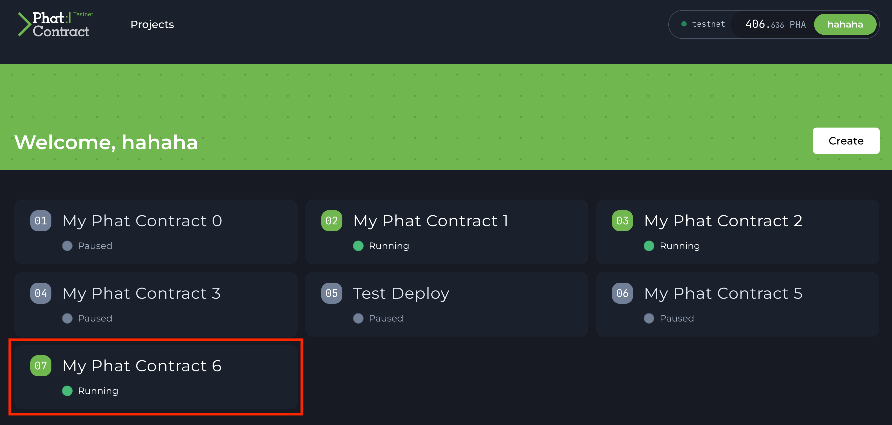
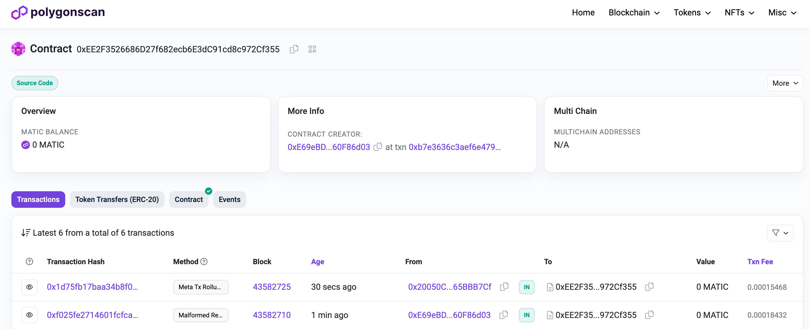

# 🫂 Connect Airstack Phat Contract to EVM Consumer Contract

In the previous section we described how the Airstack Starter Kit works. Let's revisit the diagram and description below.

<figure><figcaption></figcaption></figure>

The diagram above displays the user journey of (1) Alice requesting a trust score for Eve from the EVM Consumer Contract. When (2) a new action request is added to the queue, (3) the Phala Network Phat Contract will pop the action off the queue and perform the off-chain work to compute a trust score.

First (4) the Phat Contract will create a `batchHttpRequest` to query 3 separate subgraph endpoints to determine if Eve has transacted on-chain with Alice, has a Lens Profile, has a Farcaster account, has a primary ENS Domain, and if Alice & Eve have common POAPs. Once this data is returned then (5) the Phat Contract will compute a score based on some scoring criteria. You can view the code [here](https://bit.ly/pc-airstack-repo). Lastly, (6) the trust score for Eve has been returned to the EVM Consumer Contract and Eve's score is set in the Consumer Contract's storage for anyone to query.

## Getting Started

If you have not setup Airstack code repo locally, go back to the [Quick Start](broken-reference) section and follow the initial setup steps.

### Before Deployment

Before deploying, you will need to either export your Phala Account via polkadot.js extension or store your private key in the .env (optionally you can manually enter during deployment as well).

**Option 1: Export Polkadot account as json file**

Go to your browser and click on the polkadot.js extension. Select your account and click "Export Account". Next, you will be prompted for your password before saving the file to your project directory. **Note** this is what will be set to `POLKADOT_WALLET_ACCOUNT_PASSPHRASE`. Make sure to save the file as `polkadot-account.json` in the **root** of your project directory.

<figure><figcaption></figcaption></figure>

<figure><figcaption></figcaption></figure>

<figure><figcaption></figcaption></figure>

**Option 2: Set mnemonic phrase to `POLKADOT_WALLET_SURI`**

After creating your Phala Profile, set your `.env` variable `POLKADOT_WALLET_SURI` to the mnemonic phrase from generating the new Polkadot Account.

Here is a screenshot of how to set `POLKADOT_WALLET_SURI`:

<figure><figcaption></figcaption></figure>

## Deployments (Local, Testnet, Mainnet)

This guide will be separated into 3 tabs including:

* **Local**: Local Testnet Deployment
* **Testnet**: PoC6 Testnet & EVM Chain Testnet Deployment
* **Mainnet**: Phala Mainnet & EVM Chain Mainnet Deployment

> **Secrets (**[**What are Secrets**](broken-reference)**?):**
>
> * `apiUrl` - The endpoint base URL to the separate subgraph endpoints hosted on Airstack
> * `apiKey` - an [API key](broken-reference) created on Airstack
>
> ```
> {
>     "apiUrl": "https://api.airstack.xyz/gql",
>     "apiKey": "3a41775a358a4cb99ca9a29c1f6fc486"
> }
> ```



In the previous [Quick Start](broken-reference) section, we installed the dependencies and ran 2 separate tests locally, but these tests were not run against a live local testnet.&#x20;

This section will describe the process of:

* Start up a local hardhat node
* Deploy the EVM Consumer Contract to the local testnet
* Run the `@phala/fn watch` command to run a local instance of the Airstack Phat Contract
* Simulate a sample request by executing `npm run localhost-push-request`
* See the Airstack Phat Contract reply with a result to the EVM Consumer Contract

### Testing Locally

First step is to install the package dependencies with the following command:

```bash
npm install
```

With all the dependencies installed, we are ready to build Airstack Phat Contract.

```bash
npx @phala/fn build
```

To simulate the expected result locally, run the Phat Contract script now with this command:

> Check [this explanation ](broken-reference)out or use `decode` and `encode` playground at [https://playground.ethers.org](https://playground.ethers.org).

```bash
npx @phala/fn run dist/index.js -a 0x0000000000000000000000000000000000000000000000000000000000000001000000000000000000000000de1683287529b9b4c3132af8aad210644b259cfd '{"apiUrl": "https://gateway.thegraph.com/api/", "apiKey": "cd22a01e5b7f9828cddcb52caf03ee79"}'
```

Here is the expected output of this call where the encoded call will request a trust score result for the address `hashwarlock.eth`. The result is `16`.

```bash
npx @phala/fn run dist/index.js -a 0x0000000000000000000000000000000000000000000000000000000000000001000000000000000000000000964256674e42d61f0ff84097e28f65311786ccb000000000000000000000000eaf55242a90bb3289db8184772b0b98562053559 '{"apiUrl": "https://api.airstack.xyz/gql", "apiKey": "3a41775a358a4cb99ca9a29c1f6fc486"}' 

handle req: 0x0000000000000000000000000000000000000000000000000000000000000001000000000000000000000000964256674e42d61f0ff84097e28f65311786ccb000000000000000000000000eaf55242a90bb3289db8184772b0b98562053559
[1]: 0x964256674E42D61f0fF84097E28f65311786ccB0 0xeaf55242a90bb3289dB8184772b0B98562053559
Request received for profile 0x964256674E42D61f0fF84097E28f65311786ccB0 0xeaf55242a90bb3289dB8184772b0B98562053559
Tokens Sent on ETH Check... Result [0]
Tokens Sent on ETH Check... Result [0]
Lens Profile Check... Result [7]
Farcaster Account Check... Result [14]
Primary ENS Account. Result [24]
Common POAPs Check... Result[24]
response: 0,1,0x964256674E42D61f0fF84097E28f65311786ccB0,24
{"output":"0x00000000000000000000000000000000000000000000000000000000000000000000000000000000000000000000000000000000000000000000000000000001000000000000000000000000964256674e42d61f0ff84097e28f65311786ccb00000000000000000000000000000000000000000000000000000000000000018"}
```

#### Deploy a Local Hardhat Node

Now that we have a simple understanding of the expected functionality of the Phat Contract, we can now take our tests to a local testnet. Here we will use Hardhat to deploy the EVM Consumer Contract then listen from new action requests and reply with built Phat Contract script.

First we will start a local hardhat node.

```sh
npm run localhost-node
```

With our hardhat node running locally, we can now deploy the `OracleConsumerContract.sol` contract to the local hardhat network.

```bash
npm run localhost-deploy
```

```bash
npm run localhost-deploy
> the-graph-phat-contract@1.0.0 localhost-deploy
> hardhat run --network localhost ./scripts/localhost/deploy.ts

Compiled 18 Solidity files successfully (evm target: london).
Deploying...
Deployed { consumer: '0x5FbDB2315678afecb367f032d93F642f64180aa3' }
```

Make sure to copy the deployed contract address when you deploy your own contract locally. Note you contract address will be different than `0x5FbDB2315678afecb367f032d93F642f64180aa3`. We will now start watching the hardhat node deployed contract for any new requests from Airstack Phat Contract.

```bash
npx @phala/fn watch 0x5FbDB2315678afecb367f032d93F642f64180aa3 artifacts/contracts/OracleConsumerContract.sol/OracleConsumerContract.json dist/index.js -a '{"apiUrl": "https://api.airstack.xyz/gql", "apiKey": "3a41775a358a4cb99ca9a29c1f6fc486"}'
```

```bash
npx @phala/fn watch 0x5FbDB2315678afecb367f032d93F642f64180aa3 artifacts/contracts/OracleConsumerContract.sol/OracleConsumerContract.json dist/index.js -a '{"apiUrl": "https://api.airstack.xyz/gql", "apiKey": "3a41775a358a4cb99ca9a29c1f6fc486"}'
Listening for OracleConsumerContract MessageQueued events...
```

Let’s now make a new request and see what happens with the listener’s output. In separate tab, you will push a request with the following.

> **Note**: The file can be edited [here](https://github.com/Phala-Network/airstack-phat-contract/blob/010d9c1f8b28fd74328c1e4ef633f55a6850f2f9/scripts/localhost/push-request.ts#L16) where you can change the `target` address.

```bash
LOCALHOST_CONSUMER_CONTRACT_ADDRESS=0x5FbDB2315678afecb367f032d93F642f64180aa3 npm run localhost-push-request
```

```bash
LOCALHOST_CONSUMER_CONTRACT_ADDRESS=0x5FbDB2315678afecb367f032d93F642f64180aa3 npm run localhost-push-request
> the-graph-phat-contract@1.0.0 localhost-push-request
> hardhat run --network localhost ./scripts/localhost/push-request.ts

Pushing a request...
Received event [ResponseReceived]: {
  reqId: BigNumber { value: "1" },
  target: '0x011c23b3AadAf3D4991f3aBeE262A34d18e9fdb5',
  value: BigNumber { value: "70" }
}
```

If you check back the tab where the Phat Contract is listening for new requests, the console log may look similar to below:

```bash
Received event [MessageQueued]: {
  tail: 0n,
  data: '0x0000000000000000000000000000000000000000000000000000000000000001000000000000000000000000964256674e42d61f0ff84097e28f65311786ccb000000000000000000000000eaf55242a90bb3289db8184772b0b98562053559'
}
handle req: 0x0000000000000000000000000000000000000000000000000000000000000001000000000000000000000000964256674e42d61f0ff84097e28f65311786ccb000000000000000000000000eaf55242a90bb3289db8184772b0b98562053559
[1]: 0x964256674E42D61f0fF84097E28f65311786ccB0 0xeaf55242a90bb3289dB8184772b0B98562053559
Request received for profile 0x964256674E42D61f0fF84097E28f65311786ccB0 0xeaf55242a90bb3289dB8184772b0B98562053559
Tokens Sent on ETH Check... Result [0]
Tokens Sent on ETH Check... Result [0]
Lens Profile Check... Result [7]
Farcaster Account Check... Result [14]
Primary ENS Account. Result [24]
Common POAPs Check... Result[24]
response: 0,1,0x964256674E42D61f0fF84097E28f65311786ccB0,24
JS Execution output: 0x00000000000000000000000000000000000000000000000000000000000000000000000000000000000000000000000000000000000000000000000000000001000000000000000000000000964256674e42d61f0ff84097e28f65311786ccb00000000000000000000000000000000000000000000000000000000000000018
```

:tada: **Congratulations!**&#x20;

You've completed deploying and testing the Airstack Phat Contract successfully in a local testnet. Now let's move to deploying to an EVM Testnet and connecting a deployed Phat Contract on PoC6 Testnet to visualize how this works autonomously.




**Important**

This guide references the `mumbai` testnet chain.&#x20;

The`mumbai` testnet is [deprecated since 2024/04/08](https://polygon.technology/blog/introducing-the-amoy-testnet-for-polygon-pos), meaning the steps to deploy to a testnet will no longer work out of the box.

You can opt to use the [`amoy`](https://polygon.technology/blog/introducing-the-amoy-testnet-for-polygon-pos) testnet or any other EVM testnet instead.


In the previous [Quick Start](broken-reference) section, we installed the dependencies. Now it is time to deploy and test to an EVM public testnet.&#x20;

The following steps will be performed:

* Deploy the EVM Consumer Contract to the target EVM chain
  * The EVM Consumer Contract will request actions to be executed off-chain by the Phat Contract
* Deploy Airstack Phat Contract to the Phala PoC6 Testnet
  * Once deployed, update the `ATTESTOR_ROLE` in the EVM Consumer Contract to the `Attestor Address` in the Phat Contract 2.0 UI Dashboard
* Send a `request(address target)` transaction to get a trust score about an EVM target address
* See Airstack Phat Contract respond with an action reply with a score for the target address

### Minimum Requirements

* [ ] Create a [Phat Contract 2.0 Profile](broken-reference) on Phala PoC6 Testnet
  * [ ] Add funds to the EVM Gas Account to pay TX fees on target EVM Testnet Chain
* [ ] Finished the [Quick Start](broken-reference)
* [ ] (Recommended) Go through the `Local` tab deployment process
* [ ] Burner Account for EVM Consumer Contract deployment

### Deployment

In this example, we will use Polygon Mumbai Testnet as the target EVM Testnet Chain, but this can be changed to any EVM testnet of the developers choice.

#### Install Dependencies & Compile Contracts <a href="#user-content-install-dependencies--compile-contracts" id="user-content-install-dependencies--compile-contracts"></a>

```sh
# install dependencies
$ npm install

# compile contracts
$ npm run compile
```

#### Deploy to Polygon Mumbai Testnet <a href="#user-content-deploy-to-polygon-mumbai-testnet" id="user-content-deploy-to-polygon-mumbai-testnet"></a>

With the contracts successfully compiled, now we can begin deploying first to Polygon Mumbai Testnet. If you have not gotten `MATIC` for Mumbai Testnet then get `MATIC` from a [faucet](https://bit.ly/3ZyFoT3). Ensure to save the address after deploying the Consumer Contract because this address will be use in the "Configure Client" section of Phat Contract 2.0 UI. The deployed address will also be set to the environment variable `MUMBAI_CONSUMER_CONTRACT_ADDRESS`.

<pre class="language-sh"><code class="lang-sh"><strong>npm run test-deploy
</strong></code></pre>

```sh
# deploy contracts to testnet mumbai
npm run test-deploy
# > the-graph-phat-contract@1.0.0 test-deploy
# > hardhat run --network mumbai ./scripts/mumbai/deploy.ts
#
# Deploying...
#
# 🎉 Your Consumer Contract has been deployed, check it out here: https://mumbai.polygonscan.com/address/0xEE2F3526686D27f682ecb6E3dC91cd8c972Cf355
#
# You also need to set up the consumer contract address in your .env file:
#
# MUMBAI_CONSUMER_CONTRACT_ADDRESS=0xEE2F3526686D27f682ecb6E3dC91cd8c972Cf355
#
# Done
```

#### **(Optional) Verify Contract on Polygon Mumbai Testnet**

Ensure to update the `mumbai.arguments.ts` file with the constructor arguments used to instantiate the Consumer Contract. If you add additional parameters to the constructor function then make sure to update the `mumbai.arguments.ts` file.

> **Note**: Your contract address will be different than `0xEE2F3526686D27f682ecb6E3dC91cd8c972Cf355` when verifying your contract. Make sure to get your actual contract address from the console log output after executing `npm run test-deploy`.

```sh
npm run test-verify -- <MUMBAI_CONSUMER_CONTRACT_ADDRESS>
```

```sh
npm run test-verify -- 0xEE2F3526686D27f682ecb6E3dC91cd8c972Cf355
# > the-graph-phat-contract@1.0.0 test-verify
# > hardhat verify --network mumbai --constructor-args mumbai.arguments.ts 0xEE2F3526686D27f682ecb6E3dC91cd8c972Cf355
#
# Nothing to compile
# No need to generate any newer typings.
# Successfully submitted source code for contract
# contracts/OracleConsumerContract.sol:OracleConsumerContract at 0xEE2F3526686D27f682ecb6E3dC91cd8c972Cf355
# for verification on the block explorer. Waiting for verification result...
#
# Successfully verified contract OracleConsumerContract on Etherscan.
# https://mumbai.polygonscan.com/address/0xEE2F3526686D27f682ecb6E3dC91cd8c972Cf355#code
```

#### Deploy Phat Contract to PoC6 Testnet <a href="#user-content-deploy-phat-contract-to-poc5-testnet" id="user-content-deploy-phat-contract-to-poc5-testnet"></a>

For customizing your Phat Contract, checkout Phat Contract custom configurations in [Broken link](broken-reference "mention") to learn more before deploying to PoC6 testnet.

Now that are Phat Contract has built successfully, let's deploy to Phala PoC6 Testnet with the following command:

```shell
# If you did not export your Polkadot account in a 
# polkadot-account.json file in the root of project
npx @phala/fn upload --coreSettings='{"apiUrl": "https://api.airstack.xyz/gql", "apiKey": "3a41775a358a4cb99ca9a29c1f6fc486"}'
# If polkadot-account.json is in the root of project
npx @phala/fn upload -a ./polkadot-account.json --coreSettings='{"apiUrl": "https://api.airstack.xyz/gql", "apiKey": "3a41775a358a4cb99ca9a29c1f6fc486"}'
```

Here is the expected output:

> Note: your contract IDs will vary and not be the same as the IDs below.

```bash
npx @phala/fn upload -a ./polkadot-account.json --coreSettings='{"apiUrl": "https://api.airstack.xyz/gql", "apiKey": "3a41775a358a4cb99ca9a29c1f6fc486"}'
# ? Please enter your client RPC URL https://polygon-mumbai.g.alchemy.com/v2/JLjOfWJycWFOA0kK_SJ4jLGjtXkMN1wc
# ? Please enter your consumer address 0xEE2F3526686D27f682ecb6E3dC91cd8c972Cf355
# ? Please Enter hahaha account password [hidden]
# ✓ Compiled successfully.
# ✓ Connected to the endpoint: wss://poc6.phala.network/ws
#
# You are connecting to a testnet.
#
# ✓ Your Brick Profile contract ID: 0x2a9f9a07886e11e1c5d63a176e3f75253d6765aadb90beb112fb3e55f7c98ea8
# ✓ The ActionOffchainRollup contract has been instantiated: 0xc9b96a665c3f1730606760f056b78bbb493f31a2b5406f8dd19e138561177336
# ? Please select an external account: [1] 0x20050cae178a72e7c5adc207a060a16e65bbb7cf. https://polygon-mumbai.g.alchemy.com/v2/JLjOfWJycWFOA0kK_SJ4jLGjtXkMN1wc
# ✓ Checking your settings
# ? Please enter your project name My Phat Contract 6
# ✓ 🎉 Your workflow has been added, you can check it out here: https://bricks.phala.network/workflows/0x2a9f9a07886e11e1c5d63a176e3f75253d6765aadb90beb112fb3e55f7c98ea8/6
# Your Attestor address: 0x4a8e621202af9206959017c3795721f327f2ef28
# Your WORKFLOW_ID: 6
```

Go to the PoC6 Testnet [Phat Contract 2.0 UI](https://bit.ly/3LHccmR) Dashboard and you can see your newly deployed Phat Contract.

<figure><figcaption></figcaption></figure>

#### **Interact with Consumer Contract on Polygon Mumbai**

Test Consumer Contract on Mumbai with a few tests to check for malformed requests failures, successful requests, and set the attestor.

```sh
npm run test-set-attestor
```

```sh
npm run test-set-attestor
# > the-graph-phat-contract@1.0.0 test-set-attestor
# > hardhat run --network mumbai ./scripts/mumbai/set-attestor.ts
#
# Setting attestor...
# 🚨NOTE🚨
# Make sure to set the Consumer Contract Address in your Phat Contract 2.0 UI dashboard (https://bricks.phala.network)
# - Go to the 'Configuration' tab and update the 'Client' box
# - Set value to 0xEE2F3526686D27f682ecb6E3dC91cd8c972Cf355
# Done
```

Test pushing a malform request.

```sh
npm run test-push-malformed-request
```

```sh
npm run test-push-malformed-request
# > the-graph-phat-contract@1.0.0 test-push-malformed-request
# > hardhat run --network mumbai ./scripts/mumbai/push-malformed-request.ts
#
# Pushing a malformed request...
# Done
```

We can visualize the response from the Phat Contract in the block explorer.

<figure><figcaption></figcaption></figure>

Test pushing a valid request.

```sh
npm run test-push-request
```

```sh
npm run test-push-request
# Pushing a request...
# Done
# ✨  Done in 2.97s.
```

The next 2 images will show the request to the Consumer Contract with a reply from the Phat Contract, and the last picture shows what the Phat Contract replied with.

<figure><figcaption></figcaption></figure>

Here is the emitted event `ResponseReceived` with the score `70` for `target` address `0x011c23b3AadAf3D4991f3aBeE262A34d18e9fdb5.`

<figure><figcaption></figcaption></figure>

#### Update Phat Contract on Phala PoC6 Testnet <a href="#user-content-update-phat-contract-on-phala-poc5-testnet" id="user-content-update-phat-contract-on-phala-poc5-testnet"></a>

Sometimes you may have had a bug in your script or you want to test things out on the fly without deploying a whole new Phat Contract. The `npx @phala/fn update` command will update your Phat Contract easily in the command line.&#x20;

Now let's update the Phat Contract:

```bash
# If you did not export your Polkadot account in a 
# polkadot-account.json file in the root of project
npx @phala/fn update
# If polkadot-account.json is in the root of project
npx @phala/fn update -a ./polkadot-account.json
```

```bash
npx @phala/fn update -a ./polkadot-account.json
# ? Please Enter hahaha account password [hidden]
# ✓ Compiled successfully.
# ✓ Connected to the endpoint: wss://poc6.phala.network/ws
#
# You are connecting to a testnet.
#
# ✓ Your Brick Profile contract ID: 0x2a9f9a07886e11e1c5d63a176e3f75253d6765aadb90beb112fb3e55f7c98ea8
# ✓ The JavaScript code for workflow 6 has been updated.
```

:tada: **Congratulations!** You have now completed a full testnet deployment and have a fully functional Phat Contract connected to Airstack to compute a score and return to your EVM Consumer Contract. The steps for mainnet deployment are nearly identical, but let's take a look at the process in the `Mainnet` tab.



In the previous `Testnet` tab, you went through the full deployment process to connect Airstack Phat Contract to a Consumer Contract on an EVM Testnet Chain. Now it is time to take these talents to **Mainnet** :sunglasses:.&#x20;

The following steps will be performed:

* Deploy the EVM Consumer Contract to the target EVM  Mainnet chain
  * The EVM Consumer Contract will request actions to be executed off-chain by the Phat Contract
* Deploy Airstack Phat Contract to the Phala Mainnet
  * Once deployed, update the `ATTESTOR_ROLE` in the EVM Consumer Contract to the `Attestor Address` in the Phat Contract 2.0 UI Dashboard
* Send a `request(address target)` transaction to get a trust score about an EVM target address
* See Airstack Phat Contract respond with an action reply with a score for the target address

### Minimum Requirements

* [ ] Create a [Phat Contract 2.0 Profile](broken-reference) on Phala Mainnet
  * [ ] Add funds to the EVM Gas Account to pay TX fees on target EVM Mainnet Chain
* [ ] Finished the [Quick Start](broken-reference)
* [ ] (Recommended) Go through the `Local` AND `Testnet` tabs to understand the deployment process fully
* [ ] Burner Account for EVM Consumer Contract deployment

### Deployment

In this example, we will use Polygon PoS Mainnet as the target EVM Mainnet Chain, but this can be changed to any EVM chain of the developer's choice.

#### Install Dependencies & Compile Contracts <a href="#user-content-install-dependencies--compile-contracts" id="user-content-install-dependencies--compile-contracts"></a>

```sh
# install dependencies
$ npm install

# compile contracts
$ npm run compile
```

#### Deploy to Polygon Mainnet <a href="#user-content-deploy-to-polygon-mumbai-testnet" id="user-content-deploy-to-polygon-mumbai-testnet"></a>

With the contracts successfully compiled, now we can begin deploying first to Polygon PoS Mainnet. If you have not gotten `MATIC` then get `MATIC` from an exchange or through their [Wallet Suite](https://wallet.polygon.technology/). Ensure to save the address after deploying the Consumer Contract because this address will be use in the "Configure Client" section of Phat Contract 2.0 UI. The deployed address will also be set to the environment variable `POLYGON_CONSUMER_CONTRACT_ADDRESS`.

<pre class="language-sh"><code class="lang-sh"><strong>npm run main-deploy
</strong></code></pre>

```sh
# deploy contracts to Polygon PoS mainnet
npm run main-deploy
# > the-graph-phat-contract@1.0.0 main-deploy
# > hardhat run --network polygon ./scripts/polygon/deploy.ts
#
# Deploying...
#
# 🎉 Your Consumer Contract has been deployed, check it out here: https://polygonscan.com/address/0x0b9aC89924483077899d2B52bc8AF794F546a1e9
#
# You also need to set up the consumer contract address in your .env file:
#
# POLYGON_CONSUMER_CONTRACT_ADDRESS=0x0b9aC89924483077899d2B52bc8AF794F546a1e9
# 
# Done
```

#### **(Optional) Verify Contract on Polygon Mainnet**

Ensure to update the `polygon.arguments.ts` file with the constructor arguments used to instantiate the Consumer Contract. If you add additional parameters to the constructor function then make sure to update the `polygon.arguments.ts` file.

> **Note**: Your contract address will be different than `0x0b9aC89924483077899d2B52bc8AF794F546a1e9` when verifying your contract. Make sure to get your actual contract address from the console log output after executing `npm run main-deploy`.

```sh
npm run main-verify -- <MUMBAI_CONSUMER_CONTRACT_ADDRESS>
```

```sh
npm run main-verify -- 0x0b9aC89924483077899d2B52bc8AF794F546a1e9
# > the-graph-phat-contract@1.0.0 main-verify
# > hardhat verify --network polygon --constructor-args polygon.arguments.ts 0x0b9aC89924483077899d2B52bc8AF794F546a1e9
#
# Nothing to compile
# No need to generate any newer typings.
# Successfully submitted source code for contract
# contracts/OracleConsumerContract.sol:OracleConsumerContract at 0x0b9aC89924483077899d2B52bc8AF794F546a1e9
# for verification on the block explorer. Waiting for verification result...
#
# Successfully verified contract OracleConsumerContract on Etherscan.
# https://polygonscan.com/address/0x0b9aC89924483077899d2B52bc8AF794F546a1e9#code
```

#### Deploy Phat Contract to Phala Mainnet <a href="#user-content-deploy-phat-contract-to-poc5-testnet" id="user-content-deploy-phat-contract-to-poc5-testnet"></a>

For customizing your Phat Contract, checkout Phat Contract custom configurations in [Broken link](broken-reference "mention") to learn more before deploying to Phala Mainnet.

Now that are Phat Contract has built successfully, let's deploy to Phala Mainnet with the following command:

<pre class="language-shell"><code class="lang-shell"># If you did not export your Polkadot account in a 
# polkadot-account.json file in the root of project
npx @phala/fn upload --mode=production --coreSettings='{"apiUrl": "https://api.airstack.xyz/gql", "apiKey": "3a41775a358a4cb99ca9a29c1f6fc486"}'
# If polkadot-account.json is in the root of project
<strong>npx @phala/fn upload --mode=production -a ./polkadot-account.json --coreSettings='{"apiUrl": "https://api.airstack.xyz/gql", "apiKey": "3a41775a358a4cb99ca9a29c1f6fc486"}'
</strong></code></pre>

Here is the expected output:

> Note: your contract IDs will vary and not be the same as the IDs below.

```bash
npx @phala/fn upload --mode=production -a ./polkadot-account.json --coreSettings='{"apiUrl": "https://api.airstack.xyz/gql", "apiKey": "3a41775a358a4cb99ca9a29c1f6fc486"}'
# ? Please enter your client RPC URL https://polygon-mainnet.g.alchemy.com/v2/UZpqlxsFm0aVm_euopH95rQ6YxiRa3VC
# ? Please enter your consumer address 0x0b9aC89924483077899d2B52bc8AF794F546a1e9
# ? Please Enter hahaha account password [hidden]
# ✓ Compiled successfully.
# ✓ Connected to the endpoint: wss://api.phala.network/ws
# ✓ Your Brick Profile contract ID: 0x6e96d8c209fc14b69533e3627c4766b6eeef8f77a25348b2d77b28c90b0bd012
# ✓ The ActionOffchainRollup contract has been instantiated: 0xe2ac2edc835de67f71f76ef686ebb4e48bdf0c2da2b6862329cca00c3c9b8349
# ? Please select an external account: [0] 0x8438ce1a6196b7edae83cbc2a58d33db6fae6bee. https://polygon-mainnet.g.alchemy.com/v2/W1kyx17tiFQFT2b19mGOqppx90BLHp0a
# ✓ Checking your settings
# ? Please enter your project name My Phat Contract 0
# ✓ 🎉 Your workflow has been added, you can check it out here: https://bricks.phala.network/workflows/0x6e96d8c209fc14b69533e3627c4766b6eeef8f77a25348b2d77b28c90b0bd012/0
# Your Attestor address: 0x2829d70d48516b7d1be2b5f5f424b41ce4da8056
# Your WORKFLOW_ID: 0
```

Go to the [Phat Contract 2.0 Dashboard](https://bit.ly/3LHccmR) and you can see your newly deployed Phat Contract.

<figure><figcaption></figcaption></figure>

#### **Interact with Consumer Contract on Polygon PoS Mainnet**

Consumer Contract on Mumbai with a few transactions to set the attestor, check for malformed requests failures, and successfully fulfilled requests.

```sh
npm run main-set-attestor
```

<pre class="language-sh"><code class="lang-sh">npm run main-set-attestor
<strong># > the-graph-phat-contract@1.0.0 main-set-attestor
</strong># > hardhat run --network polygon ./scripts/polygon/set-attestor.ts
#
# Setting attestor...
# 🚨NOTE🚨
# Make sure to set the Consumer Contract Address in your Phat Contract 2.0 UI dashboard (https://bricks.phala.network)
# - Go to the 'Configuration' tab and update the 'Client' box
# - Set value to 0x0b9aC89924483077899d2B52bc8AF794F546a1e9
# Done
</code></pre>

Try pushing a malform request to ensure failures behave appropriately.

```sh
npm run main-push-malformed-request
```

```sh
npm run main-push-malformed-request
# > the-graph-phat-contract@1.0.0 main-push-malformed-request
# > hardhat run --network polygon ./scripts/polygon/push-malformed-request.ts
#
# Pushing a malformed request...
# Done
```

We can visualize the response from the Phat Contract in the Polygonscan block explorer.

<figure><figcaption></figcaption></figure>

Test pushing a valid request that will get a valid reply of a trust score value for a `target` address.

```sh
npm run main-push-request
```

```sh
npm run main-push-request
# > the-graph-phat-contract@1.0.0 main-push-request
# > hardhat run --network polygon ./scripts/polygon/push-request.ts
#
# Pushing a request...
# Done
```

The next 2 images will show the request to the Consumer Contract with a reply from the Phat Contract, and the last picture shows what the Phat Contract replied with.

<figure><figcaption></figcaption></figure>

Here is the emitted event `ResponseReceived` with the score `206` for `target` address `0xd8dA6BF26964aF9D7eEd9e03E53415D37aA96045` (aka vitalik.eth)

<figure><figcaption></figcaption></figure>

#### Update Phat Contract on Phala Mainnet <a href="#user-content-update-phat-contract-on-phala-poc5-testnet" id="user-content-update-phat-contract-on-phala-poc5-testnet"></a>

Sometimes you may have had a bug in your script or you want to test things out on the fly without deploying a whole new Phat Contract. The `npx @phala/fn update` command will update your Phat Contract easily in the command line.&#x20;

Now let's update the Phat Contract:

```bash
# If you did not export your Polkadot account in a 
# polkadot-account.json file in the root of project
npx @phala/fn update --mode=production
# If polkadot-account.json is in the root of project
npx @phala/fn update --mode=production -a ./polkadot-account.json
```

<pre class="language-bash"><code class="lang-bash">npx @phala/fn update --mode=production -a ./polkadot-account.json
<strong># ? Please Enter hahaha account password [hidden]
</strong># ✓ Compiled successfully.
# ✓ Connected to the endpoint: wss://api.phala.network/ws
# ✓ Your Brick Profile contract ID: 0x6e96d8c209fc14b69533e3627c4766b6eeef8f77a25348b2d77b28c90b0bd012
# ✓ The JavaScript code for workflow 0 has been updated.
</code></pre>

:tada: **Congratulations!** You have now completed a full mainnet deployment and have a fully functional Phat Contract connected to Airstack to compute a score and return to your EVM Consumer Contract.


