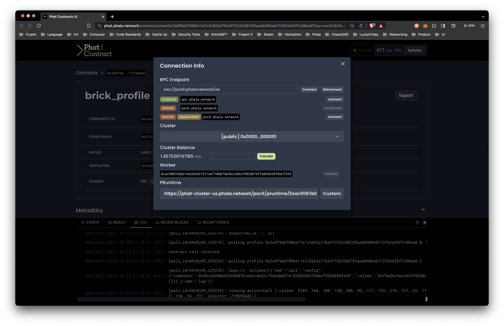

# Phat Contract Console

[Phat Contract UI](https://phat.phala.network/) provides an easy way to upload your contract, instantiate it and interact with it.

## Connect Your Wallet 

<figure><figcaption></figcaption></figure>

On the homepage, click _Connect Wallet_ in the right top corner, and select the wallet you are using. An _Authorize_ window will pop up, Click Yes to continue. Then you can connect to one of your accounts in the _Select Account_ window.

## Connecting to the Blockchain 

<figure><figcaption></figcaption></figure>

Clicking the green dot beside your account will tell you the information about the current chain you are connected to.

<figure><figcaption></figcaption></figure>

By default, the UI will connect to [Phala PoC-6 Testnet](https://polkadot.js.org/apps/?rpc=wss%3A%2F%2Fpoc5.phala.network%2Fws#/explorer). Check the full [chain list](broken-reference).

You can connect to other chains by filling in the RPC Endpoint and clicking _Connect_. The UI will automatically read the cluster information from the chain and fill in the PRuntime for you, but you can always set it to other workers manually.

> **Why two endpoints**
>
> Unlike other blockchains like Ethereum where you have to call your contracts through on-chain transactions, Phat Contracts are deployed to off-chain Workers so you can interact with them directly without submitting any transactions. The UI will ask for two endpoints, one to connect to the blockchain and another to the worker directly.

To connect to our mainnet or your local testnet, you need to specify two endpoints here:

* An RPC endpoint to connect to one of the Phala blockchain nodes to read the chain state and send transactions;
* A pRuntime endpoint to directly connect to one of our Workers where the [off-chain computation](https://medium.com/phala-network/fat-contract-introduce-off-chain-computation-to-smart-contract-dfc5839d5fb8) really happens;

## Claim Test Tokens 

Once the account is connected, you can find the _Get Test-PHA_ button on the right side of the page and request 100 test tokens by clicking it. The operations below require tokens as the transaction fee.

## Uploading and Instantiating the Contract 

Choose `Upload` and locate your `phat_hello.contract` file that you downloaded. The UI will load the metadata of your contract and list all the constructor functions in the `Init Selector` section.

<figure><figcaption></figcaption></figure>

After you click the `Submit`, the UI will ask for your permission to upload the contract WASM to the blockchain through a transaction. Click "Approve" to continue.

> **What happened**
>
> Your contract code is uploaded to the blockchain via a transaction, hence the request for your signature. The code is public, together with your instantiation arguments, so that everyone can verify the initial state of the contract.
>
> The blockchain will automatically push the contract code to the workers belonging to the cluster you choose and instantiate it.

After the successful instantiation, you will see the metadata of the deployed contract.

<figure><figcaption></figcaption></figure>

You can also expand the lower bar to see the raw events when deploying the contract.

<figure><figcaption></figcaption></figure>

## Interacting with Your Contract 

Scrolling down the page, you can see all the interfaces of your contract, with their function names, types, and descriptions.

The interfaces are divided into two types, labeled by `TX` and `QUERY` respectively. This contract only contains one `QUERY` handler. The phat-hello contract has only one `QUERY` type interface, `get_eth_balance()`.

<figure><figcaption></figcaption></figure>

Click the run icon to send a request to the contract. For example, we can invoke the `get_eth_balance()` to get the current balance of a specific ETH address. The Polkadot.js extension will ask for your permission in the first click to encrypt your following traffic to the contract.

> **What happened**
>
> Every transaction or query to the contract is encrypted and thus needs your signature. We implement a certificate mechanism to keep your query signature valid for 15 minutes.

The `QUERY` returns immediately since it involves no on-chain transactions. Click the bottom status bar to see the execution result.

<figure><figcaption></figcaption></figure>

Congrats🎉! You have finished the basic tutorial of Phat Contract!
