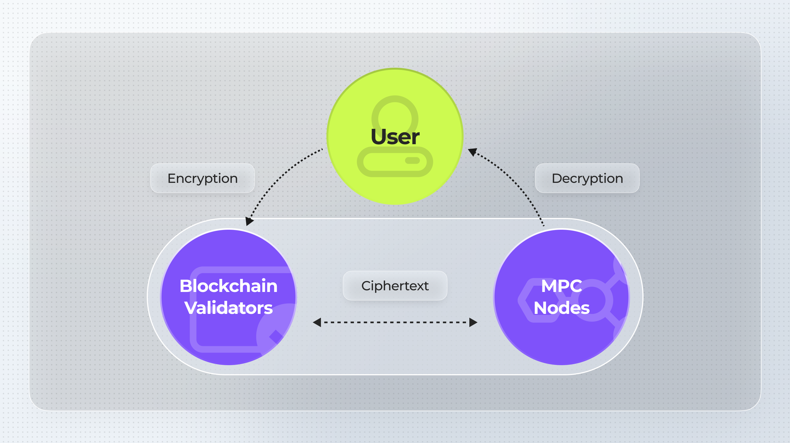

# Why Multi-Proof and How We Can Help

## The Need for Multi-Proof Systems

In the blockchain space, our vision is to bring privacy, security, and verifiability to users. Our ultimate goal is to design a system that can simultaneously fulfill these attributes. However, relying on a single proof system to achieve this is impractical for several reasons:

* No single cryptographic system can be guaranteed to be 100% secure. For instance, zero-knowledge proofs (zk) can have soundness bugs that are difficult to detect, while Multi-Party Computation (MPC) is susceptible to collusion risks between nodes.
* Privacy in zkRollups cannot be fully guaranteed because sequencers can extract user transaction data during proof generation.
* Verifiability in Fully Homomorphic Encryption (FHE) computations is challenging because the FHE server may not perform computations correctly, and without knowing the correct result, we cannot verify its accuracy.

There are several benefits we can gain by introducing TEE:

1. **Hardware-grade safety:** The privacy, confidentiality, and data integrity is guaranteed by hardware secure enclave.
2. **No computation overhead:** Applications run TEE have nearly same speed compare with running in normal CPU env
3. **Low verification cost:** The Gas consumption to verify TEE proof is minimal, requiring just an ECDSA verification.

By building on the Phala TEE network, you can gain additional advantages:

* **Data Sharing**: Phala TEE supports confidential data exchange use cases, such as Maximal Extractable Value (MEV), blockchain games, and AI model training.
* **Availability**: With 35,000 TEE workers, Phala’s Phat Contract is programmable to meet the needs of various blockchain projects, ensuring robust availability.
* **Trust of Multiple Parties**: Phala TEE ensures that your application, project, or blockchain use case remains operational and free from legislative risks, maintaining trust across multiple parties.
* **Out-of-the-Box SDK**: Our SDKs for Rust and JavaScript enable developers to launch their applications on our TEE network quickly, often within hours.

We can not guarantee any single cryptography system is 100% secure. At the same time, the current Zero-Knowledge (ZK) solution is secure theoretically but still does not guarantee system-wide bug-free operation, especially from an engineering perspective, which remains challenging due to the complexity of ZK implementation. Here's where multi-proof systems come into play, to hedge the bugs in ZK implementation, a hardware solution, Trusted Execution Environment (TEE), can be used as a 2-factor verifier to offer double security to ZK projects like zk-Rollups. Inspired by Vitalik Buterin's [presentation](https://hackmd.io/@vbuterin/zk\_slides\_20221010#/) and a recent [post](https://ethresear.ch/t/2fa-zk-Rollups-using-sgx/14462) by Justin Drake.

<figure><figcaption></figcaption></figure>

### Use Cases

Let's delve into some practical examples at the intersection of multi-proof systems. The practical real-world applications of multi-proof technology can be particularly seen in:

1. **Build coprocessor for FHE-based blockchain**:

Most FHE-based blockchain networks introduce a threshold signature-based MPC network to manage keys and perform decryption on behalf of the user, effectively acting as an FHE coprocessor. However, MPC introduces collusion risks between nodes. A better approach is to build the coprocessor using TEE, which offers several benefits:

* **Key Security**: The program can be proven immutable, and access is restricted, essentially treating TEE as a form of two-factor authentication (2FA). For more details, you can check out this [post](https://ethresear.ch/t/sgx-as-2fa-for-fhe-mpc/19780) we published earlier on the Ethereum research forum.
*   **Encryption/Decryption Validity**: Currently, we cannot guarantee the integrity of plaintext during both the encryption and decryption steps, especially since decryption is often outsourced to the MPC network. Instead of introducing Zero-Knowledge Proofs (ZKP) during encryption and decryption, an alternative approach is to run the MPC nodes inside a TEE. This can simultaneously address both key security and decryption integrity issues, and with lower computational cost. For more information, check out the [blog](https://phala.network/posts/build-fhe-coprocessor-on-tee-using-javascript) we posted.

    <figure><figcaption></figcaption></figure>

2. **Build 2FA for ZK-Rollups**:

Inspired by Vitalik Buterin's [presentation](https://hackmd.io/@vbuterin/zk\_slides\_20221010#/) and a recent [post](https://ethresear.ch/t/2fa-zk-Rollups-using-sgx/14462) by Justin Drake, we have awared that there are few improvement space exist in zk implementation. For example, we currently can not guarantee that the ZK circuit is bug free since it's tens of thousands code and we also cannot guarantee the privacy of user transaction because the sequencer can say anything.

To solve thoese problem, zk-Rollup can run a separate STF (state transition function) in TEE, and the result returned by STF will be signed by the key derived in TEE (check this [article](https://phala.network/posts/introducing-phala-sgxprover-a-twofactor-authentication-solution-for-zkrollups) for more details), then submitted on-chain verifier along with the ZKP, the security levels can be significantly improved while ensuring computational efficiencies.

<figure><figcaption></figcaption></figure>

3\. **TEE-Proof for ZK/MPC Bridges**:

ZK/MPC bridges also can run the copy of the relayer in TEE, instead generate proof or MPC signature, the program can generate TEE-proof and submit it to the destination chain. The inclusion of TEE-proof provides secondary security, strengthening the system against potential breaches and leaks.

4. **TEE-Proof for zkVM-based application**:

A zkVM-based application can simply move their guest code to TEE, guest code often has no relation to ZK primitive. We can generate the TEE proof for the output of the guest code, which can be used to provide a secondary security guarantee for the zkVM.

<figure><figcaption></figcaption></figure>
